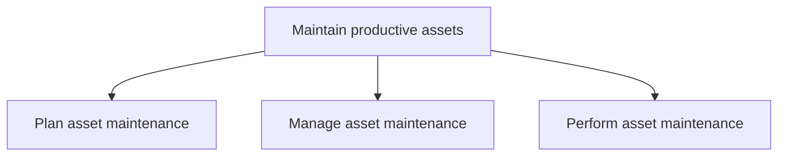
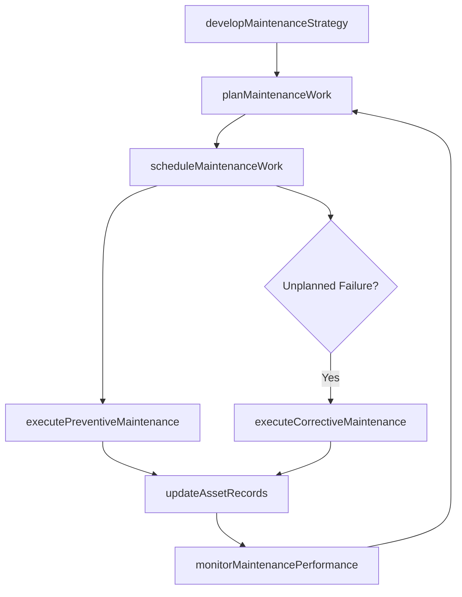

# Maintain productive assets

> Business-as-Code definition for preserving productive assets through planning, scheduling, and executing preventive, routine, corrective, and unplanned maintenance work to maximize asset availability and useful life.

## Overview

Preserving productive assets through the planning, managing, and performance of preventative, routine, and critical maintenance work.

## Process Hierarchy



## GraphDL

```yaml
maintain:
  object: Productive Assets
  actor: MaintenanceManager
  result: AssetHealthReport
```

## Actions

| Action | Description |
|--------|-------------|
| developMaintenanceStrategy | Define maintenance approach including predictive, preventive, and corrective policies |
| planMaintenanceWork | Create detailed work plans with resource requirements and priorities |
| scheduleMaintenanceWork | Allocate maintenance tasks to specific time windows and crews |
| executePreventiveMaintenance | Perform scheduled preventive maintenance activities |
| executeCorrectiveMaintenance | Perform unscheduled repairs to restore asset functionality |
| monitorMaintenancePerformance | Track maintenance KPIs against targets and service level agreements |
| updateAssetRecords | Record maintenance activities, findings, and asset condition data |

## Events

| Event | Description |
|-------|-------------|
| maintenanceStrategyDeveloped | Maintenance strategy and policies approved |
| maintenanceWorkPlanned | Work plan created with resource allocation |
| maintenanceWorkScheduled | Maintenance tasks assigned to schedule and crews |
| preventiveMaintenanceExecuted | Scheduled preventive maintenance completed |
| correctiveMaintenanceExecuted | Unscheduled repair completed and asset restored |
| maintenancePerformanceMonitored | Performance metrics reviewed against targets |
| assetRecordsUpdated | Maintenance history and condition data recorded |

## Searches

| Search | Description |
|--------|-------------|
| findWorkOrders | List maintenance work orders by status, priority, or asset |
| getAssetHealth | Retrieve condition data and remaining useful life for an asset |
| getMaintenanceSchedule | Query upcoming scheduled maintenance by facility or equipment |
| findSpareParts | Check spare parts availability and lead times |
| getMaintenanceMetrics | Retrieve KPI data for maintenance performance tracking |

## Process Flow



## RACI Matrix

| Activity | Responsible | Accountable | Consulted | Informed |
|----------|-------------|-------------|-----------|----------|
| developMaintenanceStrategy | ReliabilityEngineer | VP Operations | MaintenanceManager | Finance |
| planMaintenanceWork | MaintenancePlanner | MaintenanceManager | Operations | Procurement |
| scheduleMaintenanceWork | MaintenanceScheduler | MaintenanceManager | ProductionPlanner | HR |
| executePreventiveMaintenance | MaintenanceTechnician | MaintenanceManager | SafetyOfficer | Operations |
| monitorMaintenancePerformance | ReliabilityEngineer | VP Operations | Finance | Executive |

## Sub-Processes

| ID | Name | Description |
|----|------|-------------|
| 10.3.1 | Plan asset maintenance | Ensuring that necessary resources are available and tasks are prioritized accordingly through planni |
| 10.3.2 | Manage asset maintenance | Ensuring that asset maintenance is conducted in a timely manner and successfully. Schedule work with |
| 10.3.3 | Perform asset maintenance | Engaging in all aspects of asset maintenance. Ensure that all assets are functioning properly and to |

## Related Processes

| Process | Relationship |
|---------|-------------|
| 10.2 Design and construct productive assets | Upstream - newly constructed assets enter maintenance |
| 10.4 Dispose of assets | Downstream - assets beyond repair enter disposal process |
| 10.1 Plan and acquire assets | Parallel - spare parts and materials procurement |
| 4.0 Deliver Products and Services | Consumer - asset availability directly impacts production |

## Related Departments

| Department | Role |
|-----------|------|
| Maintenance | Plans, schedules, and executes all maintenance activities |
| Operations | Coordinates production schedules with maintenance windows |
| Reliability Engineering | Develops predictive maintenance strategies and failure analysis |
| Procurement | Sources spare parts, materials, and contractor services |
| Safety | Ensures maintenance work complies with safety standards |

## Related Occupations

| Occupation | Involvement |
|-----------|-------------|
| Maintenance Manager | Oversees maintenance operations and resource allocation |
| Reliability Engineer | Analyzes failure modes and optimizes maintenance strategies |
| Maintenance Technician | Executes hands-on maintenance and repair work |
| Maintenance Planner | Creates detailed work plans and coordinates resources |

## KPIs

| KPI | Description | Unit |
|-----|-------------|------|
| Overall Equipment Effectiveness | Combined availability, performance, and quality rate | % |
| Mean Time Between Failures | Average operating time between asset failures | Hours |
| Mean Time to Repair | Average time to restore a failed asset to operation | Hours |
| Planned Maintenance Percentage | Ratio of planned to total maintenance work orders | % |
| Maintenance Cost per Asset | Total maintenance spend divided by number of managed assets | $/Asset |

## Usage

```typescript
import { maintainProductiveAssets } from '@headlessly/maintain-productive-assets'

const maintenance = maintainProductiveAssets()

// Plan maintenance work for next quarter
const workPlan = await maintenance.planMaintenanceWork({
  facility: 'Plant-A',
  period: '2025-Q2',
  includePreventive: true,
  includePredictive: true
})

// Check asset health status
const health = await maintenance.getAssetHealth({
  assetId: 'CNC-MILL-003',
  includeHistory: true,
  predictFailure: true
})

// Execute corrective maintenance
const repair = await maintenance.executeCorrectiveMaintenance({
  workOrderId: 'WO-2025-1847',
  failureMode: 'bearing-wear',
  priority: 'urgent'
})
```
