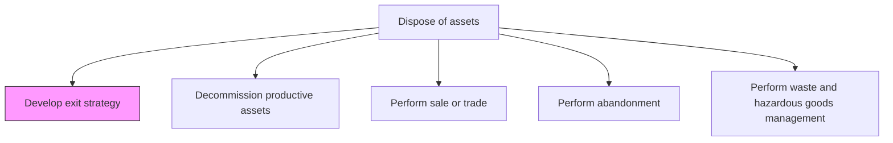
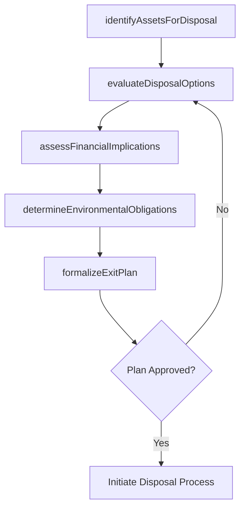

# Develop exit strategy

> Business-as-Code definition for asset exit strategy development. Models the complete process of evaluating disposal options, determining optimal exit timing, and creating disposition plans for assets no longer needed.

## Overview

Creating a strategy for managing asset exits.

## Process Hierarchy



## GraphDL

```yaml
develop:
  object: Exit Strategy
  actor: AssetStrategist
  result: AssetExitPlan
```

## Actions

| Action | Description |
|--------|-------------|
| identifyAssetsForDisposal | Determine which assets are candidates for disposal based on condition, utilization, and lifecycle stage |
| evaluateDisposalOptions | Analyze available disposition methods including sale, trade, donation, recycling, or abandonment |
| assessFinancialImplications | Calculate book value, tax implications, removal costs, and potential recovery value |
| determineEnvironmentalObligations | Identify environmental remediation, hazardous material, and regulatory requirements |
| formalizeExitPlan | Document the approved disposal approach, timeline, and responsible parties |

## Events

| Event | Description |
|-------|-------------|
| disposalCandidatesIdentified | Assets recommended for disposal cataloged |
| disposalOptionsEvaluated | Disposition methods compared and optimal approach selected |
| financialImplicationsAssessed | Tax, book value, and cost recovery analysis completed |
| environmentalObligationsDetermined | Environmental and regulatory requirements documented |
| exitPlanFormalized | Approved exit strategy document published |

## Searches

| Search | Description |
|--------|-------------|
| findDisposalCandidates | List assets recommended for disposal by condition, age, or utilization |
| getExitPlan | Retrieve the exit strategy for a specific asset or asset group |
| getDisposalOptions | Retrieve available disposition methods and their financial implications |
| findEnvironmentalObligations | List environmental requirements for asset disposal by type or location |

## Process Flow



## RACI Matrix

| Activity | Responsible | Accountable | Consulted | Informed |
|----------|-------------|-------------|-----------|----------|
| identifyAssetsForDisposal | AssetManager | VP Operations | Maintenance | Finance |
| evaluateDisposalOptions | AssetStrategist | VP Operations | Legal | Procurement |
| assessFinancialImplications | FinancialAnalyst | CFO | Tax | Accounting |
| determineEnvironmentalObligations | EnvironmentalOfficer | AssetStrategist | Legal | Regulatory |
| formalizeExitPlan | AssetStrategist | VP Operations | Finance | Board |

## Related Processes

| Process | Relationship |
|---------|-------------|
| 10.4.2 Decommission productive assets | Downstream - exit plan triggers decommissioning |
| 10.4.3 Perform sale or trade | Downstream - sale/trade is one disposal option |
| 10.3.1.2 Analyze assets and predict maintenance requirements | Upstream - asset analysis informs disposal decisions |

## Related Departments

| Department | Role |
|-----------|------|
| Asset Management | Identifies disposal candidates and develops exit plans |
| Finance | Assesses financial implications and recovery value |
| Legal | Advises on contractual and regulatory obligations |
| Environmental | Determines remediation and hazardous material requirements |

## Related Occupations

| Occupation | Involvement |
|-----------|-------------|
| Asset Strategist | Develops the exit strategy and plan |
| Financial Analyst | Conducts financial impact analysis |
| Environmental Officer | Identifies environmental obligations |
| Asset Manager | Maintains the asset disposal pipeline |

## KPIs

| KPI | Description | Unit |
|-----|-------------|------|
| Exit Plan Development Time | Average time from disposal identification to approved plan | Days |
| Asset Recovery Rate | Percentage of book value recovered through disposal | % |
| Disposal Pipeline Value | Total book value of assets in the disposal pipeline | Currency |
| Environmental Compliance Rate | Percentage of disposals meeting environmental requirements | % |

## Usage

```typescript
import { developExitStrategy } from '@headlessly/develop-exit-strategy'

const strategy = developExitStrategy()

// Identify assets for disposal
const candidates = await strategy.identifyAssetsForDisposal({
  criteria: {
    remainingUsefulLife: { lessThan: 2 },
    utilizationRate: { lessThan: 0.30 },
    maintenanceCostRatio: { greaterThan: 0.15 }
  },
  facilityId: 'plant-north'
})

// Evaluate disposal options
const options = await strategy.evaluateDisposalOptions({
  assetIds: candidates.map(a => a.id),
  methods: ['sale', 'trade-in', 'recycling', 'abandonment']
})
```
