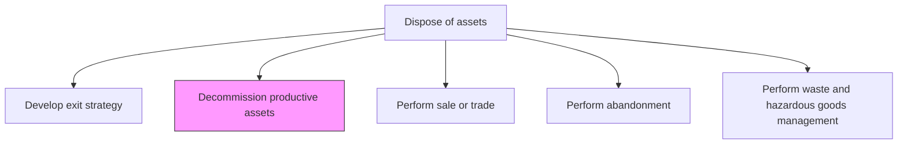
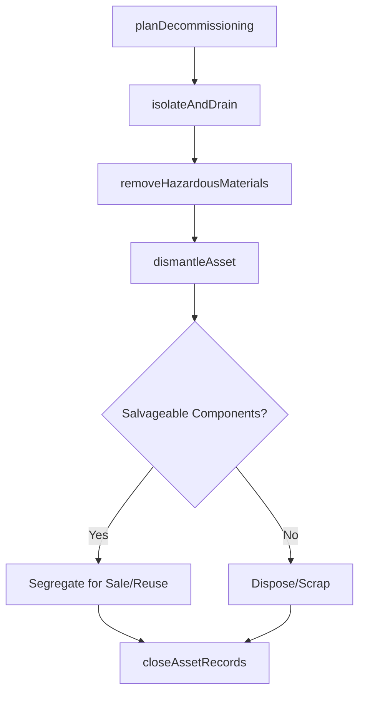

# Decommission productive assets

> Business-as-Code definition for productive asset decommissioning. Models the complete process of safely shutting down, disconnecting, and removing assets from service, including environmental remediation and record closure.

## Overview

Retiring assets that are no longer viable to the business. Decommission assets that are no longer in working order, are out of date, or whose maintenance exceeds the cost of replacement.

## Process Hierarchy



## GraphDL

```yaml
decommission:
  object: Productive Assets
  actor: DecommissioningManager
  result: DecommissionedAssetRecord
```

## Actions

| Action | Description |
|--------|-------------|
| planDecommissioning | Develop a detailed plan for safely shutting down and removing the asset from service |
| isolateAndDrain | Disconnect utilities, drain fluids, and safely isolate all energy sources |
| removeHazardousMaterials | Identify and safely remove asbestos, chemicals, and other hazardous substances |
| dismantleAsset | Physically disassemble the asset and segregate components for disposal or salvage |
| closeAssetRecords | Update enterprise systems to reflect decommissioned status and archive all documentation |

## Events

| Event | Description |
|-------|-------------|
| decommissioningPlanned | Detailed decommissioning plan created and approved |
| assetIsolated | All energy sources disconnected and fluids drained |
| hazardousMaterialsRemoved | Hazardous substances safely extracted and disposed |
| assetDismantled | Physical dismantlement and component segregation completed |
| assetRecordsClosed | Enterprise asset records updated and archived |

## Searches

| Search | Description |
|--------|-------------|
| findAssetsForDecommissioning | List assets approved for decommissioning by status or timeline |
| getDecommissioningPlan | Retrieve the detailed plan for a specific asset decommissioning |
| findHazardousMaterials | List hazardous materials present in an asset scheduled for decommissioning |
| getDecommissionedAssets | Retrieve records of previously decommissioned assets |

## Process Flow



## RACI Matrix

| Activity | Responsible | Accountable | Consulted | Informed |
|----------|-------------|-------------|-----------|----------|
| planDecommissioning | DecommissioningManager | VP Operations | SafetyOfficer | Finance |
| isolateAndDrain | MaintenanceTechnician | DecommissioningManager | Operations | SafetyOfficer |
| removeHazardousMaterials | HazmatSpecialist | EnvironmentalOfficer | Legal | SafetyOfficer |
| dismantleAsset | DemolitionContractor | DecommissioningManager | Engineering | SalvageTeam |
| closeAssetRecords | AssetManager | DecommissioningManager | Finance | Accounting |

## Related Processes

| Process | Relationship |
|---------|-------------|
| 10.4.1 Develop exit strategy | Upstream - exit strategy authorizes decommissioning |
| 10.4.3 Perform sale or trade | Downstream - salvageable components may be sold or traded |
| 10.4.5 Perform waste and hazardous goods management | Parallel - hazardous materials require specialized disposal |

## Related Departments

| Department | Role |
|-----------|------|
| Operations | Coordinates transition of production away from decommissioned assets |
| Maintenance | Performs isolation, draining, and dismantlement |
| Environmental | Manages hazardous material removal and site remediation |
| Finance | Records asset write-offs and salvage value |

## Related Occupations

| Occupation | Involvement |
|-----------|-------------|
| Decommissioning Manager | Plans and oversees the decommissioning process |
| Hazmat Specialist | Handles hazardous material identification and removal |
| Demolition Contractor | Performs physical dismantlement |
| Asset Manager | Closes records and updates the enterprise asset register |

## KPIs

| KPI | Description | Unit |
|-----|-------------|------|
| Decommissioning Cycle Time | Time from plan approval to record closure | Days |
| Salvage Recovery Rate | Value of salvaged components as percentage of original asset value | % |
| Environmental Compliance | Percentage of decommissionings meeting all environmental requirements | % |
| Decommissioning Cost Accuracy | Variance between planned and actual decommissioning costs | % |

## Usage

```typescript
import { decommissionProductiveAssets } from '@headlessly/decommission-productive-assets'

const decommission = decommissionProductiveAssets()

// Plan the decommissioning
const plan = await decommission.planDecommissioning({
  assetId: 'boiler-unit-2',
  hazardousAssessment: true,
  targetCompletionDate: '2026-09-30'
})

// Dismantle the asset
const dismantlement = await decommission.dismantleAsset({
  planId: plan.id,
  contractor: 'industrial-demolition-inc',
  salvageItems: ['control-panel', 'pressure-vessel', 'heat-exchanger-tubes']
})
```
