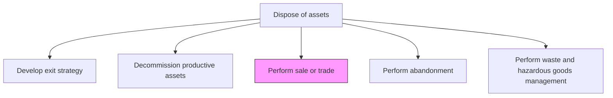
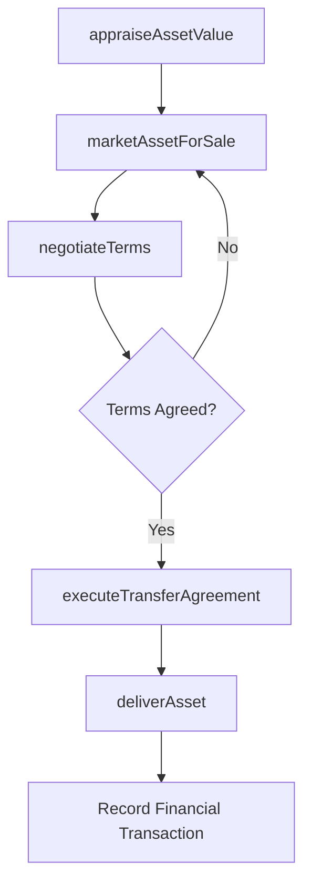

# Perform sale or trade

> Business-as-Code definition for asset sale or trade execution. Models the complete process of marketing, negotiating, and completing the transfer of surplus assets to buyers or trade partners.

## Overview

Performing the sale of assets. Achieve and complete the sale process. Deliver the end product to the customers.

## Process Hierarchy



## GraphDL

```yaml
perform:
  object: Sale Or Trade
  actor: AssetDisposalSpecialist
  result: SaleOrTradeRecord
```

## Actions

| Action | Description |
|--------|-------------|
| appraiseAssetValue | Determine the fair market value of the asset through professional appraisal |
| marketAssetForSale | Advertise the asset through auction houses, brokers, dealers, or online marketplaces |
| negotiateTerms | Negotiate sale price, payment terms, warranty conditions, and delivery arrangements |
| executeTransferAgreement | Finalize the sale or trade contract and transfer ownership documentation |
| deliverAsset | Arrange transportation and handover of the asset to the buyer or trade partner |

## Events

| Event | Description |
|-------|-------------|
| assetAppraised | Fair market value determined through professional assessment |
| assetListedForSale | Asset marketed through selected sales channels |
| termsNegotiated | Sale price and conditions agreed with buyer |
| transferAgreementExecuted | Sale contract signed and ownership transferred |
| assetDelivered | Physical asset transferred to the buyer or trade partner |

## Searches

| Search | Description |
|--------|-------------|
| findAssetsForSale | List assets available for sale or trade |
| getAssetAppraisal | Retrieve the current market valuation for an asset |
| findPotentialBuyers | List prospective buyers or dealers for a specific asset type |
| getSaleHistory | Retrieve completed sale or trade transactions |

## Process Flow



## RACI Matrix

| Activity | Responsible | Accountable | Consulted | Informed |
|----------|-------------|-------------|-----------|----------|
| appraiseAssetValue | Appraiser | AssetDisposalSpecialist | Finance | AssetManager |
| marketAssetForSale | AssetDisposalSpecialist | VP Operations | Marketing | Legal |
| negotiateTerms | AssetDisposalSpecialist | VP Operations | Legal | Finance |
| executeTransferAgreement | AssetDisposalSpecialist | VP Operations | Legal | Accounting |
| deliverAsset | LogisticsCoordinator | AssetDisposalSpecialist | Buyer | Insurance |

## Related Processes

| Process | Relationship |
|---------|-------------|
| 10.4.1 Develop exit strategy | Upstream - exit strategy identifies sale/trade as the disposal method |
| 10.4.2 Decommission productive assets | Upstream - assets must be decommissioned before sale |
| 10.2.3.5 Renew/Replace assets | Related - trade-ins may offset replacement costs |

## Related Departments

| Department | Role |
|-----------|------|
| Asset Management | Manages the sale or trade process |
| Finance | Records financial transactions and tax implications |
| Legal | Reviews contracts and transfer agreements |
| Logistics | Arranges asset transportation and delivery |

## Related Occupations

| Occupation | Involvement |
|-----------|-------------|
| Asset Disposal Specialist | Primary executor of the sale or trade |
| Appraiser | Determines fair market value |
| Contracts Administrator | Manages sale agreements |
| Logistics Coordinator | Arranges asset delivery |

## KPIs

| KPI | Description | Unit |
|-----|-------------|------|
| Recovery Rate | Sale proceeds as percentage of appraised value | % |
| Time to Sale | Average time from listing to completed sale | Days |
| Trade-In Value Ratio | Trade-in credit received as percentage of new asset purchase price | % |
| Sale Completion Rate | Percentage of listed assets successfully sold or traded | % |

## Usage

```typescript
import { performSaleOrTrade } from '@headlessly/perform-sale-or-trade'

const sale = performSaleOrTrade()

// Appraise the asset for sale
const appraisal = await sale.appraiseAssetValue({
  assetId: 'cnc-machine-12',
  method: 'fair-market-value',
  includeInstallation: false
})

// Execute the transfer agreement
const transfer = await sale.executeTransferAgreement({
  assetId: 'cnc-machine-12',
  buyerId: 'buyer-acme-manufacturing',
  salePrice: 125000,
  paymentTerms: 'net-30'
})
```
