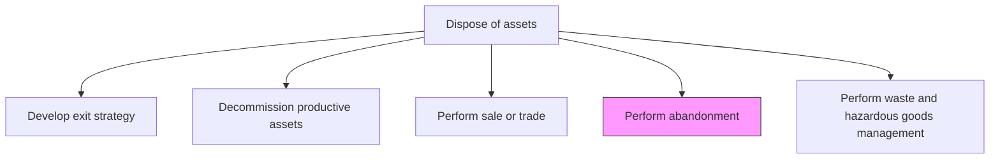
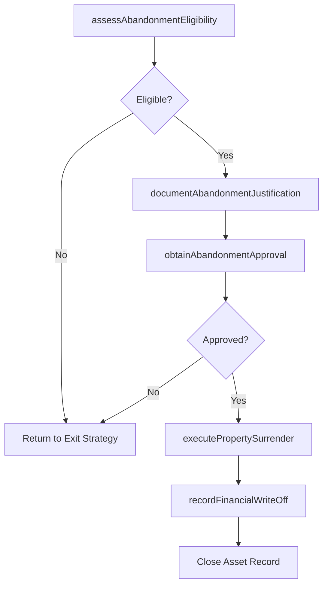

# Perform abandonment

> Business-as-Code definition for asset abandonment execution. Models the complete process of formally relinquishing ownership of assets that cannot be economically sold, traded, or recycled, including legal surrender, tax write-off, and regulatory notification.

## Overview

Abandoning assets. Manage the act of deliberately and permanently giving up, granting, leaving, or surrendering property or buildings and allowing others to use the intellectual property without protest.

## Process Hierarchy



## GraphDL

```yaml
perform:
  object: Abandonment
  actor: AssetDisposalSpecialist
  result: AbandonmentRecord
```

## Actions

| Action | Description |
|--------|-------------|
| assessAbandonmentEligibility | Evaluate whether the asset qualifies for abandonment based on residual value, marketability, and regulatory constraints |
| documentAbandonmentJustification | Prepare formal documentation explaining why sale, trade, or recycling is not economically viable |
| obtainAbandonmentApproval | Secure executive and legal approval to proceed with asset abandonment |
| executePropertySurrender | Formally relinquish ownership through legal instruments, deed surrender, or intellectual property release |
| recordFinancialWriteOff | Process the accounting write-off, recognize the loss, and capture tax implications |

## Events

| Event | Description |
|-------|-------------|
| abandonmentEligibilityAssessed | Asset evaluated and confirmed as eligible for abandonment |
| abandonmentJustificationDocumented | Formal justification for abandonment prepared and filed |
| abandonmentApprovalObtained | Executive and legal approval to abandon the asset granted |
| propertySurrendered | Ownership formally relinquished through legal instruments |
| financialWriteOffRecorded | Accounting write-off processed and loss recognized |

## Searches

| Search | Description |
|--------|-------------|
| findAbandonmentCandidates | List assets eligible for abandonment by type, condition, or residual value |
| getAbandonmentJustification | Retrieve the formal justification documentation for a specific abandonment |
| findAbandonedAssets | List previously abandoned assets with their write-off details |
| getAbandonmentRegulations | Retrieve applicable regulatory requirements for abandoning assets by jurisdiction |

## Process Flow



## RACI Matrix

| Activity | Responsible | Accountable | Consulted | Informed |
|----------|-------------|-------------|-----------|----------|
| assessAbandonmentEligibility | AssetDisposalSpecialist | VP Operations | Finance | Legal |
| documentAbandonmentJustification | AssetDisposalSpecialist | VP Operations | Legal | Accounting |
| obtainAbandonmentApproval | VP Operations | CFO | Legal | Board |
| executePropertySurrender | Legal | VP Operations | RealEstate | Regulatory |
| recordFinancialWriteOff | Accountant | CFO | Tax | Auditor |

## Related Processes

| Process | Relationship |
|---------|-------------|
| 10.4.1 Develop exit strategy | Upstream - exit strategy identifies abandonment as the disposal method |
| 10.4.2 Decommission productive assets | Upstream - assets must be decommissioned before abandonment |
| 10.4.5 Perform waste and hazardous goods management | Parallel - abandoned sites may require environmental remediation |

## Related Departments

| Department | Role |
|-----------|------|
| Asset Management | Identifies abandonment candidates and manages the process |
| Legal | Executes property surrender and ensures regulatory compliance |
| Finance | Processes write-offs and manages tax implications |
| Environmental | Assesses remediation obligations for abandoned assets |

## Related Occupations

| Occupation | Involvement |
|-----------|-------------|
| Asset Disposal Specialist | Assesses eligibility and documents justification |
| Corporate Attorney | Executes legal surrender of property rights |
| Tax Accountant | Processes write-offs and optimizes tax treatment |
| Environmental Compliance Officer | Ensures abandoned assets meet environmental obligations |

## KPIs

| KPI | Description | Unit |
|-----|-------------|------|
| Abandonment Processing Time | Average time from eligibility assessment to completed write-off | Days |
| Write-Off Accuracy | Variance between estimated and actual financial impact of abandonment | % |
| Regulatory Compliance Rate | Percentage of abandonments meeting all regulatory notification requirements | % |
| Abandonment Rate | Ratio of abandoned assets to total disposed assets | % |

## Usage

```typescript
import { performAbandonment } from '@headlessly/perform-abandonment'

const abandonment = performAbandonment()

// Assess whether an asset qualifies for abandonment
const eligibility = await abandonment.assessAbandonmentEligibility({
  assetId: 'warehouse-south-3',
  residualBookValue: 12000,
  estimatedSaleProceeds: 0,
  removalCost: 45000
})

// Execute the property surrender
const surrender = await abandonment.executePropertySurrender({
  assetId: 'warehouse-south-3',
  approvalId: eligibility.approvalId,
  surrenderMethod: 'deed-release',
  jurisdiction: 'state-of-ohio'
})
```
