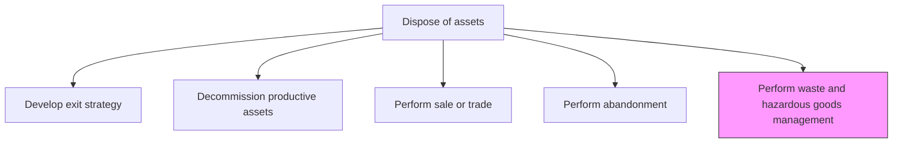
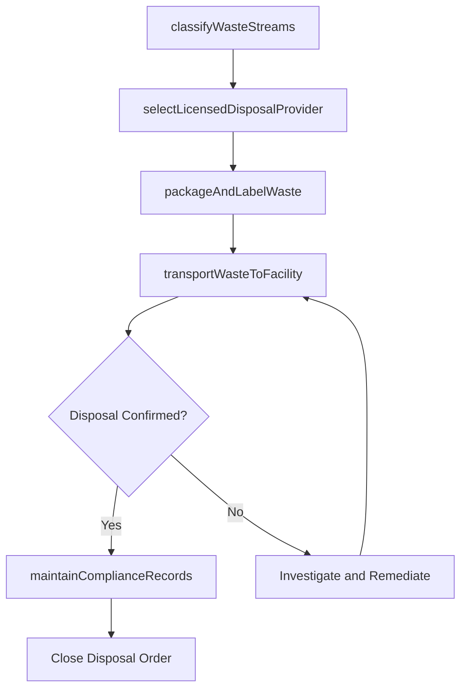

# Perform waste and hazardous goods management

> Business-as-Code definition for waste and hazardous goods management. Models the complete process of classifying, handling, transporting, and disposing of waste and hazardous materials in compliance with environmental regulations.

## Overview

Disposing of waste and hazardous materials as outlined by state, local, and federal regulations.

## Process Hierarchy



## GraphDL

```yaml
perform:
  object: Waste And Hazardous Goods Management
  actor: WasteManagementCoordinator
  result: WasteDisposalRecord
```

## Actions

| Action | Description |
|--------|-------------|
| classifyWasteStreams | Identify and categorize waste materials by type, hazard class, and applicable regulatory framework |
| selectLicensedDisposalProvider | Evaluate and contract with licensed waste haulers and disposal facilities |
| packageAndLabelWaste | Prepare waste containers with proper packaging, labeling, and documentation per DOT and EPA requirements |
| transportWasteToFacility | Coordinate the safe transportation of waste to approved treatment, storage, or disposal facilities |
| maintainComplianceRecords | Generate and archive manifests, certificates of disposal, and regulatory filings |

## Events

| Event | Description |
|-------|-------------|
| wasteStreamsClassified | Waste materials categorized by type and hazard class |
| disposalProviderSelected | Licensed waste hauler and disposal facility contracted |
| wastePackagedAndLabeled | Waste containers prepared with compliant packaging and labeling |
| wasteTransportedToFacility | Waste safely delivered to approved disposal facility |
| complianceRecordsMaintained | Manifests and disposal certificates archived |

## Searches

| Search | Description |
|--------|-------------|
| findWasteStreams | List active waste streams by classification, volume, or facility |
| getLicensedDisposalProviders | Retrieve approved waste haulers and disposal facilities by waste type |
| getWasteManifests | Retrieve tracking manifests for waste shipments |
| findComplianceGaps | List waste management activities with pending or expired regulatory filings |

## Process Flow



## RACI Matrix

| Activity | Responsible | Accountable | Consulted | Informed |
|----------|-------------|-------------|-----------|----------|
| classifyWasteStreams | WasteManagementCoordinator | EnvironmentalOfficer | SafetyOfficer | Operations |
| selectLicensedDisposalProvider | WasteManagementCoordinator | EnvironmentalOfficer | Procurement | Legal |
| packageAndLabelWaste | HazmatTechnician | WasteManagementCoordinator | SafetyOfficer | Logistics |
| transportWasteToFacility | WasteHauler | WasteManagementCoordinator | DOTCompliance | EnvironmentalOfficer |
| maintainComplianceRecords | WasteManagementCoordinator | EnvironmentalOfficer | Legal | Auditor |

## Related Processes

| Process | Relationship |
|---------|-------------|
| 10.4.2 Decommission productive assets | Upstream - decommissioning generates hazardous waste requiring disposal |
| 10.4.4 Perform abandonment | Parallel - abandoned sites may contain waste requiring management |
| 10.4.1 Develop exit strategy | Upstream - exit strategy identifies waste management obligations |

## Related Departments

| Department | Role |
|-----------|------|
| Environmental | Classifies waste, selects providers, and maintains regulatory compliance |
| Safety | Ensures safe handling and packaging of hazardous materials |
| Logistics | Coordinates waste transportation to disposal facilities |
| Legal | Advises on regulatory obligations and liability exposure |

## Related Occupations

| Occupation | Involvement |
|-----------|-------------|
| Waste Management Coordinator | Plans and oversees the entire waste disposal process |
| Hazmat Technician | Handles classification, packaging, and labeling of hazardous waste |
| Environmental Compliance Officer | Ensures regulatory filings and manifests are complete |
| Licensed Waste Hauler | Transports waste to approved disposal facilities |

## KPIs

| KPI | Description | Unit |
|-----|-------------|------|
| Regulatory Compliance Rate | Percentage of waste disposals meeting all federal, state, and local requirements | % |
| Manifest Accuracy | Percentage of waste manifests completed without errors or corrections | % |
| Waste Diversion Rate | Percentage of waste diverted from landfill through recycling or treatment | % |
| Disposal Cost Per Ton | Average cost to dispose of waste materials per metric ton | Currency/Ton |

## Usage

```typescript
import { performWasteAndHazardousGoodsManagement } from '@headlessly/perform-waste-and-hazardous-goods-management'

const waste = performWasteAndHazardousGoodsManagement()

// Classify waste streams from a decommissioned asset
const classification = await waste.classifyWasteStreams({
  sourceAssetId: 'chemical-storage-tank-4',
  materials: ['residual-solvents', 'tank-sludge', 'contaminated-piping'],
  regulatoryFramework: 'RCRA'
})

// Transport waste to licensed disposal facility
const transport = await waste.transportWasteToFacility({
  manifestId: classification.manifestId,
  disposalFacilityId: 'cleanearth-facility-oh-12',
  wasteClass: 'hazardous',
  estimatedWeight: 2400
})
```
