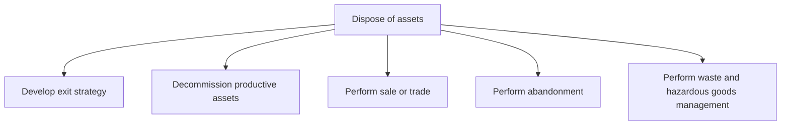
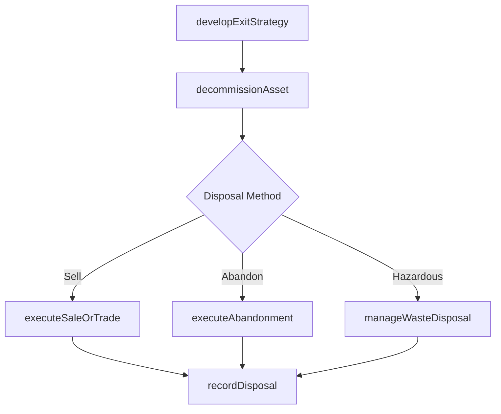

# Dispose of assets

> Business-as-Code definition for retiring productive and non-productive assets through exit strategy development, decommissioning, sale, trade, abandonment, and proper waste and hazardous materials management.

## Overview

Retiring productive and non-productive assets.

## Process Hierarchy



## GraphDL

```yaml
dispose:
  object: Of Assets
  actor: AssetDisposalManager
  result: DisposalRecord
```

## Actions

| Action | Description |
|--------|-------------|
| developExitStrategy | Create a plan for asset retirement including timeline and method |
| decommissionAsset | Safely take a productive asset out of operational service |
| executeSaleOrTrade | Perform the sale, auction, or trade of retired assets |
| executeAbandonment | Formally abandon assets that cannot be sold or repurposed |
| manageWasteDisposal | Dispose of waste and hazardous materials per regulatory requirements |
| recordDisposal | Document disposal activities and update asset registers |

## Events

| Event | Description |
|-------|-------------|
| exitStrategyDeveloped | Asset exit strategy approved with disposal method and timeline |
| assetDecommissioned | Productive asset safely removed from operational service |
| saleOrTradeExecuted | Asset sale or trade transaction completed |
| abandonmentExecuted | Asset formally abandoned and written off |
| wasteDisposalManaged | Waste and hazardous materials disposed per regulations |
| disposalRecorded | Asset register and financial records updated for disposal |

## Searches

| Search | Description |
|--------|-------------|
| findAssetsForDisposal | List assets approaching or past end of useful life |
| getDisposalHistory | Retrieve disposal records for auditing and compliance |
| findBuyersOrTraders | Query potential buyers or trade partners for surplus assets |
| getEnvironmentalCompliance | Check waste disposal compliance status by facility |

## Process Flow



## RACI Matrix

| Activity | Responsible | Accountable | Consulted | Informed |
|----------|-------------|-------------|-----------|----------|
| developExitStrategy | AssetManager | CFO | Operations | Legal |
| decommissionAsset | MaintenanceManager | VP Operations | Safety | Environmental |
| executeSaleOrTrade | ProcurementManager | CFO | Legal | Accounting |
| manageWasteDisposal | EnvironmentalManager | VP Operations | Legal | Regulatory |

## Sub-Processes

| ID | Name | Description |
|----|------|-------------|
| 10.4.1 | Develop exit strategy | Creating a strategy for managing asset exits. |
| 10.4.2 | Decommission productive assets | Retiring assets that are no longer viable to the business. Decommission assets that are no longer in |
| 10.4.3 | Perform sale or trade | Performing the sale of assets. Achieve and complete the sale process. Deliver the end product to the |
| 10.4.4 | Perform abandonment | Abandoning assets. Manage the act of deliberately and permanently giving up, granting, leaving, or s |
| 10.4.5 | Perform waste and hazardous goods management | Disposing of waste and hazardous materials as outlined by state, local, and federal regulations. |

## Related Processes

| Process | Relationship |
|---------|-------------|
| 10.3 Maintain productive assets | Upstream - maintenance data informs disposal decisions |
| 10.1 Plan and acquire assets | Parallel - disposal frees capacity for new acquisitions |
| 8.0 Manage Financial Resources | Downstream - disposal impacts asset valuation and write-offs |
| 11.0 Manage Enterprise Risk | Parallel - environmental and regulatory compliance during disposal |

## Related Departments

| Department | Role |
|-----------|------|
| Asset Management | Plans disposal strategy and coordinates decommissioning |
| Finance | Manages write-offs, gain/loss calculations, and tax implications |
| Environmental Health and Safety | Ensures hazardous waste compliance during disposal |
| Legal | Reviews sale agreements and regulatory obligations |
| Procurement | Manages asset auctions and trade transactions |

## Related Occupations

| Occupation | Involvement |
|-----------|-------------|
| Asset Disposal Manager | Coordinates end-to-end asset retirement process |
| Environmental Compliance Specialist | Manages hazardous materials disposal regulations |
| Fixed Asset Accountant | Records disposal transactions and updates asset registers |

## KPIs

| KPI | Description | Unit |
|-----|-------------|------|
| Asset Recovery Rate | Percentage of book value recovered through sale or trade | % |
| Disposal Cycle Time | Average time from disposal decision to completion | Days |
| Environmental Compliance Rate | Percentage of disposals meeting environmental regulations | % |
| Write-off Accuracy | Variance between estimated and actual disposal loss | % |

## Usage

```typescript
import { disposeOfAssets } from '@headlessly/dispose-of-assets'

const disposal = disposeOfAssets()

// Develop exit strategy for aging equipment
const strategy = await disposal.developExitStrategy({
  assetId: 'PRESS-LINE-007',
  reason: 'end-of-useful-life',
  targetDate: '2025-09-30'
})

// Find assets approaching disposal threshold
const candidates = await disposal.findAssetsForDisposal({
  facility: 'Plant-B',
  maxRemainingLife: 6,
  unit: 'months'
})

// Execute sale of decommissioned asset
const sale = await disposal.executeSaleOrTrade({
  assetId: 'PRESS-LINE-007',
  method: 'auction',
  reservePrice: 150000
})
```
