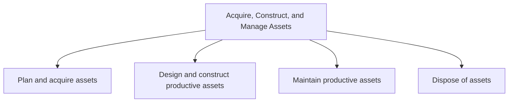
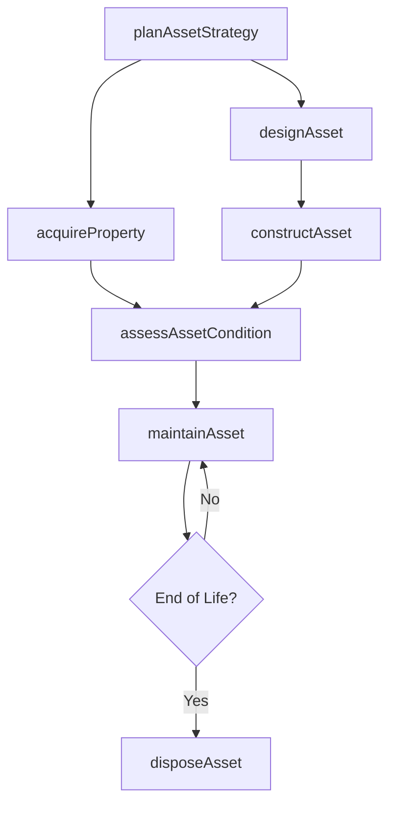

# Acquire, Construct, and Manage Assets

> Business-as-Code definition for the end-to-end lifecycle of organizational assets, from strategic planning and acquisition through construction, ongoing maintenance, and eventual disposal or decommissioning.

## Overview

Relating to the design, construction, acquisition, and management of both productive and non-productive assets.

## Process Hierarchy



## GraphDL

```yaml
acquire,:
  object: Construct, And Manage Assets
  actor: FacilitiesManager
  result: AssetPortfolio
```

## Actions

| Action | Description |
|--------|-------------|
| planAssetStrategy | Define long-term asset acquisition and management strategy aligned with business goals |
| acquireProperty | Execute the procurement or lease of physical property and facilities |
| designAsset | Develop engineering specifications and blueprints for productive assets |
| constructAsset | Build or modify productive assets according to approved designs |
| maintainAsset | Perform scheduled and unscheduled maintenance on productive assets |
| disposeAsset | Retire, sell, trade, or decommission assets that have reached end of useful life |
| assessAssetCondition | Evaluate current state and remaining useful life of existing assets |
| trackAssetCompliance | Monitor regulatory and safety compliance across the asset portfolio |

## Events

| Event | Description |
|-------|-------------|
| assetStrategyPlanned | Long-term asset strategy defined and approved |
| propertyAcquired | Physical property or facility procurement completed |
| assetDesigned | Engineering specifications and blueprints finalized |
| assetConstructed | New productive asset built or modification completed |
| assetMaintained | Scheduled or unscheduled maintenance work completed |
| assetDisposed | Asset retired, sold, or decommissioned |
| assetConditionAssessed | Condition assessment and remaining life evaluation completed |
| assetComplianceTracked | Regulatory and safety compliance review completed |

## Searches

| Search | Description |
|--------|-------------|
| findAssets | List assets filtered by type, location, status, or condition rating |
| getAssetDetails | Retrieve full details for a specific asset including maintenance history |
| getAssetValuation | Retrieve current book value and depreciation schedule for assets |
| findMaintenanceSchedule | Query upcoming preventive and corrective maintenance activities |
| getCapitalProjects | List active capital construction and acquisition projects |

## Process Flow



## RACI Matrix

| Activity | Responsible | Accountable | Consulted | Informed |
|----------|-------------|-------------|-----------|----------|
| planAssetStrategy | FacilitiesManager | CFO | OperationsDirector | Board |
| acquireProperty | RealEstateManager | VP Facilities | Legal | Finance |
| constructAsset | ProjectManager | VP Engineering | SafetyOfficer | Operations |
| maintainAsset | MaintenanceManager | VP Operations | Engineering | Finance |
| disposeAsset | AssetManager | CFO | Legal | Accounting |

## Sub-Processes

| ID | Name | Description |
|----|------|-------------|
| 10.1 | Plan and acquire assets | Planning, acquiring, and managing facilities, workspaces, and supporting assets. Acquire, configure, |
| 10.2 | Design and construct productive assets | Conceptualizing and realizing dividend and income generating assets such as machines, tools, factori |
| 10.3 | Maintain productive assets | Preserving productive assets through the planning, managing, and performance of preventative, routin |
| 10.4 | Dispose of assets | Retiring productive and non-productive assets. |

## Related Processes

| Process | Relationship |
|---------|-------------|
| 8.0 Manage Financial Resources | Upstream - capital budgeting funds asset acquisition |
| 7.0 Manage Information Technology | Parallel - IT infrastructure assets managed jointly |
| 11.0 Manage Enterprise Risk, Compliance, Remediation, and Resiliency | Downstream - asset compliance feeds enterprise risk |
| 4.0 Deliver Products and Services | Consumer - productive assets enable service delivery |

## Related Departments

| Department | Role |
|-----------|------|
| Facilities Management | Primary owner of property and workspace assets |
| Engineering | Designs and oversees construction of productive assets |
| Finance | Manages capital budgets, depreciation, and asset valuation |
| Operations | Consumes productive assets for service delivery |
| Legal | Manages property contracts, permits, and regulatory compliance |

## Related Occupations

| Occupation | Involvement |
|-----------|-------------|
| Facilities Manager | Oversees property acquisition and workspace management |
| Maintenance Engineer | Plans and executes preventive and corrective maintenance |
| Capital Project Manager | Manages construction and asset development projects |
| Asset Accountant | Tracks depreciation, valuations, and disposal accounting |

## KPIs

| KPI | Description | Unit |
|-----|-------------|------|
| Asset Utilization Rate | Percentage of productive assets actively in use | % |
| Maintenance Cost Ratio | Maintenance spend as a percentage of asset replacement value | % |
| Capital Project On-Time Delivery | Percentage of capital projects completed on schedule | % |
| Asset Downtime | Average unplanned downtime per productive asset per month | Hours |
| Return on Assets | Net income generated per dollar of asset value | Ratio |

## Usage

```typescript
import { acquireConstructAndManageAssets } from '@headlessly/acquire-construct-and-manage-assets'

const assets = acquireConstructAndManageAssets()

// Plan asset acquisition strategy
const strategy = await assets.planAssetStrategy({
  horizon: '5-year',
  capitalBudget: 50000000,
  assetClasses: ['facilities', 'equipment', 'vehicles']
})

// Assess condition of existing assets
const condition = await assets.assessAssetCondition({
  assetId: 'PROD-4821',
  inspectionType: 'comprehensive'
})

// Query upcoming maintenance schedule
const schedule = await assets.findMaintenanceSchedule({
  facility: 'Plant-A',
  dateRange: { start: '2025-Q1', end: '2025-Q2' }
})
```
