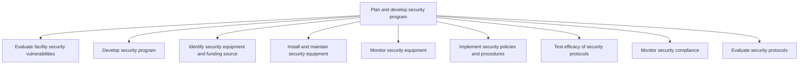

# Plan and develop security program

> TODO: Business-as-Code definition for plan and develop security program (education)

## Overview

TODO: Add process overview

## Process Hierarchy



## GraphDL

```yaml
plan:
  object: And Develop Security Program
  actor: TODO
  result: TODO
```

## Actions

| Action | Description |
|--------|-------------|
| TODO | TODO |

## Events

| Event | Description |
|-------|-------------|
| TODO | TODO |

## Searches

| Search | Description |
|--------|-------------|
| TODO | TODO |

## Process Flow


## RACI Matrix

| Activity | Responsible | Accountable | Consulted | Informed |
|----------|-------------|-------------|-----------|----------|
| TODO | TODO | TODO | TODO | TODO |

## Sub-Processes

| ID | Name | Description |
|----|------|-------------|
| 10.5.1 | Evaluate facility security vulnerabilities | TODO |
| 10.5.2 | Develop security program | TODO |
| 10.5.3 | Identify security equipment and funding source | TODO |
| 10.5.4 | Install and maintain security equipment | TODO |
| 10.5.5 | Monitor security equipment | TODO |
| 10.5.6 | Implement security policies and procedures | TODO |
| 10.5.7 | Test efficacy of security protocols | TODO |
| 10.5.8 | Monitor security compliance | TODO |
| 10.5.9 | Evaluate security protocols | TODO |

## Related Processes

| Process | Relationship |
|---------|-------------|
| TODO | TODO |

## Related Departments

| Department | Role |
|-----------|------|
| TODO | TODO |

## Related Occupations

| Occupation | Involvement |
|-----------|-------------|
| TODO | TODO |

## KPIs

| KPI | Description | Unit |
|-----|-------------|------|
| TODO | TODO | TODO |

## Usage

```typescript
import { TODO } from '@headlessly/plan-and-develop-security-program'

const client = TODO()

// TODO: Example action calls
```
