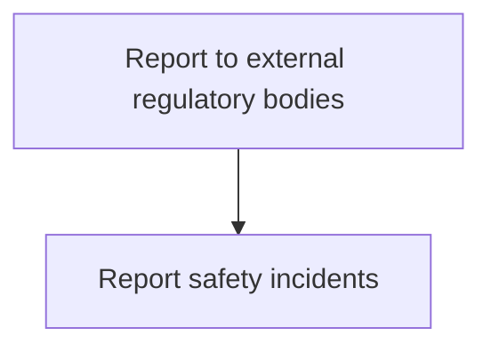

# Report to external regulatory bodies

> TODO: Business-as-Code definition for report to external regulatory bodies (airline)

## Overview

Includes Aviation Authority / Government / Air Traffic Control

## Process Hierarchy



## GraphDL

```yaml
report:
  object: To External Regulatory Bodies
  actor: TODO
  result: TODO
```

## Actions

| Action | Description |
|--------|-------------|
| TODO | TODO |

## Events

| Event | Description |
|-------|-------------|
| TODO | TODO |

## Searches

| Search | Description |
|--------|-------------|
| TODO | TODO |

## Process Flow


## RACI Matrix

| Activity | Responsible | Accountable | Consulted | Informed |
|----------|-------------|-------------|-----------|----------|
| TODO | TODO | TODO | TODO | TODO |

## Sub-Processes

| ID | Name | Description |
|----|------|-------------|
| 11.2.2.10.1 | Report safety incidents | Regulatory requirement as part of Safety Compliance |

## Related Processes

| Process | Relationship |
|---------|-------------|
| TODO | TODO |

## Related Departments

| Department | Role |
|-----------|------|
| TODO | TODO |

## Related Occupations

| Occupation | Involvement |
|-----------|-------------|
| TODO | TODO |

## KPIs

| KPI | Description | Unit |
|-----|-------------|------|
| TODO | TODO | TODO |

## Usage

```typescript
import { TODO } from '@headlessly/report-to-external-regulatory-bodies'

const client = TODO()

// TODO: Example action calls
```
