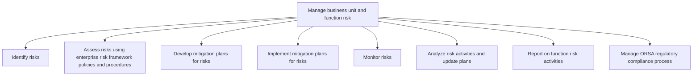

# Manage business unit and function risk

> TODO: Business-as-Code definition for manage business unit and function risk (unknown)

## Overview

TODO: Add process overview

## Process Hierarchy



## GraphDL

```yaml
manage:
  object: Business Unit And Function Risk
  actor: TODO
  result: TODO
```

## Actions

| Action | Description |
|--------|-------------|
| TODO | TODO |

## Events

| Event | Description |
|-------|-------------|
| TODO | TODO |

## Searches

| Search | Description |
|--------|-------------|
| TODO | TODO |

## Process Flow


## RACI Matrix

| Activity | Responsible | Accountable | Consulted | Informed |
|----------|-------------|-------------|-----------|----------|
| TODO | TODO | TODO | TODO | TODO |

## Sub-Processes

| ID | Name | Description |
|----|------|-------------|
| 11.1.4.1 | Identify risks | TODO |
| 11.1.4.2 | Assess risks using enterprise risk framework policies and procedures | TODO |
| 11.1.4.3 | Develop mitigation plans for risks | TODO |
| 11.1.4.4 | Implement mitigation plans for risks | TODO |
| 11.1.4.5 | Monitor risks | TODO |
| 11.1.4.6 | Analyze risk activities and update plans | TODO |
| 11.1.4.7 | Report on function risk activities | TODO |
| 11.1.4.8 | Manage ORSA regulatory compliance process | TODO |

## Related Processes

| Process | Relationship |
|---------|-------------|
| TODO | TODO |

## Related Departments

| Department | Role |
|-----------|------|
| TODO | TODO |

## Related Occupations

| Occupation | Involvement |
|-----------|-------------|
| TODO | TODO |

## KPIs

| KPI | Description | Unit |
|-----|-------------|------|
| TODO | TODO | TODO |

## Usage

```typescript
import { TODO } from '@headlessly/manage-business-unit-and-function-risk'

const client = TODO()

// TODO: Example action calls
```
