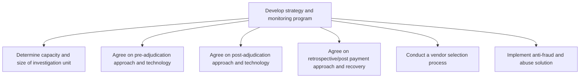

# Develop strategy and monitoring program

> TODO: Business-as-Code definition for develop strategy and monitoring program (unknown)

## Overview

TODO: Add process overview

## Process Hierarchy



## GraphDL

```yaml
develop:
  object: Strategy And Monitoring Program
  actor: TODO
  result: TODO
```

## Actions

| Action | Description |
|--------|-------------|
| TODO | TODO |

## Events

| Event | Description |
|-------|-------------|
| TODO | TODO |

## Searches

| Search | Description |
|--------|-------------|
| TODO | TODO |

## Process Flow


## RACI Matrix

| Activity | Responsible | Accountable | Consulted | Informed |
|----------|-------------|-------------|-----------|----------|
| TODO | TODO | TODO | TODO | TODO |

## Sub-Processes

| ID | Name | Description |
|----|------|-------------|
| 11.4.1.1 | Determine capacity and size of investigation unit | TODO |
| 11.4.1.2 | Agree on pre-adjudication approach and technology | TODO |
| 11.4.1.3 | Agree on post-adjudication approach and technology | TODO |
| 11.4.1.4 | Agree on retrospective/post payment approach and recovery | TODO |
| 11.4.1.5 | Conduct a vendor selection process | TODO |
| 11.4.1.6 | Implement anti-fraud and abuse solution | TODO |

## Related Processes

| Process | Relationship |
|---------|-------------|
| TODO | TODO |

## Related Departments

| Department | Role |
|-----------|------|
| TODO | TODO |

## Related Occupations

| Occupation | Involvement |
|-----------|-------------|
| TODO | TODO |

## KPIs

| KPI | Description | Unit |
|-----|-------------|------|
| TODO | TODO | TODO |

## Usage

```typescript
import { TODO } from '@headlessly/develop-strategy-and-monitoring-program'

const client = TODO()

// TODO: Example action calls
```
