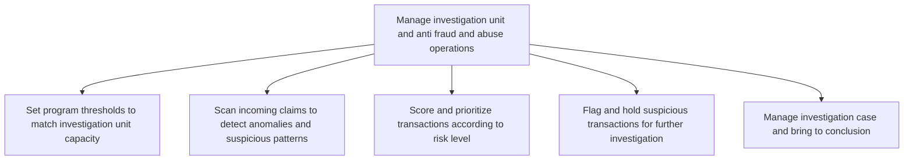

# Manage investigation unit and anti fraud and abuse operations

> TODO: Business-as-Code definition for manage investigation unit and anti fraud and abuse operations (unknown)

## Overview

TODO: Add process overview

## Process Hierarchy



## GraphDL

```yaml
manage:
  object: Investigation Unit And Anti Fraud And Abuse Operations
  actor: TODO
  result: TODO
```

## Actions

| Action | Description |
|--------|-------------|
| TODO | TODO |

## Events

| Event | Description |
|-------|-------------|
| TODO | TODO |

## Searches

| Search | Description |
|--------|-------------|
| TODO | TODO |

## Process Flow


## RACI Matrix

| Activity | Responsible | Accountable | Consulted | Informed |
|----------|-------------|-------------|-----------|----------|
| TODO | TODO | TODO | TODO | TODO |

## Sub-Processes

| ID | Name | Description |
|----|------|-------------|
| 11.4.2.1 | Set program thresholds to match investigation unit capacity | TODO |
| 11.4.2.2 | Scan incoming claims to detect anomalies and suspicious patterns | TODO |
| 11.4.2.3 | Score and prioritize transactions according to risk level | TODO |
| 11.4.2.4 | Flag and hold suspicious transactions for further investigation | TODO |
| 11.4.2.5 | Manage investigation case and bring to conclusion | TODO |

## Related Processes

| Process | Relationship |
|---------|-------------|
| TODO | TODO |

## Related Departments

| Department | Role |
|-----------|------|
| TODO | TODO |

## Related Occupations

| Occupation | Involvement |
|-----------|-------------|
| TODO | TODO |

## KPIs

| KPI | Description | Unit |
|-----|-------------|------|
| TODO | TODO | TODO |

## Usage

```typescript
import { TODO } from '@headlessly/manage-investigation-unit-and-anti-fraud-and-abuse-operations'

const client = TODO()

// TODO: Example action calls
```
