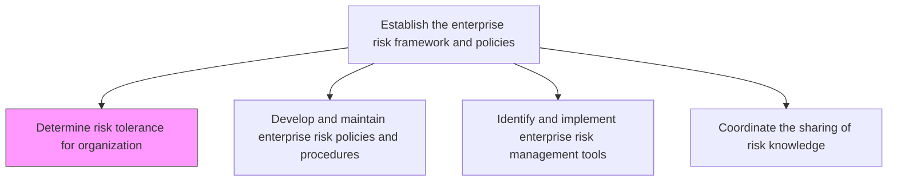
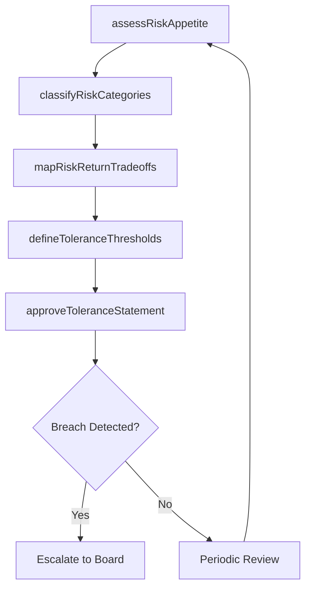

# Determine risk tolerance for organization

> Business-as-Code definition for establishing the organization's appetite and capacity for risk exposure across strategic, operational, financial, and compliance domains.

## Overview

Recognizing the organization's tolerance for risk, given risk-return trade-offs for one or more anticipated and predictable consequences.

## Process Hierarchy



## GraphDL

```yaml
determine:
  object: Risk Tolerance For Organization
  actor: ChiefRiskOfficer
  result: RiskToleranceStatement
```

## Actions

| Action | Description |
|--------|-------------|
| assessRiskAppetite | Evaluate the board's and executive team's willingness to accept risk |
| defineToleranceThresholds | Set quantitative and qualitative thresholds for each risk category |
| mapRiskReturnTradeoffs | Analyze the relationship between risk exposure and expected returns |
| classifyRiskCategories | Categorize risks into strategic, operational, financial, and compliance buckets |
| approveToleranceStatement | Obtain board approval for the formal risk tolerance statement |

## Events

| Event | Description |
|-------|-------------|
| riskAppetiteAssessed | Board-level risk appetite evaluation completed |
| toleranceThresholdsDefined | Quantitative risk tolerance limits established |
| riskReturnTradeoffsMapped | Risk-return analysis completed for key initiatives |
| toleranceStatementApproved | Formal risk tolerance statement ratified by board |
| toleranceBreachDetected | Actual risk exposure exceeds defined tolerance levels |

## Searches

| Search | Description |
|--------|-------------|
| getRiskToleranceLevels | Retrieve current tolerance thresholds by risk category |
| findToleranceBreaches | List instances where risk exposure exceeded tolerance limits |
| getHistoricalToleranceChanges | Track changes to tolerance levels over time |
| getRiskReturnAnalysis | Retrieve risk-return tradeoff analyses for specific initiatives |

## Process Flow



## RACI Matrix

| Activity | Responsible | Accountable | Consulted | Informed |
|----------|-------------|-------------|-----------|----------|
| assessRiskAppetite | ChiefRiskOfficer | BoardOfDirectors | CFO | ExecutiveTeam |
| defineToleranceThresholds | RiskManager | ChiefRiskOfficer | BusinessUnitLeads | Compliance |
| mapRiskReturnTradeoffs | RiskAnalyst | ChiefRiskOfficer | FinanceTeam | StrategyTeam |
| approveToleranceStatement | BoardOfDirectors | Chairman | ChiefRiskOfficer | AllEmployees |

## Related Processes

| Process | Relationship |
|---------|-------------|
| 11.1.1.2 Develop and maintain enterprise risk policies and procedures | Downstream - tolerance informs policy creation |
| 11.1.2.1 Identify enterprise level risks | Downstream - tolerance levels guide risk identification |
| 11.1.2.2 Assess risks to determine which to mitigate | Consumer - uses tolerance thresholds for prioritization |
| 1.2.2 Define and evaluate strategic options | Parallel - strategic risk appetite alignment |

## Related Departments

| Department | Role |
|-----------|------|
| Enterprise Risk Management | Primary owner of risk tolerance framework |
| Finance | Provides financial risk exposure data |
| Strategy | Aligns risk tolerance with strategic objectives |
| Legal | Advises on regulatory risk boundaries |

## Related Occupations

| Occupation | Involvement |
|-----------|-------------|
| Chief Risk Officer | Primary decision maker |
| Risk Analyst | Data analysis and threshold modeling |
| Board Director | Approval authority |
| Financial Controller | Financial risk quantification |

## KPIs

| KPI | Description | Unit |
|-----|-------------|------|
| Tolerance Breach Rate | Frequency of risk exposure exceeding defined tolerance | Per Quarter |
| Risk Appetite Alignment | Degree of alignment between stated tolerance and actual exposure | % |
| Tolerance Review Cadence | How often risk tolerance statements are reviewed and updated | Per Year |
| Stakeholder Consensus | Percentage of board members endorsing tolerance statement | % |

## Usage

```typescript
import { determineRiskToleranceForOrganization } from '@headlessly/determine-risk-tolerance-for-organization'

const tolerance = determineRiskToleranceForOrganization()

// Assess current risk appetite across categories
const appetite = await tolerance.assessRiskAppetite({
  categories: ['strategic', 'operational', 'financial', 'compliance'],
  stakeholders: ['board', 'executive-team']
})

// Define tolerance thresholds
const thresholds = await tolerance.defineToleranceThresholds({
  category: 'financial',
  maxExposure: 5000000,
  probabilityLimit: 0.05
})
```
