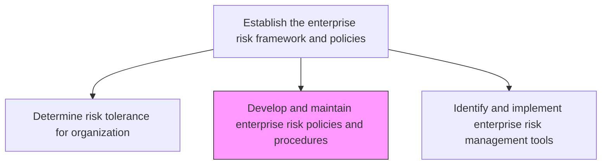
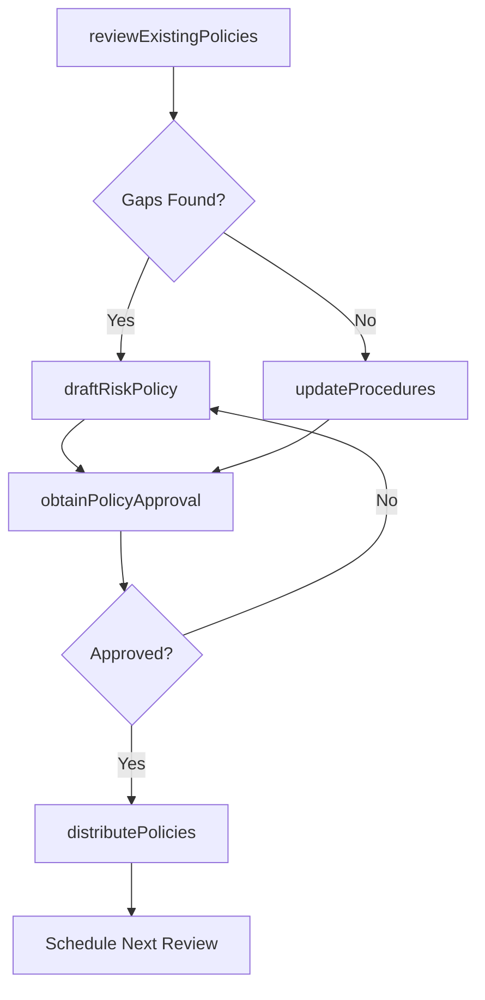

# Develop and maintain enterprise risk policies and procedures

> Business-as-Code definition for creating and maintaining the policies, procedures, and governance structures that guide enterprise-wide risk management practices.

## Overview

Establishing and maintaining the policies and procedures for managing risk. Create rules and regulations for enterprise risk dealing with hazardous, financial, operational, and strategic risks.

## Process Hierarchy



## GraphDL

```yaml
develop:
  object: And Maintain Enterprise Risk Policies And Procedures
  actor: RiskPolicyManager
  result: EnterpriseRiskPolicyDocument
```

## Actions

| Action | Description |
|--------|-------------|
| draftRiskPolicy | Author new risk management policies based on tolerance thresholds |
| reviewExistingPolicies | Evaluate current policies for gaps and outdated provisions |
| updateProcedures | Revise risk procedures to reflect regulatory and organizational changes |
| obtainPolicyApproval | Route policy documents through governance review and approval |
| distributePolicies | Communicate approved policies to all relevant stakeholders |

## Events

| Event | Description |
|-------|-------------|
| riskPolicyDrafted | New risk management policy document created |
| policiesReviewed | Periodic review of existing policies completed |
| proceduresUpdated | Risk procedures revised and version-controlled |
| policyApproved | Risk policy approved by governance committee |
| policiesDistributed | Updated policies communicated to all stakeholders |

## Searches

| Search | Description |
|--------|-------------|
| findPoliciesByCategory | Retrieve risk policies filtered by risk category |
| getPolicyVersionHistory | Track revisions and changes to a specific policy |
| getExpiredPolicies | List policies that are overdue for review |
| searchPolicyByRegulation | Find policies linked to specific regulatory requirements |

## Process Flow



## RACI Matrix

| Activity | Responsible | Accountable | Consulted | Informed |
|----------|-------------|-------------|-----------|----------|
| draftRiskPolicy | RiskPolicyManager | ChiefRiskOfficer | Legal | AllDepartments |
| reviewExistingPolicies | RiskAnalyst | RiskPolicyManager | Compliance | AuditCommittee |
| updateProcedures | RiskPolicyManager | ChiefRiskOfficer | OperationsTeam | BusinessUnitLeads |
| obtainPolicyApproval | ChiefRiskOfficer | BoardOfDirectors | GeneralCounsel | ExecutiveTeam |

## Related Processes

| Process | Relationship |
|---------|-------------|
| 11.1.1.1 Determine risk tolerance for organization | Upstream - tolerance drives policy content |
| 11.1.1.3 Identify and implement enterprise risk management tools | Downstream - policies guide tool selection |
| 11.1.4.2 Assess risks using enterprise risk framework policies and procedures | Consumer - uses policies as assessment criteria |
| 11.2.1.1 Develop enterprise compliance policies and procedures | Parallel - compliance alignment |

## Related Departments

| Department | Role |
|-----------|------|
| Enterprise Risk Management | Primary author and owner of risk policies |
| Legal | Ensures policies meet regulatory requirements |
| Compliance | Aligns risk policies with compliance obligations |
| Internal Audit | Reviews policy effectiveness and adherence |

## Related Occupations

| Occupation | Involvement |
|-----------|-------------|
| Risk Policy Manager | Primary author and maintainer |
| Chief Risk Officer | Governance oversight and approval |
| Compliance Officer | Regulatory alignment review |
| Internal Auditor | Policy effectiveness assessment |

## KPIs

| KPI | Description | Unit |
|-----|-------------|------|
| Policy Coverage | Percentage of identified risk categories with formal policies | % |
| Policy Currency | Percentage of policies reviewed within the designated cycle | % |
| Policy Compliance Rate | Degree of organizational adherence to risk policies | % |
| Time to Policy Update | Average time from identified gap to approved policy update | Days |

## Usage

```typescript
import { developAndMaintainEnterpriseRiskPoliciesAndProcedures } from '@headlessly/develop-and-maintain-enterprise-risk-policies-and-procedures'

const policies = developAndMaintainEnterpriseRiskPoliciesAndProcedures()

// Review existing policies for gaps
const review = await policies.reviewExistingPolicies({
  categories: ['financial', 'operational', 'strategic'],
  lastReviewedBefore: '2025-01-01'
})

// Draft a new risk policy
const draft = await policies.draftRiskPolicy({
  category: 'cybersecurity',
  toleranceLevel: 'low',
  regulatoryBasis: ['SOX', 'GDPR']
})
```
