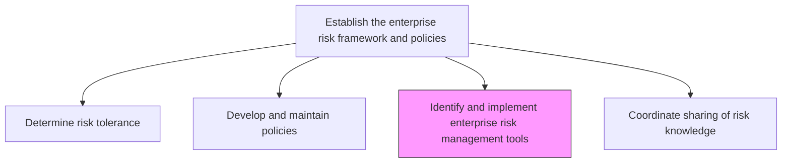
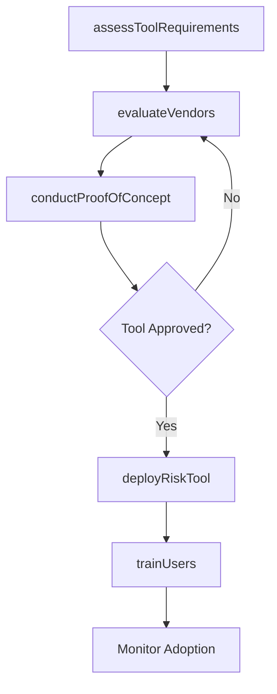

# Identify and implement enterprise risk management tools

> Business-as-Code definition for evaluating, selecting, and deploying risk management tools, platforms, and methodologies to support enterprise-wide risk identification, assessment, and monitoring.

## Overview

Recognizing and implementing tools for managing risk. Identify and apply enterprise risk management tools. Leverage methods and processes to manage risks and opportunities associated with business objectives.

## Process Hierarchy



## GraphDL

```yaml
identify:
  object: And Implement Enterprise Risk Management Tools
  actor: RiskTechnologyManager
  result: RiskManagementToolset
```

## Actions

| Action | Description |
|--------|-------------|
| assessToolRequirements | Gather requirements from risk teams for tool capabilities |
| evaluateVendors | Compare GRC platforms and risk analytics tools against criteria |
| conductProofOfConcept | Run pilot programs to validate tool effectiveness |
| deployRiskTool | Implement and configure selected risk management tools |
| trainUsers | Provide training to risk practitioners on new tools |

## Events

| Event | Description |
|-------|-------------|
| toolRequirementsAssessed | Risk tool requirements gathered and documented |
| vendorsEvaluated | Vendor comparison and scoring completed |
| proofOfConceptCompleted | Pilot program results evaluated |
| riskToolDeployed | Risk management tool implemented in production |
| usersTrainedOnTool | Risk practitioners trained on new tool capabilities |

## Searches

| Search | Description |
|--------|-------------|
| getActiveRiskTools | List all currently deployed risk management tools |
| findToolsByCapability | Search tools by specific risk management capability |
| getToolUtilizationMetrics | Retrieve usage and adoption metrics for risk tools |
| getVendorEvaluations | Access completed vendor assessments and scorecards |

## Process Flow



## RACI Matrix

| Activity | Responsible | Accountable | Consulted | Informed |
|----------|-------------|-------------|-----------|----------|
| assessToolRequirements | RiskTechnologyManager | ChiefRiskOfficer | BusinessUnitLeads | IT |
| evaluateVendors | RiskTechnologyManager | ChiefRiskOfficer | Procurement | Finance |
| deployRiskTool | ITProjectManager | CIO | RiskTeam | AllUsers |
| trainUsers | TrainingCoordinator | RiskTechnologyManager | HumanResources | Management |

## Related Processes

| Process | Relationship |
|---------|-------------|
| 11.1.1.2 Develop and maintain enterprise risk policies and procedures | Upstream - policies define tool requirements |
| 11.1.2.1 Identify enterprise level risks | Consumer - tools support risk identification |
| 11.2.1.4 Maintain controls-related technologies and tools | Parallel - shared technology governance |
| 8.1.1 Develop the information technology strategy | Upstream - IT strategy alignment |

## Related Departments

| Department | Role |
|-----------|------|
| Enterprise Risk Management | Defines tool requirements and manages adoption |
| Information Technology | Deploys and maintains risk technology infrastructure |
| Procurement | Manages vendor selection and contracting |
| Finance | Budget approval for tool investments |

## Related Occupations

| Occupation | Involvement |
|-----------|-------------|
| Risk Technology Manager | Primary evaluator and implementer |
| GRC Platform Administrator | Day-to-day tool management |
| IT Project Manager | Deployment coordination |
| Risk Analyst | End user and requirements contributor |

## KPIs

| KPI | Description | Unit |
|-----|-------------|------|
| Tool Adoption Rate | Percentage of risk practitioners actively using deployed tools | % |
| Risk Coverage | Percentage of risk categories supported by automated tools | % |
| Implementation Timeline | Time from tool selection to full deployment | Days |
| User Satisfaction | Risk practitioner satisfaction with tool capabilities | Score (1-5) |

## Usage

```typescript
import { identifyAndImplementEnterpriseRiskManagementTools } from '@headlessly/identify-and-implement-enterprise-risk-management-tools'

const tools = identifyAndImplementEnterpriseRiskManagementTools()

// Evaluate vendors for a GRC platform
const evaluation = await tools.evaluateVendors({
  capabilities: ['risk-register', 'heat-maps', 'scenario-analysis'],
  budget: 250000,
  deploymentModel: 'cloud'
})

// Deploy selected tool
const deployment = await tools.deployRiskTool({
  vendorId: evaluation.topCandidate.id,
  modules: ['risk-assessment', 'control-monitoring'],
  rolloutPhase: 'pilot'
})
```
