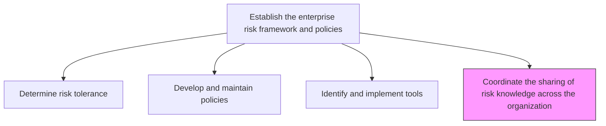
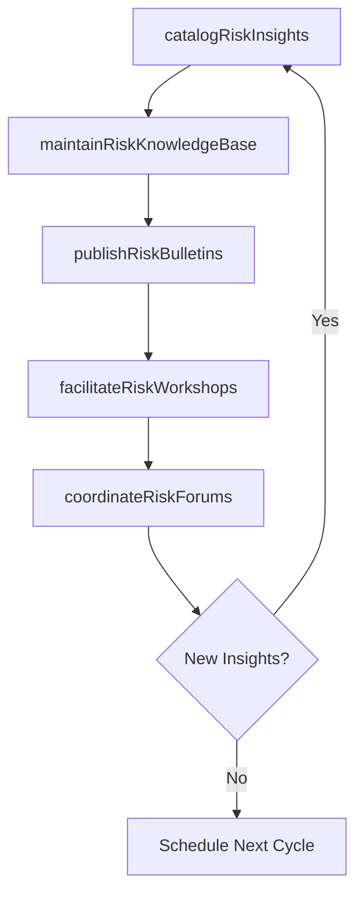

# Coordinate the sharing of risk knowledge across the organization

> Business-as-Code definition for facilitating the cross-functional dissemination of risk intelligence, lessons learned, and best practices throughout the organization.

## Overview

Communicating the knowledge about risk within the organization. Identify operational risks. Share risk information within the organization.

## Process Hierarchy



## GraphDL

```yaml
coordinate:
  object: Sharing Of Risk Knowledge Across Organization
  actor: RiskCommunicationsManager
  result: RiskKnowledgeRepository
```

## Actions

| Action | Description |
|--------|-------------|
| catalogRiskInsights | Document risk events, lessons learned, and emerging threats |
| publishRiskBulletins | Distribute periodic risk intelligence updates to stakeholders |
| facilitateRiskWorkshops | Organize cross-functional risk awareness and training sessions |
| maintainRiskKnowledgeBase | Curate a centralized repository of risk information and best practices |
| coordinateRiskForums | Manage regular risk committee meetings and discussion forums |

## Events

| Event | Description |
|-------|-------------|
| riskInsightsCataloged | New risk insight or lesson learned documented |
| riskBulletinPublished | Periodic risk intelligence bulletin distributed |
| riskWorkshopCompleted | Cross-functional risk awareness session held |
| knowledgeBaseUpdated | Risk knowledge repository content refreshed |
| riskForumConducted | Risk committee meeting or forum completed |

## Searches

| Search | Description |
|--------|-------------|
| searchRiskKnowledgeBase | Query the centralized risk knowledge repository |
| getRiskBulletins | Retrieve published risk bulletins by topic or date |
| findLessonsLearned | Locate documented lessons from past risk events |
| getRiskForumMinutes | Access minutes and action items from risk forums |

## Process Flow



## RACI Matrix

| Activity | Responsible | Accountable | Consulted | Informed |
|----------|-------------|-------------|-----------|----------|
| catalogRiskInsights | RiskAnalyst | RiskCommunicationsManager | BusinessUnitLeads | AllEmployees |
| publishRiskBulletins | RiskCommunicationsManager | ChiefRiskOfficer | CorporateCommunications | ExecutiveTeam |
| facilitateRiskWorkshops | TrainingCoordinator | RiskCommunicationsManager | SubjectMatterExperts | Departments |
| coordinateRiskForums | RiskCommunicationsManager | ChiefRiskOfficer | RiskCommittee | BoardOfDirectors |

## Related Processes

| Process | Relationship |
|---------|-------------|
| 11.1.1.5 Prepare and report enterprise risk to executive management and board | Downstream - knowledge feeds executive reporting |
| 11.4.5 Share knowledge of specific risks across other parts of the organization | Parallel - operational risk knowledge sharing |
| 11.1.3.1 Ensure each business unit follows the enterprise risk management process | Supporting - knowledge sharing enables compliance |
| 7.3.1 Create and manage employee communications | Parallel - internal communications alignment |

## Related Departments

| Department | Role |
|-----------|------|
| Enterprise Risk Management | Curates and coordinates risk knowledge |
| Corporate Communications | Supports risk messaging and distribution channels |
| Human Resources | Integrates risk knowledge into training programs |
| All Business Units | Contribute and consume risk intelligence |

## Related Occupations

| Occupation | Involvement |
|-----------|-------------|
| Risk Communications Manager | Primary coordinator of knowledge sharing |
| Risk Analyst | Content contributor and curator |
| Training Coordinator | Workshop facilitation |
| Knowledge Management Specialist | Repository management |

## KPIs

| KPI | Description | Unit |
|-----|-------------|------|
| Knowledge Reach | Percentage of employees accessing risk knowledge resources | % |
| Bulletin Frequency | Number of risk bulletins published per period | Per Quarter |
| Workshop Attendance | Average attendance rate for risk awareness sessions | % |
| Insight Contribution Rate | Number of new risk insights contributed by business units | Per Month |

## Usage

```typescript
import { coordinateSharingOfRiskKnowledgeAcrossOrganization } from '@headlessly/coordinate-sharing-of-risk-knowledge-across-organization'

const knowledge = coordinateSharingOfRiskKnowledgeAcrossOrganization()

// Publish a risk bulletin
const bulletin = await knowledge.publishRiskBulletins({
  topic: 'supply-chain-disruption',
  severity: 'high',
  audience: ['operations', 'procurement', 'executive-team']
})

// Search the risk knowledge base
const insights = await knowledge.searchRiskKnowledgeBase({
  keywords: ['cybersecurity', 'ransomware'],
  dateRange: { from: '2025-01-01', to: '2025-12-31' }
})
```
