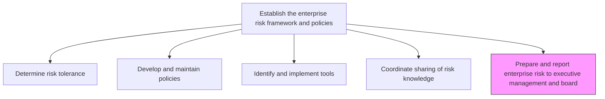
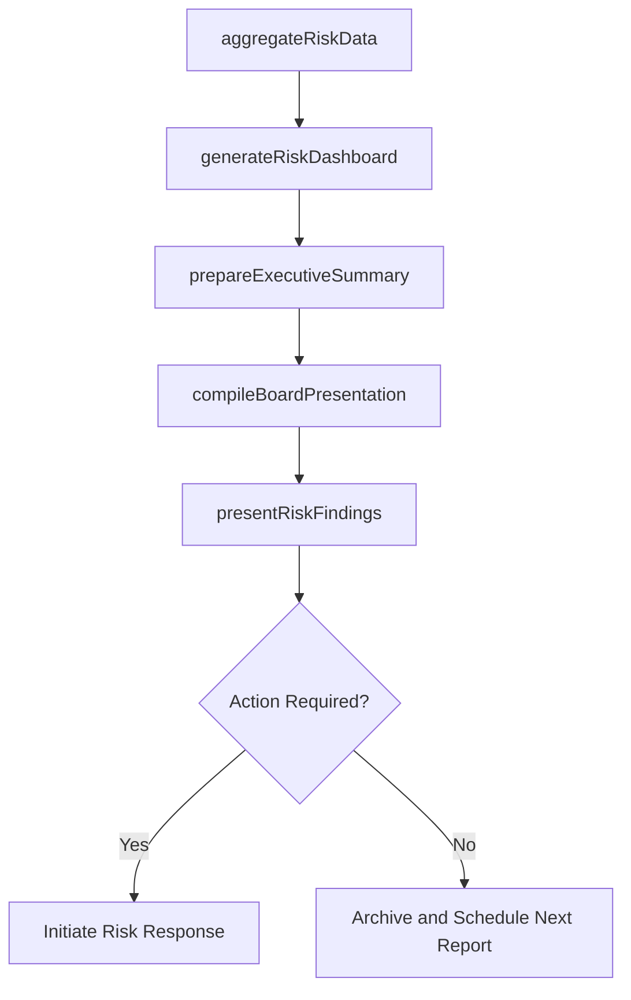

# Prepare and report enterprise risk to executive management and board

> Business-as-Code definition for aggregating enterprise risk data and producing executive-level reports and board presentations on the organization's risk profile.

## Overview

Preparing and presenting reports about enterprise risk to the management of the organization. Create reports for management on hazard risks (e.g., property damage and liability torts), financial risks (e.g., currency and liquidity risks), and operational risks (e.g., product failure, customer satisfaction, social trends, and competition).

## Process Hierarchy



## GraphDL

```yaml
prepare:
  object: And Report Enterprise Risk To Executive Management And Board
  actor: RiskReportingAnalyst
  result: EnterpriseRiskReport
```

## Actions

| Action | Description |
|--------|-------------|
| aggregateRiskData | Collect and consolidate risk exposure data across all business units |
| generateRiskDashboard | Create visual dashboards showing key risk indicators and trends |
| prepareExecutiveSummary | Draft concise executive summaries of the enterprise risk profile |
| compileBoardPresentation | Assemble formal board-level risk report with recommendations |
| presentRiskFindings | Deliver risk reports to executive management and board committees |

## Events

| Event | Description |
|-------|-------------|
| riskDataAggregated | Enterprise-wide risk data consolidated for reporting period |
| riskDashboardGenerated | Key risk indicator dashboard produced |
| executiveSummaryPrepared | Executive risk summary drafted and reviewed |
| boardPresentationCompiled | Board-level risk presentation assembled |
| riskFindingsPresented | Risk report delivered to executive management or board |

## Searches

| Search | Description |
|--------|-------------|
| getRiskReports | Retrieve historical enterprise risk reports by period |
| getRiskDashboardMetrics | Access current key risk indicator dashboard data |
| getBoardReportHistory | List board-level risk presentations and their outcomes |
| getTopRisksByCategory | Retrieve highest-priority risks across categories |

## Process Flow



## RACI Matrix

| Activity | Responsible | Accountable | Consulted | Informed |
|----------|-------------|-------------|-----------|----------|
| aggregateRiskData | RiskReportingAnalyst | RiskManager | BusinessUnitLeads | DataAnalytics |
| generateRiskDashboard | RiskReportingAnalyst | ChiefRiskOfficer | IT | ExecutiveTeam |
| prepareExecutiveSummary | RiskManager | ChiefRiskOfficer | CFO | GeneralCounsel |
| presentRiskFindings | ChiefRiskOfficer | CEO | BoardOfDirectors | AuditCommittee |

## Related Processes

| Process | Relationship |
|---------|-------------|
| 11.1.1.4 Coordinate the sharing of risk knowledge across the organization | Upstream - knowledge feeds reporting |
| 11.1.2.6 Report on enterprise risk activities | Parallel - operational risk reporting |
| 11.2.2.8 Compile and communicate internal and regulatory compliance reports | Parallel - compliance reporting alignment |
| 9.5.2 Manage financial reporting | Parallel - financial risk data integration |

## Related Departments

| Department | Role |
|-----------|------|
| Enterprise Risk Management | Prepares and delivers risk reports |
| Finance | Provides financial risk data and analysis |
| Internal Audit | Contributes assurance findings to risk reporting |
| Corporate Secretary | Coordinates board presentation logistics |

## Related Occupations

| Occupation | Involvement |
|-----------|-------------|
| Risk Reporting Analyst | Report preparation and data aggregation |
| Chief Risk Officer | Presenter and content owner |
| Data Visualization Specialist | Dashboard design |
| Board Secretary | Presentation coordination |

## KPIs

| KPI | Description | Unit |
|-----|-------------|------|
| Reporting Timeliness | Percentage of risk reports delivered on schedule | % |
| Report Accuracy | Number of corrections required post-distribution | Count |
| Board Engagement | Percentage of risk recommendations acted upon by board | % |
| Data Freshness | Age of most recent data in risk reports | Days |

## Usage

```typescript
import { prepareAndReportEnterpriseRiskToExecutiveManagementAndBoard } from '@headlessly/prepare-and-report-enterprise-risk-to-executive-management-and-board'

const reporting = prepareAndReportEnterpriseRiskToExecutiveManagementAndBoard()

// Aggregate risk data for quarterly report
const data = await reporting.aggregateRiskData({
  period: 'Q4-2025',
  businessUnits: 'all',
  categories: ['hazard', 'financial', 'operational', 'strategic']
})

// Generate executive dashboard
const dashboard = await reporting.generateRiskDashboard({
  metrics: ['risk-exposure', 'mitigation-progress', 'tolerance-breaches'],
  format: 'interactive'
})
```
