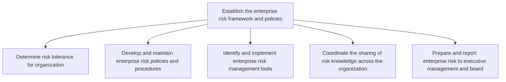
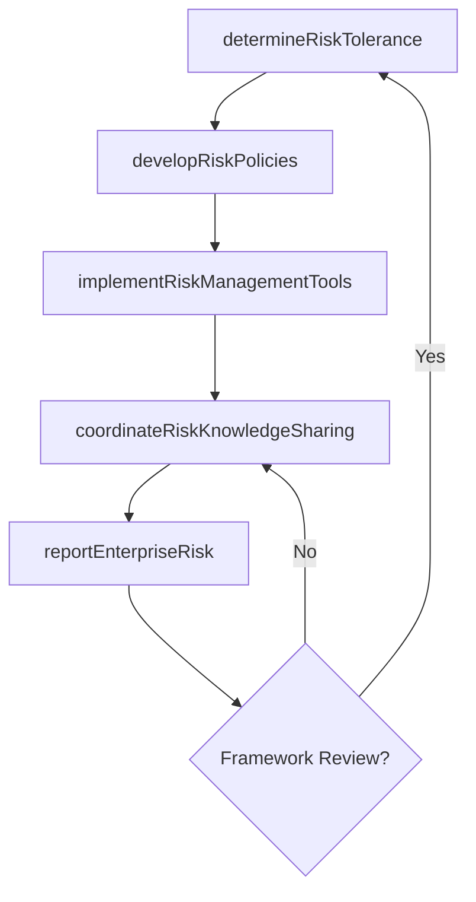

# Establish the enterprise risk framework and policies

> Business-as-Code definition for defining organizational risk tolerance, developing enterprise risk policies and procedures, implementing risk management tools, and coordinating risk knowledge sharing across the organization.

## Overview

Creating an agenda for the rules and regulations of enterprise risk that deal with hazardous, financial, operational, and strategic risks.

## Process Hierarchy



## GraphDL

```yaml
establish:
  object: Enterprise Risk Framework And Policies
  actor: ChiefRiskOfficer
  result: EnterpriseRiskFramework
```

## Actions

| Action | Description |
|--------|-------------|
| determineRiskTolerance | Define risk appetite and tolerance thresholds for the organization |
| developRiskPolicies | Create and maintain enterprise risk management policies and procedures |
| implementRiskManagementTools | Select and deploy GRC platforms and risk assessment tools |
| coordinateRiskKnowledgeSharing | Facilitate cross-functional communication of risk intelligence |
| reportEnterpriseRisk | Prepare risk dashboards and reports for executive management and board |

## Events

| Event | Description |
|-------|-------------|
| riskToleranceDetermined | Organizational risk appetite and tolerance levels approved |
| riskPoliciesDeveloped | Enterprise risk policies and procedures published |
| riskManagementToolsImplemented | GRC platform or risk assessment tools deployed |
| riskKnowledgeShared | Risk intelligence distributed across business units |
| enterpriseRiskReported | Risk report delivered to executive management or board |

## Searches

| Search | Description |
|--------|-------------|
| getRiskTolerance | Retrieve current risk appetite and tolerance thresholds by risk category |
| findRiskPolicies | Query risk policies by domain, jurisdiction, or effective date |
| getRiskReport | Retrieve enterprise risk reports by period or risk category |
| findRiskManagementTools | List deployed GRC tools and their coverage areas |

## Process Flow



## RACI Matrix

| Activity | Responsible | Accountable | Consulted | Informed |
|----------|-------------|-------------|-----------|----------|
| determineRiskTolerance | ChiefRiskOfficer | CEO | Board | AllBusinessUnits |
| developRiskPolicies | RiskPolicyManager | ChiefRiskOfficer | Legal | Compliance |
| implementRiskManagementTools | RiskAnalyst | ChiefRiskOfficer | IT | Finance |
| coordinateRiskKnowledgeSharing | RiskCoordinator | ChiefRiskOfficer | BusinessUnitLeads | HR |
| reportEnterpriseRisk | RiskAnalyst | ChiefRiskOfficer | Finance | Board |

## Sub-Processes

| ID | Name | Description |
|----|------|-------------|
| 11.1.1.1 | Determine risk tolerance for organization | Recognizing the organization's tolerance for risk, given risk-return trade-offs for one or more anti |
| 11.1.1.2 | Develop and maintain enterprise risk policies and procedures | Establishing and maintaining the policies and procedures for managing risk. Create rules and regulat |
| 11.1.1.3 | Identify and implement enterprise risk management tools | Recognizing and implementing tools for managing risk. Identify and apply enterprise risk management  |
| 11.1.1.4 | Coordinate the sharing of risk knowledge across the organization | Communicating the knowledge about risk within the organization. Identify operational risks. Share ri |
| 11.1.1.5 | Prepare and report enterprise risk to executive management and board | Preparing and presenting reports about enterprise risk to the management of the organization. Create |

## Related Processes

| Process | Relationship |
|---------|-------------|
| 11.1.2 Oversee and coordinate enterprise risk management activities | Downstream - framework guides enterprise-wide risk coordination |
| 11.1.3 Coordinate business unit and functional risk management activities | Downstream - policies cascade to business unit risk management |
| 11.2.1 Establish compliance framework and policies | Parallel - risk framework aligns with compliance framework |

## Related Departments

| Department | Role |
|-----------|------|
| Enterprise Risk Management | Develops and maintains the risk framework and policies |
| Legal | Advises on regulatory risk exposure and liability |
| Internal Audit | Validates risk controls and framework effectiveness |
| Information Technology | Deploys and maintains GRC platforms and tools |

## Related Occupations

| Occupation | Involvement |
|-----------|-------------|
| Chief Risk Officer | Sponsors and governs the enterprise risk framework |
| Risk Policy Manager | Drafts and maintains risk policies and procedures |
| Risk Analyst | Assesses risks and produces risk reports |

## KPIs

| KPI | Description | Unit |
|-----|-------------|------|
| Risk Policy Coverage | Percentage of organizational risk domains covered by formal policies | % |
| Risk Tolerance Breach Rate | Number of risk events exceeding tolerance thresholds per quarter | Count |
| GRC Tool Adoption | Percentage of business units actively using the enterprise GRC platform | % |
| Risk Reporting Timeliness | Percentage of risk reports delivered on or before deadline | % |

## Usage

```typescript
import { establishEnterpriseRiskFrameworkAndPolicies } from '@headlessly/establish-enterprise-risk-framework-and-policies'

const framework = establishEnterpriseRiskFrameworkAndPolicies()

// Define risk tolerance thresholds
const tolerance = await framework.determineRiskTolerance({
  riskCategories: ['operational', 'financial', 'strategic', 'compliance'],
  appetiteLevel: 'moderate',
  reviewCycle: 'annual'
})

// Prepare enterprise risk report for the board
const report = await framework.reportEnterpriseRisk({
  period: '2025-Q2',
  audience: 'board',
  includeHeatMap: true,
  topRisksCount: 10
})
```
