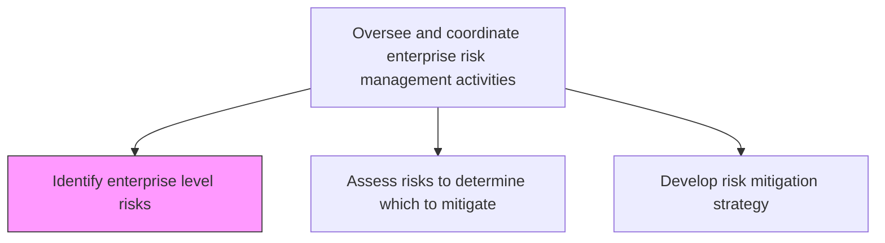
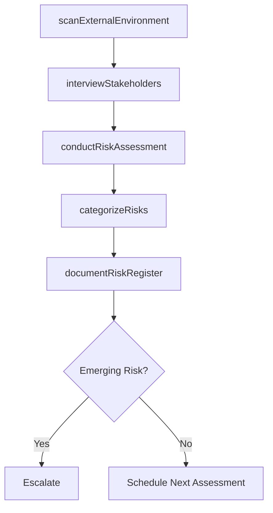

# Identify enterprise level risks

> Business-as-Code definition for systematically identifying strategic, operational, financial, and compliance risks that could impede the organization's ability to achieve its objectives.

## Overview

Determining risks that could thwart objectives. Document and communicate the concern.

## Process Hierarchy



## GraphDL

```yaml
identify:
  object: Enterprise Level Risks
  actor: EnterpriseRiskManager
  result: RiskRegister
```

## Actions

| Action | Description |
|--------|-------------|
| conductRiskAssessment | Perform structured assessment to uncover potential risks |
| scanExternalEnvironment | Monitor external threats including regulatory, economic, and geopolitical factors |
| interviewStakeholders | Gather risk intelligence from business unit leaders and subject matter experts |
| categorizeRisks | Classify identified risks by type, impact, and likelihood |
| documentRiskRegister | Record identified risks in the enterprise risk register with full details |

## Events

| Event | Description |
|-------|-------------|
| riskAssessmentConducted | Structured risk assessment cycle completed |
| externalThreatIdentified | New external risk factor detected through environmental scanning |
| riskCategorized | Newly identified risk classified and scored |
| riskRegisterUpdated | Enterprise risk register updated with new entries |
| emergingRiskFlagged | Previously unknown risk identified and escalated |

## Searches

| Search | Description |
|--------|-------------|
| getRiskRegister | Retrieve the full enterprise risk register |
| findRisksByCategory | Filter risks by strategic, operational, financial, or compliance category |
| getEmergingRisks | List newly identified or trending risk factors |
| getRisksByBusinessUnit | Retrieve risks associated with a specific business unit |

## Process Flow



## RACI Matrix

| Activity | Responsible | Accountable | Consulted | Informed |
|----------|-------------|-------------|-----------|----------|
| conductRiskAssessment | EnterpriseRiskManager | ChiefRiskOfficer | BusinessUnitLeads | AuditCommittee |
| scanExternalEnvironment | RiskAnalyst | EnterpriseRiskManager | Strategy | ExecutiveTeam |
| categorizeRisks | RiskAnalyst | EnterpriseRiskManager | SubjectMatterExperts | Compliance |
| documentRiskRegister | RiskAnalyst | EnterpriseRiskManager | AllDepartments | BoardOfDirectors |

## Related Processes

| Process | Relationship |
|---------|-------------|
| 11.1.2.2 Assess risks to determine which to mitigate | Downstream - identified risks feed assessment |
| 11.1.1.1 Determine risk tolerance for organization | Upstream - tolerance guides identification scope |
| 11.1.4.1 Identify risks | Parallel - business unit level identification |
| 1.1.1 Assess the external environment | Upstream - environmental analysis inputs |

## Related Departments

| Department | Role |
|-----------|------|
| Enterprise Risk Management | Leads risk identification process |
| Strategy | Provides strategic risk context |
| Operations | Identifies operational vulnerabilities |
| Finance | Highlights financial risk exposures |

## Related Occupations

| Occupation | Involvement |
|-----------|-------------|
| Enterprise Risk Manager | Process owner and facilitator |
| Risk Analyst | Research and documentation |
| Business Unit Director | Risk intelligence contributor |
| Chief Risk Officer | Oversight and escalation |

## KPIs

| KPI | Description | Unit |
|-----|-------------|------|
| Risk Identification Coverage | Percentage of business areas assessed for risks | % |
| New Risks Identified | Number of new risks added to register per period | Count |
| Time to Identify | Average time from risk emergence to formal identification | Days |
| Assessment Completion Rate | Percentage of scheduled risk assessments completed on time | % |

## Usage

```typescript
import { identifyEnterpriseLevelRisks } from '@headlessly/identify-enterprise-level-risks'

const riskIdentification = identifyEnterpriseLevelRisks()

// Conduct an enterprise-wide risk assessment
const assessment = await riskIdentification.conductRiskAssessment({
  scope: 'enterprise-wide',
  categories: ['strategic', 'operational', 'financial', 'compliance'],
  period: 'Q1-2026'
})

// Scan for external threats
const threats = await riskIdentification.scanExternalEnvironment({
  domains: ['regulatory', 'geopolitical', 'economic', 'technology'],
  regions: ['North America', 'Europe']
})
```
