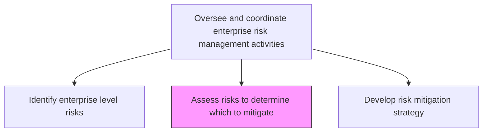
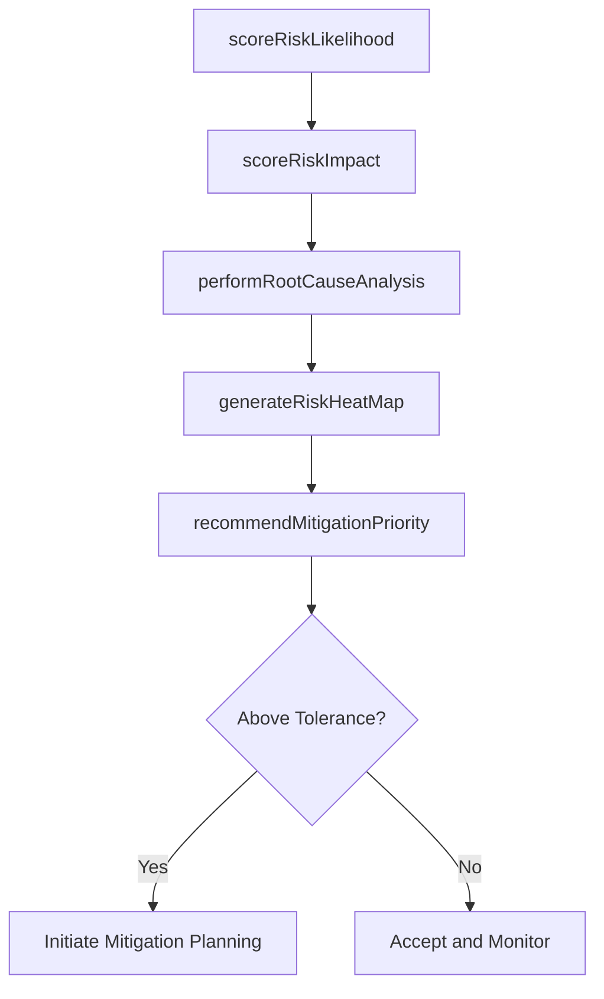

# Assess risks to determine which to mitigate

> Business-as-Code definition for evaluating identified enterprise risks using quantitative and qualitative methods to prioritize which risks require active mitigation.

## Overview

Identifying options/actions to enhance opportunities and reduce threats. Recognize the root reasons of the identified risks.

## Process Hierarchy



## GraphDL

```yaml
assess:
  object: Risks To Determine Which To Mitigate
  actor: RiskAssessmentAnalyst
  result: PrioritizedRiskMatrix
```

## Actions

| Action | Description |
|--------|-------------|
| scoreRiskLikelihood | Rate the probability of each risk materializing |
| scoreRiskImpact | Evaluate the potential business impact of each risk |
| performRootCauseAnalysis | Investigate the underlying causes of identified risks |
| generateRiskHeatMap | Create visual risk prioritization matrices |
| recommendMitigationPriority | Rank risks by priority for mitigation action |

## Events

| Event | Description |
|-------|-------------|
| riskLikelihoodScored | Probability rating assigned to a risk |
| riskImpactScored | Business impact assessment completed for a risk |
| rootCauseIdentified | Underlying cause of a risk determined |
| riskHeatMapGenerated | Visual risk prioritization matrix created |
| mitigationPrioritySet | Risk mitigation priority ranking established |

## Searches

| Search | Description |
|--------|-------------|
| getRisksByPriority | Retrieve risks ranked by mitigation priority |
| getRiskHeatMap | Access the current enterprise risk heat map |
| findHighImpactRisks | List risks exceeding specified impact thresholds |
| getRootCauseAnalysis | Retrieve root cause analysis for a specific risk |

## Process Flow



## RACI Matrix

| Activity | Responsible | Accountable | Consulted | Informed |
|----------|-------------|-------------|-----------|----------|
| scoreRiskLikelihood | RiskAssessmentAnalyst | EnterpriseRiskManager | BusinessUnitLeads | AuditCommittee |
| scoreRiskImpact | RiskAssessmentAnalyst | EnterpriseRiskManager | Finance | ExecutiveTeam |
| performRootCauseAnalysis | RiskAnalyst | RiskAssessmentAnalyst | SubjectMatterExperts | Compliance |
| recommendMitigationPriority | EnterpriseRiskManager | ChiefRiskOfficer | CFO | BoardOfDirectors |

## Related Processes

| Process | Relationship |
|---------|-------------|
| 11.1.2.1 Identify enterprise level risks | Upstream - provides risks for assessment |
| 11.1.2.3 Develop risk mitigation and management strategy | Downstream - assessment drives strategy |
| 11.1.1.1 Determine risk tolerance for organization | Upstream - tolerance defines assessment criteria |
| 11.1.4.2 Assess risks using enterprise risk framework | Parallel - business unit level assessment |

## Related Departments

| Department | Role |
|-----------|------|
| Enterprise Risk Management | Conducts assessments and determines priorities |
| Finance | Quantifies financial impact of risks |
| Operations | Provides operational risk context |
| Internal Audit | Validates assessment methodology |

## Related Occupations

| Occupation | Involvement |
|-----------|-------------|
| Risk Assessment Analyst | Primary assessor and scorer |
| Enterprise Risk Manager | Oversight and final prioritization |
| Actuary | Quantitative risk modeling |
| Internal Auditor | Assessment methodology review |

## KPIs

| KPI | Description | Unit |
|-----|-------------|------|
| Assessment Cycle Time | Time from risk identification to prioritization | Days |
| Risk Scoring Accuracy | Percentage of risk scores validated by actual outcomes | % |
| High-Priority Risk Coverage | Percentage of high-priority risks with active mitigation plans | % |
| Assessment Completion Rate | Percentage of identified risks assessed within the cycle | % |

## Usage

```typescript
import { assessRisksToDetermineWhichToMitigate } from '@headlessly/assess-risks-to-determine-which-to-mitigate'

const assessment = assessRisksToDetermineWhichToMitigate()

// Score risk likelihood and impact
const scored = await assessment.scoreRiskLikelihood({
  riskId: 'RISK-2026-042',
  likelihood: 0.35,
  confidenceLevel: 'medium'
})

// Generate risk heat map
const heatMap = await assessment.generateRiskHeatMap({
  scope: 'enterprise',
  categories: ['strategic', 'operational', 'financial'],
  period: 'Q1-2026'
})
```
