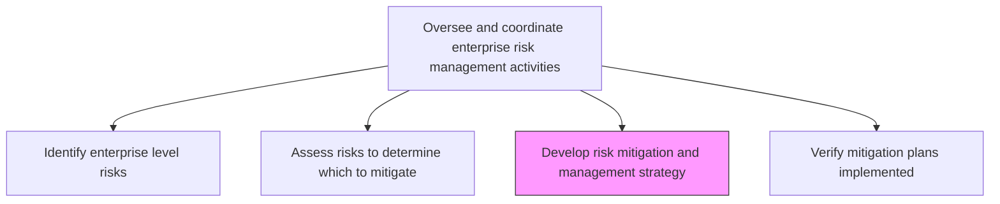
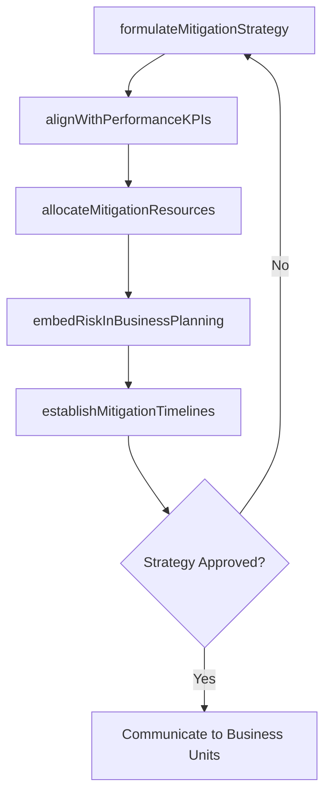

# Develop risk mitigation and management strategy and integrate with existing performance management processes

> Business-as-Code definition for formulating enterprise-wide risk mitigation strategies and embedding them into existing performance management frameworks and business processes.

## Overview

Developing activities to improve opportunities and lessen threats. Specify the organization's objectives. Evolve strategies and policies to attain these objectives. Assign resources to project objectives.

## Process Hierarchy



## GraphDL

```yaml
develop:
  object: Risk Mitigation And Management Strategy And Integrate With Existing Performance Management Processes
  actor: RiskStrategyDirector
  result: IntegratedRiskMitigationStrategy
```

## Actions

| Action | Description |
|--------|-------------|
| formulateMitigationStrategy | Design strategic approaches to address prioritized enterprise risks |
| alignWithPerformanceKPIs | Map risk mitigation activities to existing performance management metrics |
| allocateMitigationResources | Assign budgets, personnel, and tools to risk mitigation initiatives |
| embedRiskInBusinessPlanning | Integrate risk considerations into annual planning and budgeting cycles |
| establishMitigationTimelines | Set milestones and deadlines for mitigation strategy execution |

## Events

| Event | Description |
|-------|-------------|
| mitigationStrategyFormulated | Enterprise risk mitigation strategy drafted |
| strategyAlignedWithKPIs | Risk mitigation linked to performance management metrics |
| mitigationResourcesAllocated | Resources assigned to mitigation activities |
| riskEmbeddedInPlanning | Risk considerations integrated into business planning |
| mitigationTimelinesEstablished | Execution milestones and deadlines set |

## Searches

| Search | Description |
|--------|-------------|
| getMitigationStrategies | Retrieve mitigation strategies by risk category or priority |
| getResourceAllocations | View resource assignments for active mitigation efforts |
| getMitigationTimelines | Access milestones and progress for mitigation initiatives |
| findStrategyByPerformanceKPI | Locate mitigation strategies linked to specific KPIs |

## Process Flow



## RACI Matrix

| Activity | Responsible | Accountable | Consulted | Informed |
|----------|-------------|-------------|-----------|----------|
| formulateMitigationStrategy | RiskStrategyDirector | ChiefRiskOfficer | ExecutiveTeam | BoardOfDirectors |
| alignWithPerformanceKPIs | RiskManager | RiskStrategyDirector | PerformanceManagement | Finance |
| allocateMitigationResources | CFO | CEO | ChiefRiskOfficer | BusinessUnitLeads |
| embedRiskInBusinessPlanning | StrategyDirector | CEO | ChiefRiskOfficer | AllDepartments |

## Related Processes

| Process | Relationship |
|---------|-------------|
| 11.1.2.2 Assess risks to determine which to mitigate | Upstream - assessment drives strategy |
| 11.1.2.4 Verify business unit mitigation plans are implemented | Downstream - strategy guides implementation |
| 11.1.4.3 Develop mitigation plans for risks | Downstream - business unit plan development |
| 1.3.1 Develop strategic plan | Parallel - strategic planning integration |

## Related Departments

| Department | Role |
|-----------|------|
| Enterprise Risk Management | Develops and coordinates mitigation strategy |
| Strategy | Integrates risk into strategic planning |
| Finance | Allocates budgets for mitigation initiatives |
| Performance Management | Aligns risk metrics with performance KPIs |

## Related Occupations

| Occupation | Involvement |
|-----------|-------------|
| Risk Strategy Director | Primary strategy developer |
| Chief Risk Officer | Strategy approval and oversight |
| Performance Management Analyst | KPI alignment |
| Financial Planner | Resource allocation modeling |

## KPIs

| KPI | Description | Unit |
|-----|-------------|------|
| Strategy Alignment Score | Degree of alignment between risk mitigation and performance KPIs | % |
| Resource Utilization | Percentage of allocated mitigation budget effectively deployed | % |
| Milestone Adherence | Percentage of mitigation milestones met on schedule | % |
| Risk Reduction Rate | Measured decrease in risk exposure after strategy implementation | % |

## Usage

```typescript
import { developRiskMitigationAndManagementStrategy } from '@headlessly/develop-risk-mitigation-and-management-strategy-and-integrate-with-existing-performance-management-processes'

const strategy = developRiskMitigationAndManagementStrategy()

// Formulate mitigation strategy for prioritized risks
const plan = await strategy.formulateMitigationStrategy({
  risks: ['RISK-2026-001', 'RISK-2026-005', 'RISK-2026-012'],
  approach: 'risk-transfer',
  budgetLimit: 2000000
})

// Align with existing performance KPIs
const aligned = await strategy.alignWithPerformanceKPIs({
  strategyId: plan.id,
  kpis: ['operational-efficiency', 'revenue-growth', 'customer-satisfaction']
})
```
