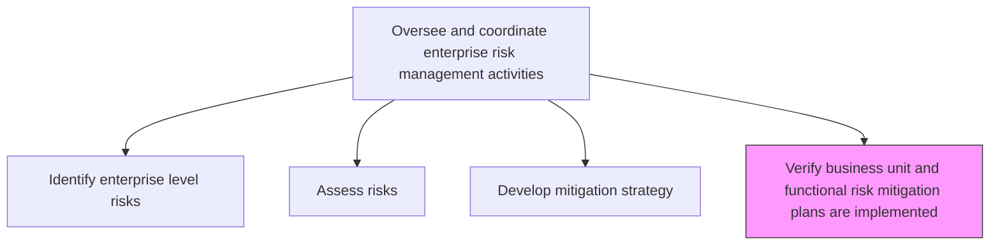
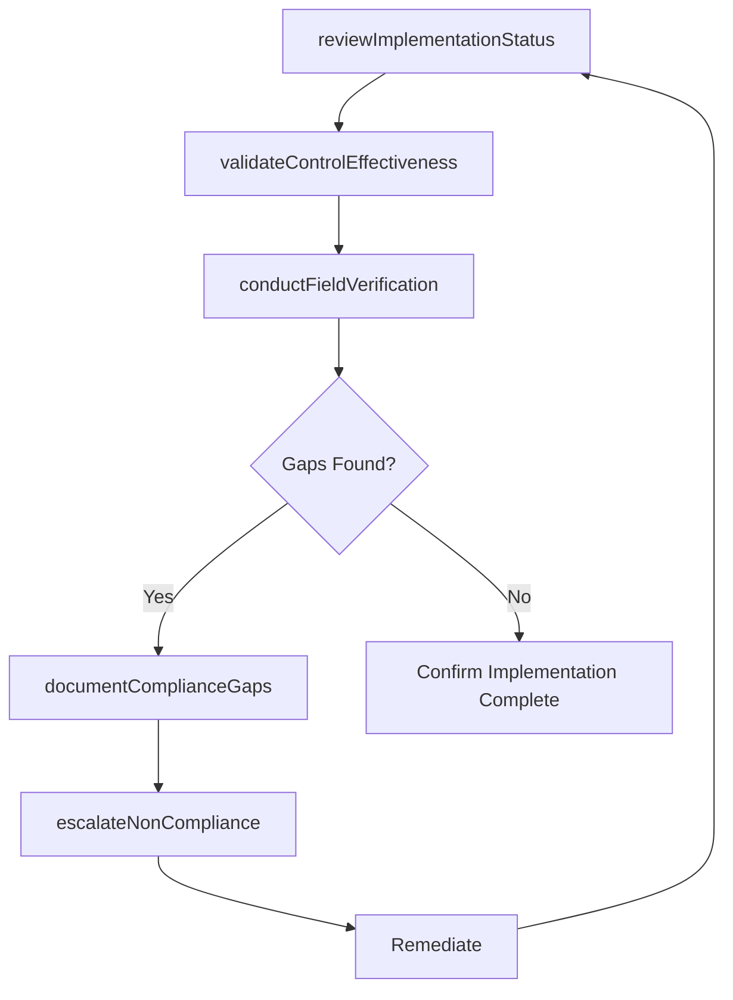

# Verify business unit and functional risk mitigation plans are implemented

> Business-as-Code definition for validating that approved risk mitigation plans are correctly implemented across all business units and functional areas.

## Overview

Checking that the blueprint created for managing risk in individual business units and divisions is correctly effectuated. Validate the implementation of all activities geared to mitigate risks.

## Process Hierarchy



## GraphDL

```yaml
verify:
  object: Business Unit And Functional Risk Mitigation Plans Are Implemented
  actor: RiskAssuranceManager
  result: ImplementationVerificationReport
```

## Actions

| Action | Description |
|--------|-------------|
| reviewImplementationStatus | Check progress of mitigation plan execution across business units |
| validateControlEffectiveness | Test whether implemented controls are operating as designed |
| conductFieldVerification | Perform on-site audits of mitigation activities |
| documentComplianceGaps | Record deviations between planned and actual implementation |
| escalateNonCompliance | Raise unresolved implementation gaps to senior management |

## Events

| Event | Description |
|-------|-------------|
| implementationStatusReviewed | Business unit mitigation progress assessed |
| controlEffectivenessValidated | Control testing completed with results documented |
| fieldVerificationConducted | On-site verification audit completed |
| complianceGapDocumented | Gap between planned and actual implementation recorded |
| nonComplianceEscalated | Unresolved gap escalated to senior management |

## Searches

| Search | Description |
|--------|-------------|
| getImplementationStatus | Retrieve mitigation plan implementation progress by business unit |
| findComplianceGaps | List gaps between planned and actual mitigation implementation |
| getVerificationHistory | Access historical verification reports |
| getControlTestResults | Retrieve results of control effectiveness testing |

## Process Flow



## RACI Matrix

| Activity | Responsible | Accountable | Consulted | Informed |
|----------|-------------|-------------|-----------|----------|
| reviewImplementationStatus | RiskAssuranceManager | ChiefRiskOfficer | BusinessUnitLeads | AuditCommittee |
| validateControlEffectiveness | InternalAuditor | RiskAssuranceManager | ControlOwners | Compliance |
| conductFieldVerification | RiskAssuranceManager | ChiefRiskOfficer | OperationsManagers | ExecutiveTeam |
| escalateNonCompliance | ChiefRiskOfficer | CEO | GeneralCounsel | BoardOfDirectors |

## Related Processes

| Process | Relationship |
|---------|-------------|
| 11.1.2.3 Develop risk mitigation and management strategy | Upstream - strategies define expected implementation |
| 11.1.2.5 Ensure risks and risk mitigation actions are monitored | Downstream - verified plans feed ongoing monitoring |
| 11.1.3.1 Ensure each business unit follows the enterprise risk management process | Parallel - process compliance verification |
| 11.2.1.3 Manage internal audits | Supporting - audit methodology for verification |

## Related Departments

| Department | Role |
|-----------|------|
| Enterprise Risk Management | Conducts verification activities |
| Internal Audit | Provides audit support and methodology |
| All Business Units | Subject to verification of implementation |
| Compliance | Reviews regulatory compliance of implemented controls |

## Related Occupations

| Occupation | Involvement |
|-----------|-------------|
| Risk Assurance Manager | Primary verifier |
| Internal Auditor | Control testing specialist |
| Business Unit Risk Coordinator | Local implementation liaison |
| Compliance Officer | Regulatory alignment review |

## KPIs

| KPI | Description | Unit |
|-----|-------------|------|
| Implementation Rate | Percentage of approved mitigation plans fully implemented | % |
| Verification Coverage | Percentage of business units verified per cycle | % |
| Gap Closure Rate | Percentage of documented gaps remediated within target timeframe | % |
| Control Effectiveness Score | Percentage of tested controls operating as designed | % |

## Usage

```typescript
import { verifyBusinessUnitAndFunctionalRiskMitigationPlansAreImplemented } from '@headlessly/verify-business-unit-and-functional-risk-mitigation-plans-are-implemented'

const verification = verifyBusinessUnitAndFunctionalRiskMitigationPlansAreImplemented()

// Review implementation status across business units
const status = await verification.reviewImplementationStatus({
  businessUnits: ['finance', 'operations', 'technology'],
  mitigationPlanId: 'PLAN-2026-003'
})

// Validate control effectiveness
const controlTest = await verification.validateControlEffectiveness({
  controlId: 'CTRL-2026-015',
  testingMethod: 'walkthrough',
  sampleSize: 25
})
```
