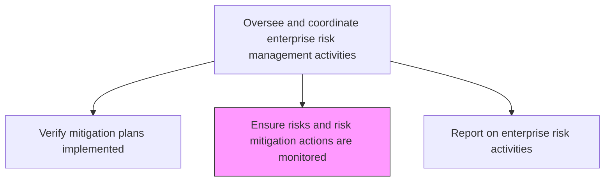
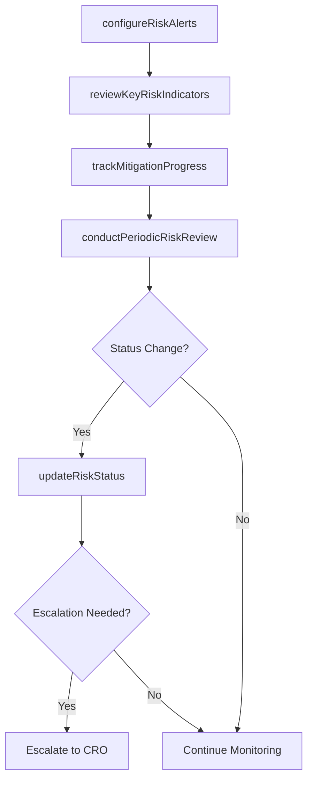

# Ensure risks and risk mitigation actions are monitored

> Business-as-Code definition for establishing and maintaining ongoing monitoring of identified risks and the effectiveness of mitigation actions across the enterprise.

## Overview

Ensuring risk monitoring and mitigation activities. Monitor actions to enhance opportunities and reduce threats to project objectives.

## Process Hierarchy



## GraphDL

```yaml
ensure:
  object: Risks And Risk Mitigation Actions Are Monitored
  actor: RiskMonitoringCoordinator
  result: RiskMonitoringDashboard
```

## Actions

| Action | Description |
|--------|-------------|
| configureRiskAlerts | Set up automated alerts for key risk indicators breaching thresholds |
| trackMitigationProgress | Monitor status and effectiveness of active mitigation initiatives |
| reviewKeyRiskIndicators | Analyze KRI trends and identify deteriorating risk positions |
| conductPeriodicRiskReview | Hold regular risk review meetings with business unit representatives |
| updateRiskStatus | Revise risk ratings and statuses based on monitoring data |

## Events

| Event | Description |
|-------|-------------|
| riskAlertTriggered | Key risk indicator exceeded defined threshold |
| mitigationProgressTracked | Mitigation initiative status updated |
| keyRiskIndicatorReviewed | KRI trend analysis completed |
| periodicRiskReviewConducted | Scheduled risk review meeting held |
| riskStatusUpdated | Risk rating or status revised based on new data |

## Searches

| Search | Description |
|--------|-------------|
| getActiveRiskAlerts | Retrieve currently triggered risk alerts |
| getMitigationProgress | Access progress data for active mitigation initiatives |
| getKRITrends | Retrieve key risk indicator trend data over time |
| getRiskReviewSchedule | View upcoming periodic risk review meetings |

## Process Flow



## RACI Matrix

| Activity | Responsible | Accountable | Consulted | Informed |
|----------|-------------|-------------|-----------|----------|
| configureRiskAlerts | RiskMonitoringCoordinator | EnterpriseRiskManager | IT | BusinessUnitLeads |
| trackMitigationProgress | RiskAnalyst | RiskMonitoringCoordinator | ProjectManagers | ChiefRiskOfficer |
| reviewKeyRiskIndicators | RiskAnalyst | RiskMonitoringCoordinator | Finance | AuditCommittee |
| conductPeriodicRiskReview | RiskMonitoringCoordinator | ChiefRiskOfficer | AllDepartments | ExecutiveTeam |

## Related Processes

| Process | Relationship |
|---------|-------------|
| 11.1.2.4 Verify business unit mitigation plans are implemented | Upstream - verified plans enter monitoring |
| 11.1.2.6 Report on enterprise risk activities | Downstream - monitoring data feeds reporting |
| 11.1.4.5 Monitor risks | Parallel - business unit level monitoring |
| 11.1.1.3 Identify and implement enterprise risk management tools | Supporting - tools enable monitoring |

## Related Departments

| Department | Role |
|-----------|------|
| Enterprise Risk Management | Oversees monitoring framework |
| Information Technology | Supports monitoring tools and alert systems |
| All Business Units | Provide risk status updates and participate in reviews |
| Internal Audit | Validates monitoring effectiveness |

## Related Occupations

| Occupation | Involvement |
|-----------|-------------|
| Risk Monitoring Coordinator | Primary monitoring process owner |
| Risk Analyst | KRI analysis and trend tracking |
| GRC Platform Administrator | Tool configuration and maintenance |
| Business Unit Risk Champion | Local monitoring liaison |

## KPIs

| KPI | Description | Unit |
|-----|-------------|------|
| Monitoring Coverage | Percentage of identified risks under active monitoring | % |
| Alert Response Time | Average time from risk alert to acknowledgment and action | Hours |
| KRI Review Cadence | Frequency of key risk indicator reviews | Per Month |
| Risk Status Accuracy | Percentage of risk statuses that reflect current conditions | % |

## Usage

```typescript
import { ensureRisksAndRiskMitigationActionsAreMonitored } from '@headlessly/ensure-risks-and-risk-mitigation-actions-are-monitored'

const monitoring = ensureRisksAndRiskMitigationActionsAreMonitored()

// Configure risk alerts for key indicators
const alerts = await monitoring.configureRiskAlerts({
  riskId: 'RISK-2026-008',
  indicators: ['exposure-level', 'control-effectiveness'],
  threshold: 0.8,
  notifyRoles: ['risk-manager', 'business-unit-lead']
})

// Review key risk indicators
const kris = await monitoring.reviewKeyRiskIndicators({
  period: 'last-90-days',
  categories: ['financial', 'operational'],
  trendAnalysis: true
})
```
