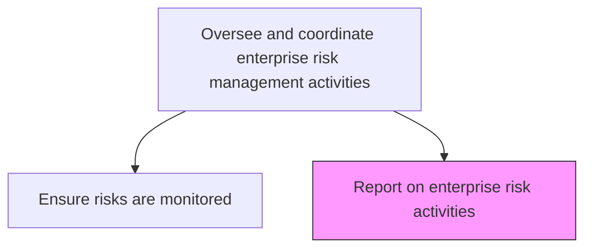
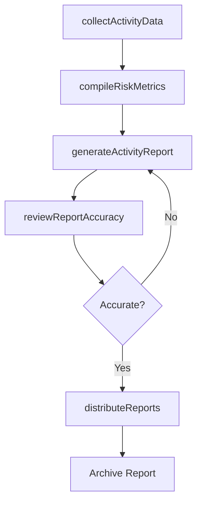

# Report on enterprise risk activities

> Business-as-Code definition for producing comprehensive reports on enterprise risk management activities, including risk identification, assessment, mitigation progress, and monitoring outcomes.

## Overview

Creating a report of activities to address hazard risks, liability torts, financial risks, operational risks, social trends, competition, etc.

## Process Hierarchy



## GraphDL

```yaml
report:
  object: On Enterprise Risk Activities
  actor: RiskReportingAnalyst
  result: EnterpriseRiskActivityReport
```

## Actions

| Action | Description |
|--------|-------------|
| collectActivityData | Gather data on risk management activities from all business units |
| compileRiskMetrics | Aggregate key risk metrics and performance indicators |
| generateActivityReport | Produce formatted reports on risk management activities and outcomes |
| reviewReportAccuracy | Validate report data for accuracy and completeness |
| distributeReports | Deliver risk activity reports to designated stakeholders |

## Events

| Event | Description |
|-------|-------------|
| activityDataCollected | Risk activity data gathered from all sources |
| riskMetricsCompiled | Key risk metrics aggregated for reporting period |
| activityReportGenerated | Risk activity report produced |
| reportAccuracyVerified | Report data validated for correctness |
| reportsDistributed | Risk activity reports delivered to stakeholders |

## Searches

| Search | Description |
|--------|-------------|
| getRiskActivityReports | Retrieve historical risk activity reports by period |
| getRiskMetricsSummary | Access aggregated risk metrics for a reporting period |
| getReportDistributionLog | View report delivery history and recipient acknowledgments |
| findActivitiesByRiskCategory | List risk management activities filtered by risk type |

## Process Flow



## RACI Matrix

| Activity | Responsible | Accountable | Consulted | Informed |
|----------|-------------|-------------|-----------|----------|
| collectActivityData | RiskAnalyst | RiskReportingAnalyst | BusinessUnitLeads | RiskManager |
| compileRiskMetrics | RiskReportingAnalyst | EnterpriseRiskManager | Finance | Compliance |
| generateActivityReport | RiskReportingAnalyst | ChiefRiskOfficer | DataAnalytics | ExecutiveTeam |
| distributeReports | RiskReportingAnalyst | ChiefRiskOfficer | CorporateCommunications | BoardOfDirectors |

## Related Processes

| Process | Relationship |
|---------|-------------|
| 11.1.2.5 Ensure risks and risk mitigation actions are monitored | Upstream - monitoring data feeds reporting |
| 11.1.1.5 Prepare and report enterprise risk to executive management and board | Parallel - executive-level risk reporting |
| 11.1.4.7 Report on risk activities | Parallel - business unit level reporting |
| 11.2.2.8 Compile and communicate internal and regulatory compliance reports | Parallel - compliance reporting alignment |

## Related Departments

| Department | Role |
|-----------|------|
| Enterprise Risk Management | Produces and owns risk activity reports |
| Data Analytics | Supports data aggregation and visualization |
| Corporate Communications | Assists with report formatting and distribution |
| Internal Audit | Validates reporting accuracy |

## Related Occupations

| Occupation | Involvement |
|-----------|-------------|
| Risk Reporting Analyst | Primary report author |
| Enterprise Risk Manager | Content reviewer and approver |
| Data Analyst | Metrics compilation |
| Chief Risk Officer | Report signoff and presentation |

## KPIs

| KPI | Description | Unit |
|-----|-------------|------|
| Report Timeliness | Percentage of risk reports delivered by scheduled deadline | % |
| Data Completeness | Percentage of business units contributing data to reports | % |
| Report Utilization | Percentage of distributed reports accessed by recipients | % |
| Correction Rate | Number of post-publication corrections required | Count |

## Usage

```typescript
import { reportOnEnterpriseRiskActivities } from '@headlessly/report-on-enterprise-risk-activities'

const reporting = reportOnEnterpriseRiskActivities()

// Compile risk metrics for the quarter
const metrics = await reporting.compileRiskMetrics({
  period: 'Q4-2025',
  categories: ['hazard', 'financial', 'operational', 'strategic'],
  includeComparisons: true
})

// Generate the activity report
const report = await reporting.generateActivityReport({
  period: 'Q4-2025',
  format: 'executive-summary',
  includeCharts: true
})
```
