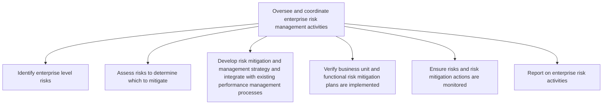
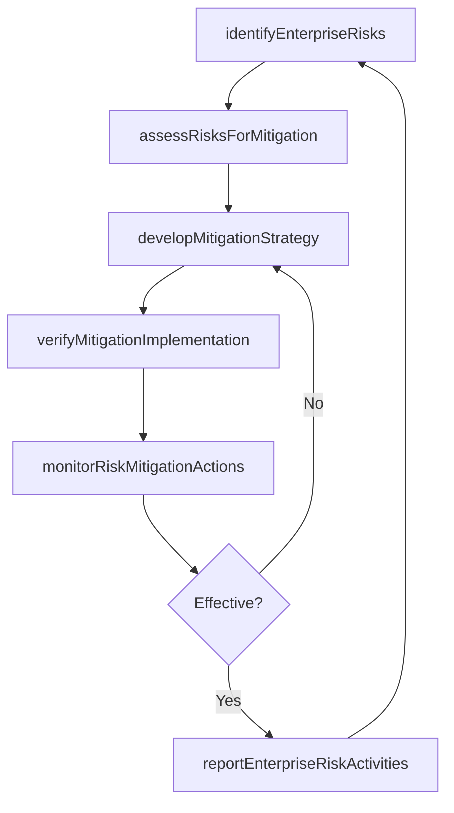

# Oversee and coordinate enterprise risk management activities

> Business-as-Code definition for identifying enterprise-level risks, assessing their impact, developing mitigation strategies, verifying implementation of risk plans, and reporting on enterprise risk management activities.

## Overview

Coordinating to plan, organize, lead, and control the activities of an organization in order to minimize the special effects of risk on capital and earnings.

## Process Hierarchy



## GraphDL

```yaml
oversee:
  object: And Coordinate Enterprise Risk Management Activities
  actor: EnterpriseRiskManager
  result: RiskMitigationStatusReport
```

## Actions

| Action | Description |
|--------|-------------|
| identifyEnterpriseRisks | Scan for strategic, operational, financial, and compliance risks at the enterprise level |
| assessRisksForMitigation | Evaluate identified risks using likelihood-impact analysis to prioritize mitigation |
| developMitigationStrategy | Create risk treatment plans integrated with performance management processes |
| verifyMitigationImplementation | Confirm that business unit and functional risk mitigation plans are operational |
| monitorRiskMitigationActions | Track ongoing effectiveness of risk controls and mitigation activities |
| reportEnterpriseRiskActivities | Compile and distribute enterprise risk activity reports to stakeholders |

## Events

| Event | Description |
|-------|-------------|
| enterpriseRisksIdentified | Enterprise-level risk identification cycle completed |
| risksAssessedForMitigation | Risk assessment and prioritization completed |
| mitigationStrategyDeveloped | Risk treatment plans created and approved |
| mitigationImplementationVerified | Business unit risk mitigation plans confirmed operational |
| riskMitigationActionsMonitored | Risk control effectiveness review completed |
| enterpriseRiskActivitiesReported | Enterprise risk activity report published |

## Searches

| Search | Description |
|--------|-------------|
| getEnterpriseRiskRegister | Retrieve the enterprise risk register with current risk ratings |
| findRisksByCategory | Query risks by category, severity, or business unit |
| getMitigationPlanStatus | Check implementation status of risk mitigation plans |
| getRiskActivityReport | Retrieve risk management activity reports by period |

## Process Flow



## RACI Matrix

| Activity | Responsible | Accountable | Consulted | Informed |
|----------|-------------|-------------|-----------|----------|
| identifyEnterpriseRisks | RiskAnalyst | ChiefRiskOfficer | BusinessUnitLeads | Executive |
| assessRisksForMitigation | RiskAnalyst | EnterpriseRiskManager | Finance | Legal |
| developMitigationStrategy | EnterpriseRiskManager | ChiefRiskOfficer | Operations | Board |
| verifyMitigationImplementation | RiskCoordinator | EnterpriseRiskManager | InternalAudit | Compliance |
| reportEnterpriseRiskActivities | RiskAnalyst | ChiefRiskOfficer | Finance | Board |

## Sub-Processes

| ID | Name | Description |
|----|------|-------------|
| 11.1.2.1 | Identify enterprise level risks | Determining risks that could thwart objectives. Document and communicate the concern. |
| 11.1.2.2 | Assess risks to determine which to mitigate | Identifying options/actions to enhance opportunities and reduce threats. Recognize the root reasons  |
| 11.1.2.3 | Develop risk mitigation and management strategy and integrate with existing performance management processes | Developing activities to improve opportunities and lessen threats. Specify the organization's object |
| 11.1.2.4 | Verify business unit and functional risk mitigation plans are implemented | Checking that the blueprint created for managing risk in individual business units and divisions is  |
| 11.1.2.5 | Ensure risks and risk mitigation actions are monitored | Ensuring risk monitoring and mitigation activities. Monitor actions to enhance opportunities and red |
| 11.1.2.6 | Report on enterprise risk activities | Creating a report of activities to address hazard risks, liability torts, financial risks, operation |

## Related Processes

| Process | Relationship |
|---------|-------------|
| 11.1.1 Establish the enterprise risk framework and policies | Upstream - framework and policies guide risk management activities |
| 11.1.3 Coordinate business unit and functional risk management activities | Downstream - enterprise strategies cascade to business unit coordination |
| 11.1.4 Manage business unit and function risk | Downstream - mitigation plans implemented at business unit level |

## Related Departments

| Department | Role |
|-----------|------|
| Enterprise Risk Management | Leads risk identification, assessment, and mitigation coordination |
| Internal Audit | Validates risk controls and mitigation effectiveness |
| Finance | Assesses financial risk exposure and capital implications |
| Strategy | Aligns risk management with strategic planning |

## Related Occupations

| Occupation | Involvement |
|-----------|-------------|
| Enterprise Risk Manager | Coordinates enterprise-wide risk identification and mitigation |
| Risk Analyst | Conducts risk assessments and produces risk reports |
| Internal Auditor | Verifies implementation and effectiveness of risk controls |

## KPIs

| KPI | Description | Unit |
|-----|-------------|------|
| Risk Mitigation Plan Implementation Rate | Percentage of approved mitigation plans fully implemented | % |
| Risk Assessment Cycle Time | Average days to complete a full risk assessment cycle | Days |
| Key Risk Indicator Breach Rate | Percentage of KRIs exceeding threshold in reporting period | % |
| Risk Register Completeness | Percentage of identified risks with documented treatment plans | % |

## Usage

```typescript
import { overseeAndCoordinateEnterpriseRiskManagementActivities } from '@headlessly/oversee-and-coordinate-enterprise-risk-management-activities'

const erm = overseeAndCoordinateEnterpriseRiskManagementActivities()

// Identify enterprise-level risks
const risks = await erm.identifyEnterpriseRisks({
  categories: ['strategic', 'operational', 'financial', 'compliance'],
  scope: 'enterprise',
  assessmentPeriod: '2025-Q3'
})

// Verify mitigation plans are implemented
const verification = await erm.verifyMitigationImplementation({
  businessUnit: 'North-America-Operations',
  planIds: ['RM-2025-014', 'RM-2025-021'],
  evidenceRequired: true
})
```
