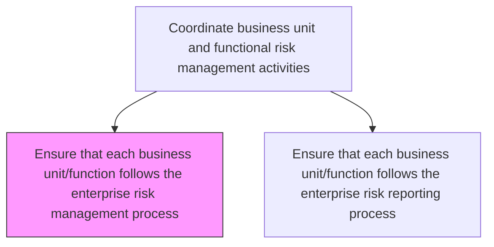
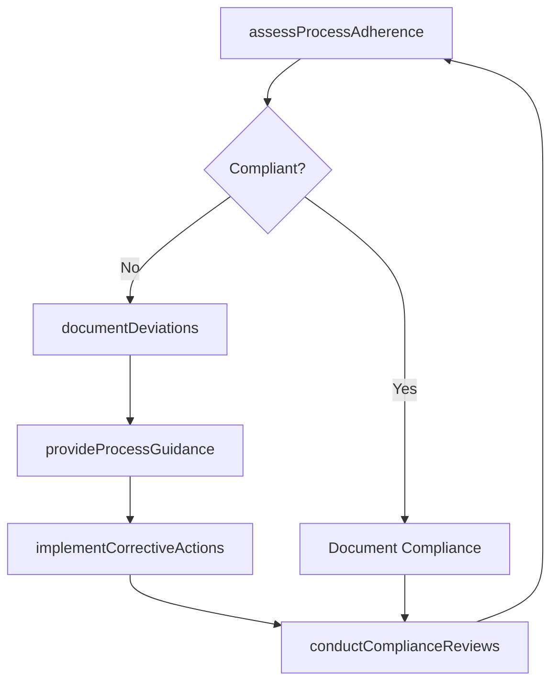

# Ensure that each business unit/function follows the enterprise risk management process

> Business-as-Code definition for verifying that all business units and functional areas consistently apply the enterprise risk management framework, processes, and standards.

## Overview

Checking each business unit's/function's options and activities to improve opportunities and lessen threats.

## Process Hierarchy



## GraphDL

```yaml
ensure:
  object: That Each Business Unit/function Follows Enterprise Risk Management Process
  actor: RiskGovernanceCoordinator
  result: ProcessComplianceReport
```

## Actions

| Action | Description |
|--------|-------------|
| assessProcessAdherence | Evaluate business unit compliance with enterprise risk management processes |
| conductComplianceReviews | Perform periodic reviews of risk management practices at the unit level |
| provideProcessGuidance | Deliver training and guidance to business units on risk management procedures |
| documentDeviations | Record deviations from standard risk management processes |
| implementCorrectiveActions | Mandate and track corrective actions for process non-compliance |

## Events

| Event | Description |
|-------|-------------|
| processAdherenceAssessed | Business unit risk process compliance evaluated |
| complianceReviewConducted | Periodic compliance review completed |
| processGuidanceProvided | Training or guidance session delivered |
| deviationDocumented | Process deviation formally recorded |
| correctiveActionImplemented | Corrective action for process non-compliance completed |

## Searches

| Search | Description |
|--------|-------------|
| getProcessComplianceByUnit | Retrieve risk process compliance status for each business unit |
| findProcessDeviations | List documented deviations from enterprise risk processes |
| getComplianceReviewSchedule | View upcoming compliance review calendar |
| getCorrectiveActionStatus | Track status of open corrective actions |

## Process Flow



## RACI Matrix

| Activity | Responsible | Accountable | Consulted | Informed |
|----------|-------------|-------------|-----------|----------|
| assessProcessAdherence | RiskGovernanceCoordinator | ChiefRiskOfficer | BusinessUnitLeads | AuditCommittee |
| conductComplianceReviews | InternalAuditor | RiskGovernanceCoordinator | RiskManagers | ExecutiveTeam |
| provideProcessGuidance | RiskTrainingCoordinator | RiskGovernanceCoordinator | HumanResources | AllEmployees |
| implementCorrectiveActions | BusinessUnitRiskManager | RiskGovernanceCoordinator | Compliance | ChiefRiskOfficer |

## Related Processes

| Process | Relationship |
|---------|-------------|
| 11.1.3.2 Ensure each business unit/function follows the enterprise risk reporting process | Parallel - reporting process compliance |
| 11.1.1.2 Develop and maintain enterprise risk policies and procedures | Upstream - policies define required processes |
| 11.1.2.4 Verify business unit mitigation plans are implemented | Parallel - implementation verification |
| 11.2.1.2 Implement enterprise compliance activities | Supporting - compliance activity alignment |

## Related Departments

| Department | Role |
|-----------|------|
| Enterprise Risk Management | Coordinates process compliance across units |
| Internal Audit | Conducts compliance reviews and assessments |
| All Business Units | Subject to process adherence requirements |
| Human Resources | Supports training delivery |

## Related Occupations

| Occupation | Involvement |
|-----------|-------------|
| Risk Governance Coordinator | Primary compliance coordinator |
| Internal Auditor | Compliance review executor |
| Business Unit Risk Manager | Local process owner |
| Training Coordinator | Process training facilitator |

## KPIs

| KPI | Description | Unit |
|-----|-------------|------|
| Process Adherence Rate | Percentage of business units fully compliant with risk processes | % |
| Deviation Resolution Time | Average time to resolve documented process deviations | Days |
| Training Completion Rate | Percentage of risk personnel completing process training | % |
| Review Cycle Compliance | Percentage of scheduled compliance reviews completed on time | % |

## Usage

```typescript
import { ensureThatEachBusinessUnitFunctionFollowsEnterpriseRiskManagementProcess } from '@headlessly/ensure-that-each-business-unit-function-follows-enterprise-risk-management-process'

const governance = ensureThatEachBusinessUnitFunctionFollowsEnterpriseRiskManagementProcess()

// Assess process adherence for a business unit
const adherence = await governance.assessProcessAdherence({
  businessUnit: 'operations',
  processes: ['risk-identification', 'risk-assessment', 'mitigation-planning'],
  period: 'Q1-2026'
})

// Document a deviation
const deviation = await governance.documentDeviations({
  businessUnit: 'marketing',
  process: 'risk-reporting',
  description: 'Quarterly risk assessment not completed within required timeline',
  severity: 'medium'
})
```
