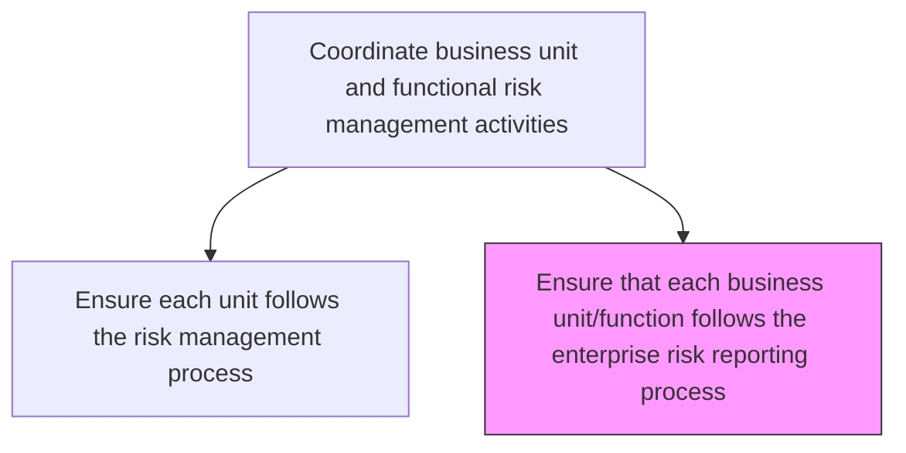
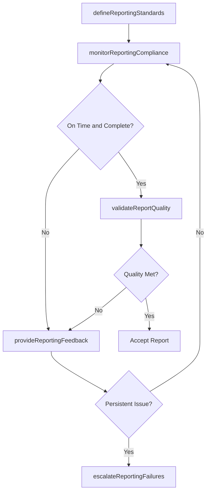

# Ensure that each business unit/function follows the enterprise risk reporting process

> Business-as-Code definition for verifying that all business units and functional areas comply with standardized enterprise risk reporting requirements, formats, and timelines.

## Overview

Checking the reporting process of each business unit's/function's options and activities to improve opportunities and lessen threats.

## Process Hierarchy



## GraphDL

```yaml
ensure:
  object: That Each Business Unit/function Follows Enterprise Risk Reporting Process
  actor: RiskReportingCoordinator
  result: ReportingComplianceAssessment
```

## Actions

| Action | Description |
|--------|-------------|
| defineReportingStandards | Establish standardized reporting templates, formats, and deadlines |
| monitorReportingCompliance | Track business unit adherence to risk reporting requirements |
| validateReportQuality | Review submitted risk reports for accuracy and completeness |
| provideReportingFeedback | Deliver feedback to business units on report quality and timeliness |
| escalateReportingFailures | Escalate persistent reporting non-compliance to senior management |

## Events

| Event | Description |
|-------|-------------|
| reportingStandardsDefined | Standardized risk reporting requirements published |
| reportingComplianceMonitored | Business unit reporting adherence assessed |
| reportQualityValidated | Submitted risk report reviewed for accuracy |
| reportingFeedbackProvided | Feedback on reporting quality delivered to business unit |
| reportingFailureEscalated | Persistent reporting non-compliance escalated |

## Searches

| Search | Description |
|--------|-------------|
| getReportingComplianceByUnit | Retrieve reporting compliance status for each business unit |
| findLateReports | List risk reports submitted past the deadline |
| getReportQualityScores | Access quality scores for submitted risk reports |
| getReportingStandards | Retrieve current risk reporting standards and templates |

## Process Flow



## RACI Matrix

| Activity | Responsible | Accountable | Consulted | Informed |
|----------|-------------|-------------|-----------|----------|
| defineReportingStandards | RiskReportingCoordinator | ChiefRiskOfficer | BusinessUnitLeads | AllDepartments |
| monitorReportingCompliance | RiskReportingCoordinator | EnterpriseRiskManager | IT | AuditCommittee |
| validateReportQuality | RiskAnalyst | RiskReportingCoordinator | DataAnalytics | Compliance |
| escalateReportingFailures | RiskReportingCoordinator | ChiefRiskOfficer | GeneralCounsel | ExecutiveTeam |

## Related Processes

| Process | Relationship |
|---------|-------------|
| 11.1.3.1 Ensure each business unit follows the enterprise risk management process | Parallel - process compliance counterpart |
| 11.1.2.6 Report on enterprise risk activities | Downstream - unit reports feed enterprise reporting |
| 11.1.4.7 Report on risk activities | Upstream - business unit reporting activities |
| 11.1.1.5 Prepare and report enterprise risk to executive management and board | Downstream - feeds board reporting |

## Related Departments

| Department | Role |
|-----------|------|
| Enterprise Risk Management | Defines and enforces reporting standards |
| All Business Units | Required to submit risk reports per standards |
| Data Analytics | Supports report quality validation |
| Internal Audit | Reviews reporting process effectiveness |

## Related Occupations

| Occupation | Involvement |
|-----------|-------------|
| Risk Reporting Coordinator | Primary process owner |
| Risk Analyst | Report validation specialist |
| Business Unit Risk Manager | Report submitter |
| Enterprise Risk Manager | Oversight and escalation |

## KPIs

| KPI | Description | Unit |
|-----|-------------|------|
| Reporting Timeliness | Percentage of risk reports submitted by deadline | % |
| Report Accuracy Rate | Percentage of reports requiring no corrections | % |
| Reporting Coverage | Percentage of business units submitting required reports | % |
| Escalation Frequency | Number of reporting failures escalated per period | Count |

## Usage

```typescript
import { ensureThatEachBusinessUnitFunctionFollowsEnterpriseRiskReportingProcess } from '@headlessly/ensure-that-each-business-unit-function-follows-enterprise-risk-reporting-process'

const reporting = ensureThatEachBusinessUnitFunctionFollowsEnterpriseRiskReportingProcess()

// Monitor reporting compliance across units
const compliance = await reporting.monitorReportingCompliance({
  period: 'Q1-2026',
  businessUnits: 'all',
  checkDeadlines: true
})

// Validate a submitted report
const validation = await reporting.validateReportQuality({
  reportId: 'RPT-OPS-2026-Q1',
  checks: ['completeness', 'accuracy', 'format-adherence']
})
```
