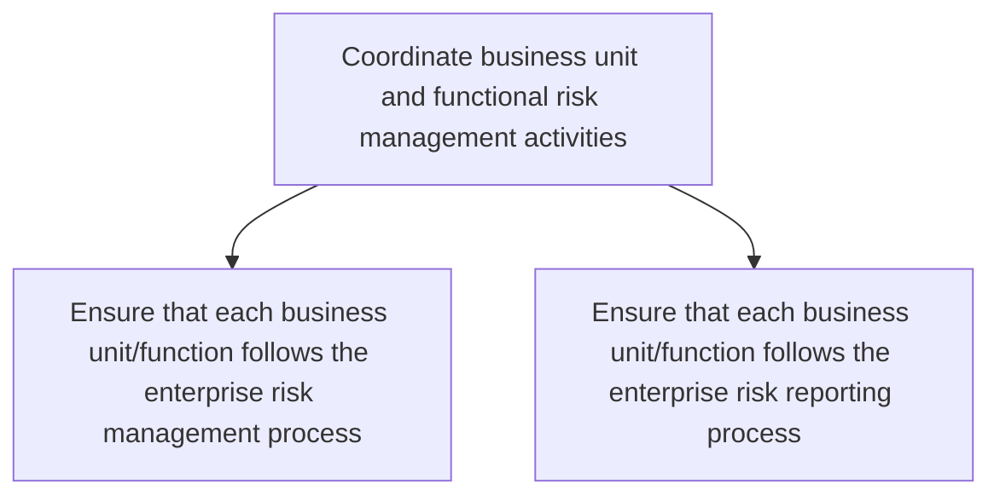
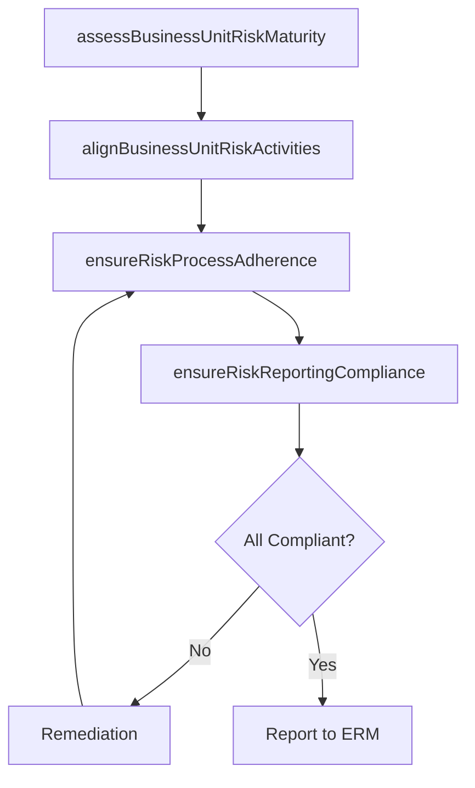

# Coordinate business unit and functional risk management activities

> Business-as-Code definition for ensuring that each business unit and function follows the enterprise risk management process and risk reporting standards consistently across the organization.

## Overview

Coordinating risk management activities to improve opportunities and lessen threats. Specify the organization's objectives. Assign resources to project objectives.

## Process Hierarchy



## GraphDL

```yaml
coordinate:
  object: Business Unit And Functional Risk Management Activities
  actor: RiskCoordinator
  result: BusinessUnitRiskComplianceReport
```

## Actions

| Action | Description |
|--------|-------------|
| ensureRiskProcessAdherence | Verify that each business unit follows the enterprise risk management process |
| ensureRiskReportingCompliance | Confirm that each business unit follows the enterprise risk reporting process |
| assessBusinessUnitRiskMaturity | Evaluate risk management maturity levels across business units |
| alignBusinessUnitRiskActivities | Harmonize risk management practices across functions and units |

## Events

| Event | Description |
|-------|-------------|
| riskProcessAdherenceEnsured | Business unit risk management process compliance verified |
| riskReportingComplianceEnsured | Business unit risk reporting adherence confirmed |
| businessUnitRiskMaturityAssessed | Risk maturity assessment completed for business units |
| businessUnitRiskActivitiesAligned | Cross-functional risk management practices harmonized |

## Searches

| Search | Description |
|--------|-------------|
| getBusinessUnitRiskCompliance | Retrieve risk process compliance status by business unit |
| findNonCompliantUnits | List business units not meeting risk management standards |
| getRiskMaturityScores | Retrieve risk maturity assessment scores by business unit |

## Process Flow



## RACI Matrix

| Activity | Responsible | Accountable | Consulted | Informed |
|----------|-------------|-------------|-----------|----------|
| ensureRiskProcessAdherence | RiskCoordinator | ChiefRiskOfficer | BusinessUnitLeads | InternalAudit |
| ensureRiskReportingCompliance | RiskCoordinator | ChiefRiskOfficer | Finance | Compliance |
| assessBusinessUnitRiskMaturity | RiskAnalyst | EnterpriseRiskManager | HR | Executive |

## Sub-Processes

| ID | Name | Description |
|----|------|-------------|
| 11.1.3.1 | Ensure that each business unit/function follows the enterprise risk management process | Checking each business unit's/function's options and activities to improve opportunities and lessen  |
| 11.1.3.2 | Ensure that each business unit/function follows the enterprise risk reporting process | Checking the reporting process of each business unit's/function's options and activities to improve  |

## Related Processes

| Process | Relationship |
|---------|-------------|
| 11.1.1 Establish the enterprise risk framework and policies | Upstream - framework provides standards that units must follow |
| 11.1.2 Oversee and coordinate enterprise risk management activities | Upstream - enterprise-level strategies guide unit-level coordination |
| 11.1.4 Manage business unit and function risk | Downstream - coordination enables effective unit-level risk management |

## Related Departments

| Department | Role |
|-----------|------|
| Enterprise Risk Management | Coordinates risk activities across business units |
| Internal Audit | Validates unit-level risk process adherence |
| Operations | Implements risk management practices within business units |
| Compliance | Ensures regulatory risk reporting requirements are met |

## Related Occupations

| Occupation | Involvement |
|-----------|-------------|
| Risk Coordinator | Facilitates cross-unit risk management alignment |
| Business Unit Risk Champion | Serves as the risk liaison within a business unit |
| Internal Auditor | Assesses business unit compliance with ERM processes |

## KPIs

| KPI | Description | Unit |
|-----|-------------|------|
| Business Unit ERM Process Compliance | Percentage of business units following the enterprise risk process | % |
| Risk Reporting On-Time Rate | Percentage of business unit risk reports submitted on schedule | % |
| Risk Maturity Score | Average risk management maturity score across business units | Score (1-5) |

## Usage

```typescript
import { coordinateBusinessUnitAndFunctionalRiskManagementActivities } from '@headlessly/coordinate-business-unit-and-functional-risk-management-activities'

const coordination = coordinateBusinessUnitAndFunctionalRiskManagementActivities()

// Verify business unit risk process adherence
const compliance = await coordination.ensureRiskProcessAdherence({
  businessUnit: 'Supply-Chain',
  assessmentDate: '2025-06-30',
  checklistVersion: 'v3.1'
})

// Assess risk maturity across business units
const maturity = await coordination.assessBusinessUnitRiskMaturity({
  scope: 'all-business-units',
  dimensions: ['culture', 'process', 'tools', 'reporting']
})
```
