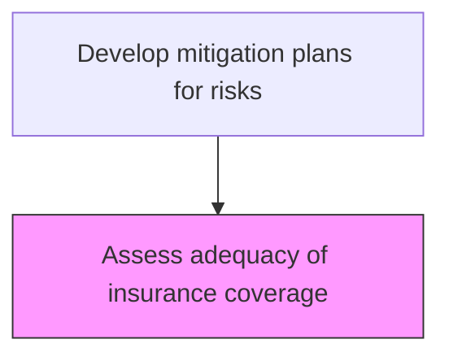
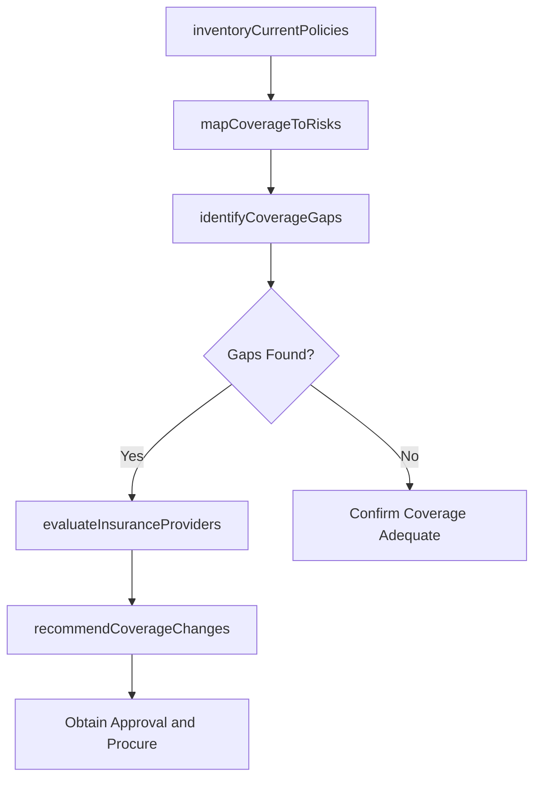

# Assess adequacy of insurance coverage

> Business-as-Code definition for evaluating whether current insurance policies adequately cover the organization's risk exposures and identifying coverage gaps or opportunities.

## Overview

Evaluating the changing needs for insurance coverage. Research available insurance providers and offerings.

## Process Hierarchy



## GraphDL

```yaml
assess:
  object: Adequacy Of Insurance Coverage
  actor: InsuranceManager
  result: InsuranceCoverageAssessment
```

## Actions

| Action | Description |
|--------|-------------|
| inventoryCurrentPolicies | Catalog all active insurance policies and their coverage terms |
| mapCoverageToRisks | Align existing insurance coverage to the enterprise risk register |
| identifyCoverageGaps | Detect risks without adequate insurance protection |
| evaluateInsuranceProviders | Research and compare insurance providers and policy options |
| recommendCoverageChanges | Propose additions, modifications, or cancellations to insurance portfolio |

## Events

| Event | Description |
|-------|-------------|
| policiesInventoried | Current insurance policy catalog updated |
| coverageMappedToRisks | Insurance coverage aligned with risk register |
| coverageGapIdentified | Risk without adequate insurance coverage detected |
| insuranceProvidersEvaluated | Provider comparison and evaluation completed |
| coverageChangesRecommended | Insurance portfolio modification recommendations submitted |

## Searches

| Search | Description |
|--------|-------------|
| getCurrentPolicies | Retrieve active insurance policies and coverage details |
| findCoverageGaps | List risks without adequate insurance coverage |
| getProviderEvaluations | Access insurance provider comparison data |
| getCoverageHistory | View historical insurance coverage changes and claims |

## Process Flow



## RACI Matrix

| Activity | Responsible | Accountable | Consulted | Informed |
|----------|-------------|-------------|-----------|----------|
| inventoryCurrentPolicies | InsuranceManager | CFO | RiskManager | Legal |
| mapCoverageToRisks | InsuranceManager | ChiefRiskOfficer | BusinessUnitLeads | Finance |
| identifyCoverageGaps | InsuranceManager | ChiefRiskOfficer | InternalAudit | AuditCommittee |
| evaluateInsuranceProviders | InsuranceManager | CFO | Procurement | Legal |

## Related Processes

| Process | Relationship |
|---------|-------------|
| 11.1.4.3 Develop mitigation plans for risks | Parent - insurance is a risk transfer mechanism |
| 11.1.4.2 Assess risks using enterprise risk framework | Upstream - risk assessment identifies coverage needs |
| 9.5.3 Manage fixed-asset accounting | Parallel - asset valuation for coverage |
| 11.1.1.1 Determine risk tolerance for organization | Upstream - tolerance guides insurance levels |

## Related Departments

| Department | Role |
|-----------|------|
| Risk Management | Leads insurance adequacy assessment |
| Finance | Budget oversight for insurance premiums |
| Legal | Reviews policy terms and conditions |
| Procurement | Manages insurance provider contracting |

## Related Occupations

| Occupation | Involvement |
|-----------|-------------|
| Insurance Manager | Primary assessor and coordinator |
| Risk Analyst | Coverage gap analysis |
| Insurance Broker | External advisory and placement |
| Financial Controller | Premium budgeting |

## KPIs

| KPI | Description | Unit |
|-----|-------------|------|
| Coverage Adequacy Ratio | Percentage of identified risks with adequate insurance coverage | % |
| Coverage Gap Count | Number of material risks without sufficient insurance | Count |
| Premium Efficiency | Insurance premium cost relative to coverage value | Ratio |
| Claims Recovery Rate | Percentage of insured losses recovered through claims | % |

## Usage

```typescript
import { assessAdequacyOfInsuranceCoverage } from '@headlessly/assess-adequacy-of-insurance-coverage'

const insurance = assessAdequacyOfInsuranceCoverage()

// Map current coverage to risk register
const mapping = await insurance.mapCoverageToRisks({
  riskRegisterVersion: 'Q1-2026',
  policyTypes: ['property', 'liability', 'cyber', 'directors-officers']
})

// Identify coverage gaps
const gaps = await insurance.identifyCoverageGaps({
  minimumCoverage: 'risk-tolerance-threshold',
  includeDeductibleAnalysis: true
})
```
