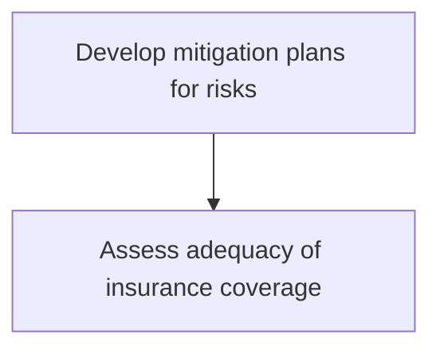
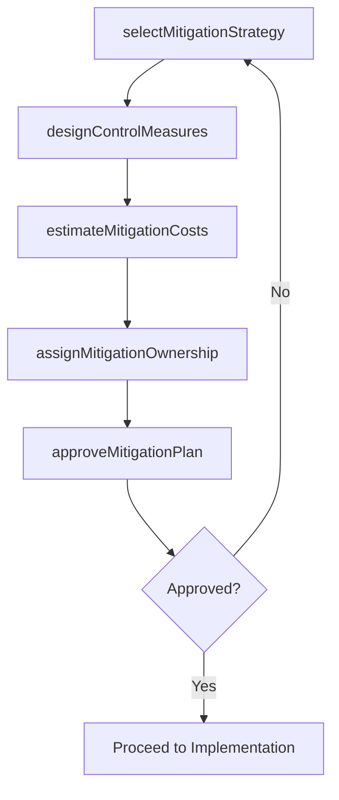

# Develop mitigation plans for risks

> Business-as-Code definition for creating actionable mitigation plans that reduce risk exposure through controls, risk transfer, avoidance, or acceptance strategies.

## Overview

Developing possibilities and arrangements to improve opportunities and reduce deviations to project objectives.

## Process Hierarchy



## GraphDL

```yaml
develop:
  object: Mitigation Plans For Risks
  actor: MitigationPlanningManager
  result: RiskMitigationPlan
```

## Actions

| Action | Description |
|--------|-------------|
| selectMitigationStrategy | Choose from avoidance, reduction, transfer, or acceptance approaches |
| designControlMeasures | Define specific controls and safeguards to reduce risk exposure |
| estimateMitigationCosts | Calculate the cost of implementing mitigation activities |
| assignMitigationOwnership | Designate responsible parties for each mitigation activity |
| approveMitigationPlan | Obtain management approval for the proposed mitigation plan |

## Events

| Event | Description |
|-------|-------------|
| mitigationStrategySelected | Risk response strategy chosen for identified risk |
| controlMeasuresDesigned | Specific controls and safeguards defined |
| mitigationCostsEstimated | Implementation cost estimates completed |
| mitigationOwnershipAssigned | Responsible parties designated for mitigation activities |
| mitigationPlanApproved | Mitigation plan approved by management |

## Searches

| Search | Description |
|--------|-------------|
| getMitigationPlans | Retrieve mitigation plans by risk or business unit |
| findPlansByStrategy | Filter mitigation plans by strategy type |
| getMitigationCosts | Access cost estimates for active mitigation plans |
| getPlanApprovalStatus | Check approval status of pending mitigation plans |

## Process Flow



## RACI Matrix

| Activity | Responsible | Accountable | Consulted | Informed |
|----------|-------------|-------------|-----------|----------|
| selectMitigationStrategy | MitigationPlanningManager | BusinessUnitDirector | ChiefRiskOfficer | Finance |
| designControlMeasures | RiskAnalyst | MitigationPlanningManager | ControlOwners | Compliance |
| estimateMitigationCosts | FinancialAnalyst | MitigationPlanningManager | Procurement | CFO |
| approveMitigationPlan | BusinessUnitDirector | ChiefRiskOfficer | ExecutiveTeam | BoardOfDirectors |

## Sub-Processes

| ID | Name | Description |
|----|------|-------------|
| 11.1.4.3.1 | Assess adequacy of insurance coverage | Evaluating the changing needs for insurance coverage. Research available insurance providers and off |

## Related Processes

| Process | Relationship |
|---------|-------------|
| 11.1.4.2 Assess risks using enterprise risk framework | Upstream - assessment drives mitigation planning |
| 11.1.4.4 Implement mitigation plans for risks | Downstream - plans feed implementation |
| 11.1.2.3 Develop risk mitigation and management strategy | Upstream - enterprise strategy guides unit plans |
| 11.1.4.3.1 Assess adequacy of insurance coverage | Sub-process - insurance as risk transfer mechanism |

## Related Departments

| Department | Role |
|-----------|------|
| Each Business Unit | Develops mitigation plans for unit-specific risks |
| Enterprise Risk Management | Provides framework and reviews plans |
| Finance | Evaluates mitigation cost-benefit |
| Insurance and Risk Transfer | Manages insurance-based mitigation options |

## Related Occupations

| Occupation | Involvement |
|-----------|-------------|
| Mitigation Planning Manager | Primary plan developer |
| Risk Analyst | Control design and cost estimation |
| Insurance Manager | Risk transfer options |
| Business Unit Director | Plan approval authority |

## KPIs

| KPI | Description | Unit |
|-----|-------------|------|
| Plan Development Time | Average time from risk assessment to approved mitigation plan | Days |
| Plan Coverage | Percentage of above-tolerance risks with approved mitigation plans | % |
| Cost-Benefit Ratio | Ratio of mitigation cost to expected risk reduction value | Ratio |
| Plan Approval Rate | Percentage of submitted plans approved on first review | % |

## Usage

```typescript
import { developMitigationPlansForRisks } from '@headlessly/develop-mitigation-plans-for-risks'

const mitigation = developMitigationPlansForRisks()

// Select a mitigation strategy for a risk
const strategy = await mitigation.selectMitigationStrategy({
  riskId: 'BU-RISK-2026-018',
  options: ['avoidance', 'reduction', 'transfer', 'acceptance'],
  costConstraint: 500000
})

// Design control measures
const controls = await mitigation.designControlMeasures({
  riskId: 'BU-RISK-2026-018',
  strategy: strategy.selectedApproach,
  targetResidualRisk: 'low'
})
```
