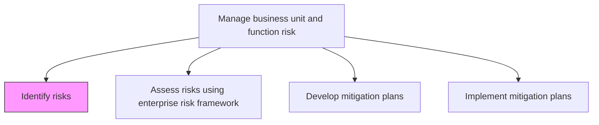
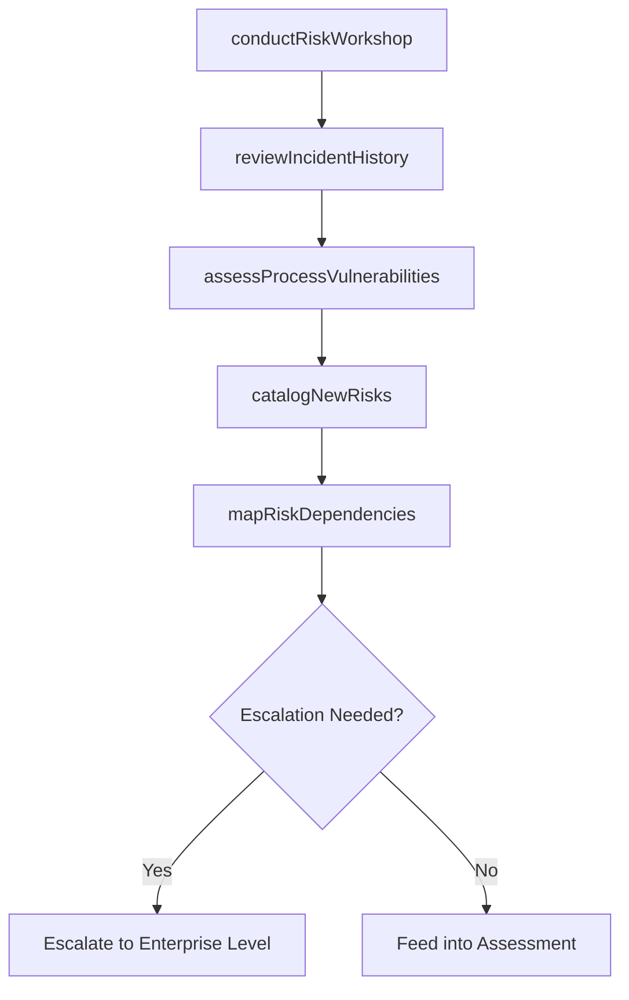

# Identify risks

> Business-as-Code definition for systematically identifying risks at the business unit and functional level that could impede operational goals and project objectives.

## Overview

Developing a timely and continuous process to identify activities that might hinder a project's goals.

## Process Hierarchy



## GraphDL

```yaml
identify:
  object: Risks
  actor: BusinessUnitRiskManager
  result: BusinessUnitRiskRegister
```

## Actions

| Action | Description |
|--------|-------------|
| conductRiskWorkshop | Facilitate structured workshops with business unit teams to surface risks |
| reviewIncidentHistory | Analyze past incidents and near-misses for recurring risk patterns |
| assessProcessVulnerabilities | Examine business processes for potential failure points |
| catalogNewRisks | Document newly identified risks with descriptions and initial ratings |
| mapRiskDependencies | Identify interconnections between risks across functions |

## Events

| Event | Description |
|-------|-------------|
| riskWorkshopConducted | Business unit risk identification workshop completed |
| incidentHistoryReviewed | Historical incident analysis completed |
| processVulnerabilityIdentified | Process weakness or failure point detected |
| newRiskCataloged | Newly identified risk documented in register |
| riskDependenciesMapped | Interconnections between related risks established |

## Searches

| Search | Description |
|--------|-------------|
| getBusinessUnitRisks | Retrieve risks identified for a specific business unit |
| findRisksByProcess | List risks associated with a specific business process |
| getIncidentHistory | Access historical incident records for pattern analysis |
| getRiskDependencyMap | View interconnections between related risks |

## Process Flow



## RACI Matrix

| Activity | Responsible | Accountable | Consulted | Informed |
|----------|-------------|-------------|-----------|----------|
| conductRiskWorkshop | BusinessUnitRiskManager | BusinessUnitDirector | EnterpriseRiskManager | TeamMembers |
| reviewIncidentHistory | RiskAnalyst | BusinessUnitRiskManager | SafetyOfficer | Compliance |
| assessProcessVulnerabilities | ProcessOwner | BusinessUnitRiskManager | QualityManager | Operations |
| catalogNewRisks | RiskAnalyst | BusinessUnitRiskManager | SubjectMatterExperts | EnterpriseRiskManager |

## Related Processes

| Process | Relationship |
|---------|-------------|
| 11.1.4.2 Assess risks using enterprise risk framework policies and procedures | Downstream - identified risks feed assessment |
| 11.1.2.1 Identify enterprise level risks | Upstream - enterprise-level context |
| 11.1.4.5 Monitor risks | Downstream - identified risks enter monitoring |
| 11.1.1.2 Develop and maintain enterprise risk policies and procedures | Upstream - policies guide identification |

## Related Departments

| Department | Role |
|-----------|------|
| Each Business Unit | Performs risk identification within its domain |
| Enterprise Risk Management | Provides framework and oversight |
| Operations | Contributes operational risk intelligence |
| Quality Assurance | Identifies quality-related risks |

## Related Occupations

| Occupation | Involvement |
|-----------|-------------|
| Business Unit Risk Manager | Facilitator and process owner |
| Risk Analyst | Research and documentation |
| Process Owner | Identifies process-specific risks |
| Safety Officer | Identifies safety and hazard risks |

## KPIs

| KPI | Description | Unit |
|-----|-------------|------|
| Risk Workshop Frequency | Number of risk identification workshops conducted per period | Per Quarter |
| New Risks Identified | Number of new risks added to business unit register | Count |
| Identification Coverage | Percentage of business processes assessed for risks | % |
| Escalation Rate | Percentage of identified risks escalated to enterprise level | % |

## Usage

```typescript
import { identifyRisks } from '@headlessly/identify-risks'

const risks = identifyRisks()

// Conduct a risk identification workshop
const workshop = await risks.conductRiskWorkshop({
  businessUnit: 'supply-chain',
  participants: ['operations-manager', 'procurement-lead', 'logistics-coordinator'],
  scope: ['supplier-risks', 'transportation-risks', 'inventory-risks']
})

// Catalog a newly identified risk
const newRisk = await risks.catalogNewRisks({
  title: 'Single-source supplier dependency',
  category: 'operational',
  process: 'procurement',
  initialLikelihood: 'medium',
  initialImpact: 'high'
})
```
