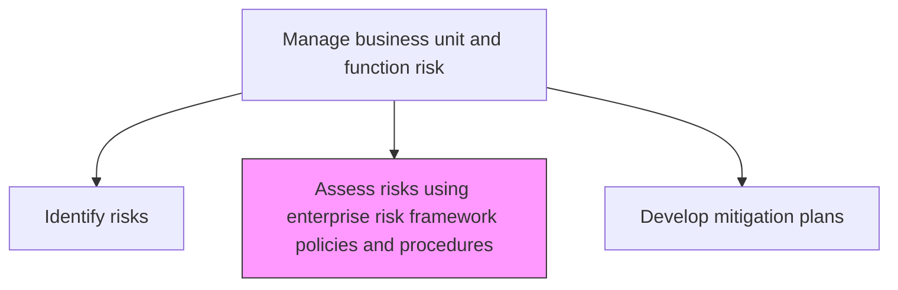
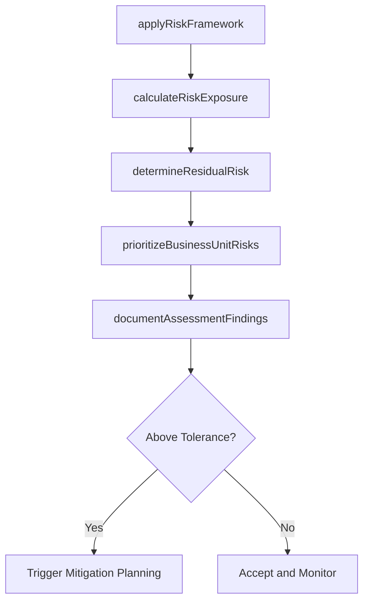

# Assess risks using enterprise risk framework policies and procedures

> Business-as-Code definition for evaluating identified business unit risks using the organization's established risk framework, policies, and standardized assessment procedures.

## Overview

Determining the possibility that a specified undesirable event will occur using established tools, implements, and frameworks. Use risk assessments to determine, for example, whether to undertake a particular venture, what rate of return a particular investment requires, and how to mitigate an activity's potential losses.

## Process Hierarchy



## GraphDL

```yaml
assess:
  object: Risks Using Enterprise Risk Framework Policies And Procedures
  actor: BusinessUnitRiskAnalyst
  result: RiskAssessmentReport
```

## Actions

| Action | Description |
|--------|-------------|
| applyRiskFramework | Use enterprise risk framework criteria to evaluate identified risks |
| calculateRiskExposure | Quantify financial and operational exposure for each risk |
| determineResidualRisk | Assess remaining risk after accounting for existing controls |
| prioritizeBusinessUnitRisks | Rank risks based on framework scoring methodology |
| documentAssessmentFindings | Record assessment results and recommendations in standard format |

## Events

| Event | Description |
|-------|-------------|
| riskFrameworkApplied | Enterprise risk framework criteria applied to business unit risks |
| riskExposureCalculated | Financial and operational exposure quantified |
| residualRiskDetermined | Remaining risk after controls assessed |
| businessUnitRisksPrioritized | Risks ranked according to framework methodology |
| assessmentFindingsDocumented | Assessment results recorded in standard format |

## Searches

| Search | Description |
|--------|-------------|
| getRiskAssessments | Retrieve assessment results for business unit risks |
| findHighExposureRisks | List risks exceeding exposure thresholds |
| getResidualRiskLevels | Access residual risk ratings for assessed risks |
| getAssessmentHistory | View historical assessment records for trend analysis |

## Process Flow



## RACI Matrix

| Activity | Responsible | Accountable | Consulted | Informed |
|----------|-------------|-------------|-----------|----------|
| applyRiskFramework | BusinessUnitRiskAnalyst | BusinessUnitRiskManager | EnterpriseRiskManager | Compliance |
| calculateRiskExposure | BusinessUnitRiskAnalyst | BusinessUnitRiskManager | Finance | CFO |
| determineResidualRisk | BusinessUnitRiskAnalyst | BusinessUnitRiskManager | ControlOwners | InternalAudit |
| prioritizeBusinessUnitRisks | BusinessUnitRiskManager | BusinessUnitDirector | ChiefRiskOfficer | ExecutiveTeam |

## Related Processes

| Process | Relationship |
|---------|-------------|
| 11.1.4.1 Identify risks | Upstream - provides risks for assessment |
| 11.1.4.3 Develop mitigation plans for risks | Downstream - assessment drives mitigation planning |
| 11.1.1.1 Determine risk tolerance for organization | Upstream - tolerance defines assessment thresholds |
| 11.1.2.2 Assess risks to determine which to mitigate | Parallel - enterprise level assessment |

## Related Departments

| Department | Role |
|-----------|------|
| Each Business Unit | Performs risk assessment within its domain |
| Enterprise Risk Management | Provides framework and methodology |
| Finance | Supports financial exposure quantification |
| Internal Audit | Validates assessment methodology application |

## Related Occupations

| Occupation | Involvement |
|-----------|-------------|
| Business Unit Risk Analyst | Primary assessor |
| Business Unit Risk Manager | Assessment oversight |
| Financial Analyst | Exposure quantification support |
| Internal Auditor | Methodology validation |

## KPIs

| KPI | Description | Unit |
|-----|-------------|------|
| Assessment Completion Rate | Percentage of identified risks assessed within cycle | % |
| Framework Adherence | Degree of compliance with enterprise assessment methodology | % |
| Assessment Cycle Time | Average time from risk identification to completed assessment | Days |
| Risk Scoring Consistency | Variance in risk scoring across business units | Score |

## Usage

```typescript
import { assessRisksUsingEnterpriseRiskFrameworkPoliciesAndProcedures } from '@headlessly/assess-risks-using-enterprise-risk-framework-policies-and-procedures'

const assessment = assessRisksUsingEnterpriseRiskFrameworkPoliciesAndProcedures()

// Apply the enterprise risk framework to a business unit risk
const result = await assessment.applyRiskFramework({
  riskId: 'BU-RISK-2026-018',
  frameworkVersion: 'v3.2',
  assessor: 'risk-analyst-ops'
})

// Calculate risk exposure
const exposure = await assessment.calculateRiskExposure({
  riskId: 'BU-RISK-2026-018',
  scenarioAnalysis: true,
  confidenceInterval: 0.95
})
```
