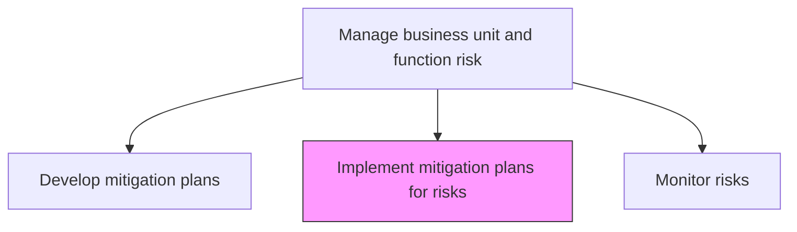
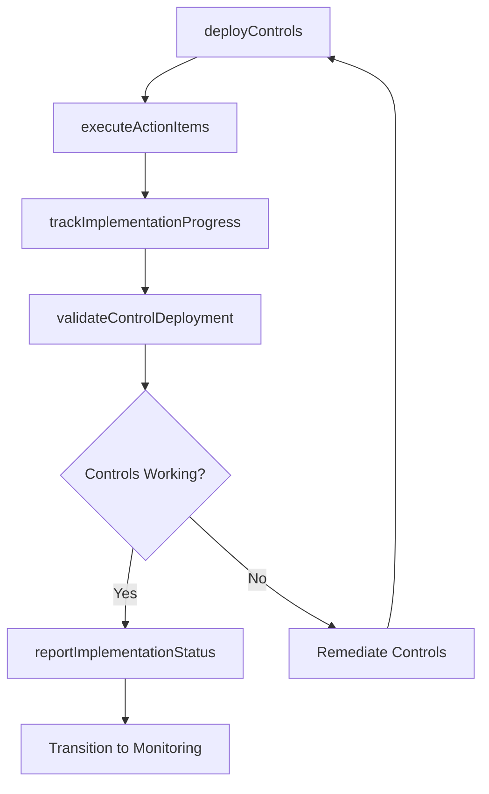

# Implement mitigation plans for risks

> Business-as-Code definition for executing approved risk mitigation plans, deploying controls, and tracking implementation progress at the business unit level.

## Overview

Executing mitigation plans to improve opportunities and reduce deviations to project objectives.

## Process Hierarchy



## GraphDL

```yaml
implement:
  object: Mitigation Plans For Risks
  actor: MitigationImplementationLead
  result: ImplementedControls
```

## Actions

| Action | Description |
|--------|-------------|
| deployControls | Install and activate risk mitigation controls and safeguards |
| executeActionItems | Carry out specific mitigation tasks assigned in the plan |
| trackImplementationProgress | Monitor completion status of mitigation activities |
| validateControlDeployment | Verify that deployed controls function as designed |
| reportImplementationStatus | Communicate mitigation progress to risk management |

## Events

| Event | Description |
|-------|-------------|
| controlsDeployed | Risk mitigation controls installed and activated |
| actionItemsExecuted | Planned mitigation tasks completed |
| implementationProgressTracked | Mitigation activity completion status updated |
| controlDeploymentValidated | Deployed controls verified as operational |
| implementationStatusReported | Mitigation progress communicated to stakeholders |

## Searches

| Search | Description |
|--------|-------------|
| getImplementationProgress | Retrieve completion status for mitigation plan activities |
| findPendingActions | List incomplete mitigation action items |
| getDeployedControls | Access inventory of implemented controls by risk |
| getImplementationTimeline | View milestone timeline for active mitigation plans |

## Process Flow



## RACI Matrix

| Activity | Responsible | Accountable | Consulted | Informed |
|----------|-------------|-------------|-----------|----------|
| deployControls | MitigationImplementationLead | BusinessUnitRiskManager | IT | Compliance |
| executeActionItems | ActionItemOwners | MitigationImplementationLead | RiskAnalyst | ProjectManager |
| trackImplementationProgress | ProjectManager | MitigationImplementationLead | EnterpriseRiskManager | ExecutiveTeam |
| validateControlDeployment | InternalAuditor | MitigationImplementationLead | ControlOwners | ChiefRiskOfficer |

## Related Processes

| Process | Relationship |
|---------|-------------|
| 11.1.4.3 Develop mitigation plans for risks | Upstream - provides approved plans for implementation |
| 11.1.4.5 Monitor risks | Downstream - implemented controls enter monitoring |
| 11.1.2.4 Verify business unit mitigation plans are implemented | Parallel - enterprise verification |
| 11.1.4.6 Analyze risk activities and update plans | Downstream - implementation data feeds analysis |

## Related Departments

| Department | Role |
|-----------|------|
| Each Business Unit | Executes mitigation plans within their domain |
| Information Technology | Deploys technology-based controls |
| Enterprise Risk Management | Monitors implementation progress |
| Internal Audit | Validates control deployment |

## Related Occupations

| Occupation | Involvement |
|-----------|-------------|
| Mitigation Implementation Lead | Primary coordinator of execution |
| Project Manager | Tracks milestones and progress |
| Control Owner | Operates and maintains deployed controls |
| Internal Auditor | Validates control effectiveness |

## KPIs

| KPI | Description | Unit |
|-----|-------------|------|
| Implementation Completion Rate | Percentage of planned mitigation actions completed | % |
| On-Time Delivery | Percentage of mitigation milestones met by deadline | % |
| Control Effectiveness | Percentage of deployed controls passing validation testing | % |
| Budget Adherence | Actual mitigation costs versus approved budget | % |

## Usage

```typescript
import { implementMitigationPlansForRisks } from '@headlessly/implement-mitigation-plans-for-risks'

const implementation = implementMitigationPlansForRisks()

// Deploy controls for an approved mitigation plan
const deployment = await implementation.deployControls({
  planId: 'MIT-PLAN-2026-008',
  controls: ['access-restriction', 'encryption-at-rest', 'monitoring-alert'],
  targetDate: '2026-03-31'
})

// Track implementation progress
const progress = await implementation.trackImplementationProgress({
  planId: 'MIT-PLAN-2026-008',
  includeActionItems: true
})
```
