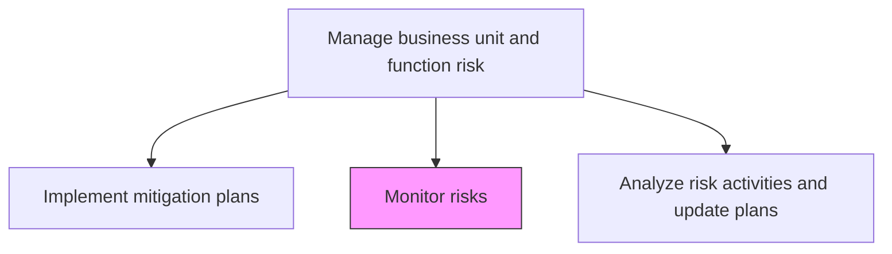
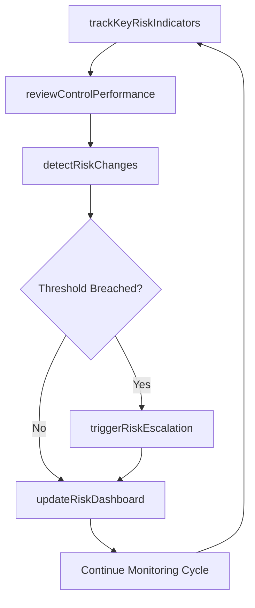

# Monitor risks

> Business-as-Code definition for continuously tracking risk indicators, control effectiveness, and emerging threats at the business unit level to ensure timely response.

## Overview

Identifying, examining, and recognizing/justifying any improbability in investment decision making.

## Process Hierarchy



## GraphDL

```yaml
monitor:
  object: Risks
  actor: RiskMonitoringAnalyst
  result: RiskMonitoringReport
```

## Actions

| Action | Description |
|--------|-------------|
| trackKeyRiskIndicators | Monitor quantitative and qualitative risk indicators |
| reviewControlPerformance | Assess whether implemented controls continue to operate effectively |
| detectRiskChanges | Identify changes in risk likelihood, impact, or velocity |
| triggerRiskEscalation | Escalate risks that breach defined thresholds |
| updateRiskDashboard | Refresh risk monitoring dashboards with current data |

## Events

| Event | Description |
|-------|-------------|
| keyRiskIndicatorTracked | KRI data point recorded and compared against threshold |
| controlPerformanceReviewed | Control effectiveness assessment completed |
| riskChangeDetected | Material change in risk profile identified |
| riskEscalationTriggered | Risk threshold breach escalated to management |
| riskDashboardUpdated | Monitoring dashboard refreshed with latest data |

## Searches

| Search | Description |
|--------|-------------|
| getKeyRiskIndicators | Retrieve current KRI values and trends |
| getControlPerformanceData | Access control effectiveness metrics |
| findRiskChanges | List risks with material profile changes |
| getEscalationHistory | View risk escalation events and resolutions |

## Process Flow



## RACI Matrix

| Activity | Responsible | Accountable | Consulted | Informed |
|----------|-------------|-------------|-----------|----------|
| trackKeyRiskIndicators | RiskMonitoringAnalyst | BusinessUnitRiskManager | EnterpriseRiskManager | Operations |
| reviewControlPerformance | RiskMonitoringAnalyst | BusinessUnitRiskManager | ControlOwners | InternalAudit |
| detectRiskChanges | RiskMonitoringAnalyst | BusinessUnitRiskManager | SubjectMatterExperts | Compliance |
| triggerRiskEscalation | BusinessUnitRiskManager | ChiefRiskOfficer | ExecutiveTeam | BoardOfDirectors |

## Related Processes

| Process | Relationship |
|---------|-------------|
| 11.1.4.4 Implement mitigation plans for risks | Upstream - implemented controls are monitored |
| 11.1.4.6 Analyze risk activities and update plans | Downstream - monitoring data feeds analysis |
| 11.1.2.5 Ensure risks and risk mitigation actions are monitored | Parallel - enterprise monitoring oversight |
| 11.1.4.7 Report on risk activities | Downstream - monitoring data feeds reporting |

## Related Departments

| Department | Role |
|-----------|------|
| Each Business Unit | Monitors risks within their operational domain |
| Enterprise Risk Management | Provides monitoring framework and oversight |
| Information Technology | Supports automated monitoring and alerting |
| Internal Audit | Validates monitoring effectiveness |

## Related Occupations

| Occupation | Involvement |
|-----------|-------------|
| Risk Monitoring Analyst | Primary monitoring executor |
| Business Unit Risk Manager | Escalation authority |
| Control Owner | Reports on control performance |
| GRC Platform Administrator | Maintains monitoring tools |

## KPIs

| KPI | Description | Unit |
|-----|-------------|------|
| Monitoring Frequency | How often risk indicators are reviewed | Per Week |
| Alert Response Time | Average time from alert to acknowledgment | Hours |
| False Positive Rate | Percentage of triggered alerts that were non-issues | % |
| Risk Profile Stability | Percentage of risks with stable or improving profiles | % |

## Usage

```typescript
import { monitorRisks } from '@headlessly/monitor-risks'

const monitoring = monitorRisks()

// Track key risk indicators for a business unit
const kris = await monitoring.trackKeyRiskIndicators({
  businessUnit: 'manufacturing',
  indicators: ['equipment-failure-rate', 'safety-incident-count', 'supplier-delay-frequency'],
  period: 'last-30-days'
})

// Review control performance
const controlReview = await monitoring.reviewControlPerformance({
  controlIds: ['CTRL-MFG-001', 'CTRL-MFG-002'],
  testingMethod: 'automated',
  reportFormat: 'summary'
})
```
