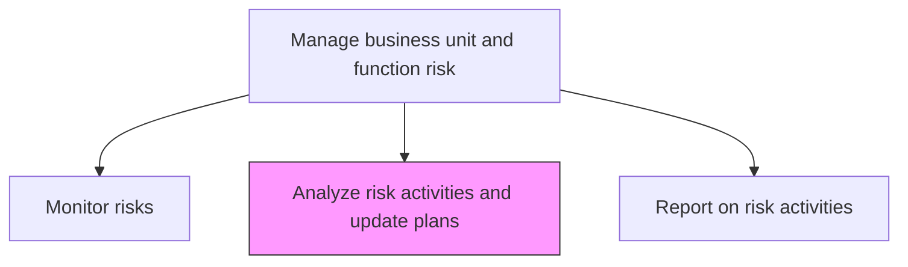
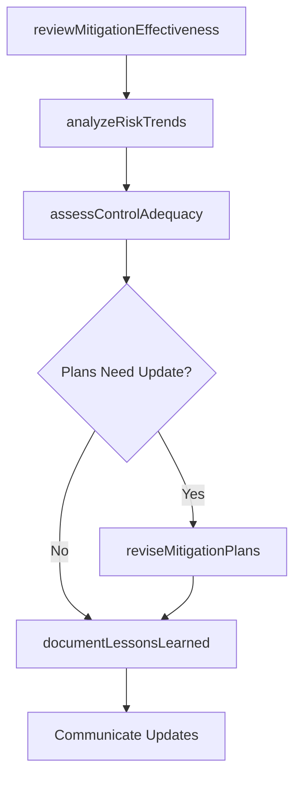

# Analyze risk activities and update plans

> Business-as-Code definition for reviewing risk management activities, evaluating their effectiveness, and revising risk plans based on emerging data and changing conditions.

## Overview

Examining the impact of risk activities in order to update the existing scheme of risk management. Analyze and substantiate the potential for adverse consequences to occur. Consider the risks associated with the activity and the methods available to manage those risks.

## Process Hierarchy



## GraphDL

```yaml
analyze:
  object: Risk Activities And Update Plans
  actor: RiskActivityAnalyst
  result: UpdatedRiskManagementPlan
```

## Actions

| Action | Description |
|--------|-------------|
| reviewMitigationEffectiveness | Evaluate whether mitigation actions achieved desired risk reduction |
| analyzeRiskTrends | Examine patterns in risk data to identify emerging or declining threats |
| assessControlAdequacy | Determine if existing controls remain sufficient for current risk levels |
| reviseMitigationPlans | Update mitigation plans based on analysis findings |
| documentLessonsLearned | Record insights from risk activities for organizational learning |

## Events

| Event | Description |
|-------|-------------|
| mitigationEffectivenessReviewed | Mitigation action effectiveness assessment completed |
| riskTrendsAnalyzed | Risk data trend analysis completed |
| controlAdequacyAssessed | Control sufficiency evaluation completed |
| mitigationPlansRevised | Mitigation plans updated based on analysis |
| lessonsLearnedDocumented | Risk activity insights recorded for future reference |

## Searches

| Search | Description |
|--------|-------------|
| getMitigationEffectiveness | Retrieve effectiveness data for mitigation actions |
| getRiskTrends | Access risk trend data over specified periods |
| getControlAdequacyReports | View control sufficiency assessment results |
| getLessonsLearned | Search documented lessons from past risk activities |

## Process Flow



## RACI Matrix

| Activity | Responsible | Accountable | Consulted | Informed |
|----------|-------------|-------------|-----------|----------|
| reviewMitigationEffectiveness | RiskActivityAnalyst | BusinessUnitRiskManager | MitigationOwners | EnterpriseRiskManager |
| analyzeRiskTrends | RiskActivityAnalyst | BusinessUnitRiskManager | DataAnalytics | ChiefRiskOfficer |
| assessControlAdequacy | InternalAuditor | BusinessUnitRiskManager | ControlOwners | Compliance |
| reviseMitigationPlans | BusinessUnitRiskManager | BusinessUnitDirector | ChiefRiskOfficer | ExecutiveTeam |

## Related Processes

| Process | Relationship |
|---------|-------------|
| 11.1.4.5 Monitor risks | Upstream - monitoring data drives analysis |
| 11.1.4.7 Report on risk activities | Downstream - analysis findings feed reporting |
| 11.1.4.3 Develop mitigation plans for risks | Circular - revised plans cycle back to planning |
| 11.1.1.4 Coordinate the sharing of risk knowledge | Downstream - lessons learned contribute to knowledge |

## Related Departments

| Department | Role |
|-----------|------|
| Each Business Unit | Performs analysis within their operational domain |
| Enterprise Risk Management | Provides analysis methodology and oversight |
| Data Analytics | Supports trend analysis and visualization |
| Internal Audit | Validates control adequacy assessments |

## Related Occupations

| Occupation | Involvement |
|-----------|-------------|
| Risk Activity Analyst | Primary analysis executor |
| Business Unit Risk Manager | Plan revision authority |
| Data Analyst | Trend analysis support |
| Internal Auditor | Control adequacy validation |

## KPIs

| KPI | Description | Unit |
|-----|-------------|------|
| Analysis Cycle Frequency | How often risk activities are analyzed | Per Quarter |
| Plan Update Rate | Percentage of mitigation plans revised per analysis cycle | % |
| Mitigation Effectiveness Score | Average effectiveness rating of implemented mitigations | Score (1-5) |
| Lessons Learned Contribution | Number of documented lessons from risk activities | Count |

## Usage

```typescript
import { analyzeRiskActivitiesAndUpdatePlans } from '@headlessly/analyze-risk-activities-and-update-plans'

const analysis = analyzeRiskActivitiesAndUpdatePlans()

// Review mitigation effectiveness
const effectiveness = await analysis.reviewMitigationEffectiveness({
  planId: 'MIT-PLAN-2026-008',
  metrics: ['risk-reduction', 'cost-efficiency', 'timeline-adherence']
})

// Analyze risk trends
const trends = await analysis.analyzeRiskTrends({
  businessUnit: 'technology',
  period: 'last-12-months',
  categories: ['cybersecurity', 'vendor-risk', 'technology-obsolescence']
})
```
