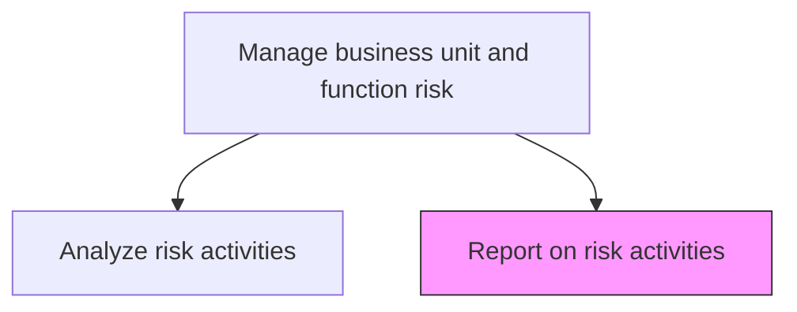
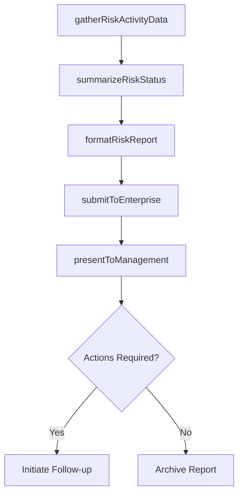

# Report on risk activities

> Business-as-Code definition for producing business unit risk activity reports covering identification, assessment, mitigation progress, and monitoring outcomes for management review.

## Overview

Creating reports on risk activities, and communicating them to management. Prepare reports on the potential for adverse safety consequences.

## Process Hierarchy



## GraphDL

```yaml
report:
  object: On Risk Activities
  actor: BusinessUnitRiskReporter
  result: BusinessUnitRiskReport
```

## Actions

| Action | Description |
|--------|-------------|
| gatherRiskActivityData | Collect data on risk identification, assessment, and mitigation activities |
| summarizeRiskStatus | Create concise summaries of current risk positions and trends |
| formatRiskReport | Prepare risk reports in standardized enterprise format |
| submitToEnterprise | Submit business unit risk report to enterprise risk management |
| presentToManagement | Deliver risk activity findings to business unit leadership |

## Events

| Event | Description |
|-------|-------------|
| riskActivityDataGathered | Risk activity data collected for reporting period |
| riskStatusSummarized | Current risk positions and trends summarized |
| riskReportFormatted | Report prepared in standard enterprise format |
| reportSubmittedToEnterprise | Business unit report submitted to enterprise risk |
| reportPresentedToManagement | Risk findings presented to leadership |

## Searches

| Search | Description |
|--------|-------------|
| getRiskActivityReports | Retrieve historical business unit risk reports |
| getRiskStatusSummary | Access current risk position summary |
| getReportSubmissionStatus | Check status of report submissions to enterprise |
| getReportingCalendar | View risk reporting schedule and deadlines |

## Process Flow



## RACI Matrix

| Activity | Responsible | Accountable | Consulted | Informed |
|----------|-------------|-------------|-----------|----------|
| gatherRiskActivityData | BusinessUnitRiskReporter | BusinessUnitRiskManager | RiskAnalysts | Operations |
| summarizeRiskStatus | BusinessUnitRiskReporter | BusinessUnitRiskManager | ControlOwners | Compliance |
| formatRiskReport | BusinessUnitRiskReporter | BusinessUnitRiskManager | EnterpriseRiskManager | DataAnalytics |
| presentToManagement | BusinessUnitRiskManager | BusinessUnitDirector | ChiefRiskOfficer | ExecutiveTeam |

## Related Processes

| Process | Relationship |
|---------|-------------|
| 11.1.4.6 Analyze risk activities and update plans | Upstream - analysis findings feed reporting |
| 11.1.3.2 Ensure each unit follows the enterprise risk reporting process | Governing - defines reporting requirements |
| 11.1.2.6 Report on enterprise risk activities | Downstream - unit reports feed enterprise reporting |
| 11.1.1.5 Prepare and report enterprise risk to board | Downstream - data feeds board reporting |

## Related Departments

| Department | Role |
|-----------|------|
| Each Business Unit | Produces unit-level risk activity reports |
| Enterprise Risk Management | Receives and consolidates unit reports |
| Data Analytics | Supports report data preparation |
| Internal Audit | Reviews report accuracy and completeness |

## Related Occupations

| Occupation | Involvement |
|-----------|-------------|
| Business Unit Risk Reporter | Primary report author |
| Business Unit Risk Manager | Report reviewer and presenter |
| Risk Analyst | Data gathering and analysis |
| Enterprise Risk Manager | Report recipient and consolidator |

## KPIs

| KPI | Description | Unit |
|-----|-------------|------|
| Reporting Timeliness | Percentage of reports submitted by deadline | % |
| Report Completeness | Percentage of required report sections fully populated | % |
| Management Engagement | Percentage of risk recommendations acknowledged by leadership | % |
| Data Accuracy | Number of corrections required post-submission | Count |

## Usage

```typescript
import { reportOnRiskActivities } from '@headlessly/report-on-risk-activities'

const reporting = reportOnRiskActivities()

// Gather risk activity data for the quarter
const data = await reporting.gatherRiskActivityData({
  businessUnit: 'finance',
  period: 'Q1-2026',
  activities: ['identification', 'assessment', 'mitigation', 'monitoring']
})

// Format and submit the report
const report = await reporting.formatRiskReport({
  data: data,
  template: 'enterprise-standard',
  includeCharts: true
})
```
