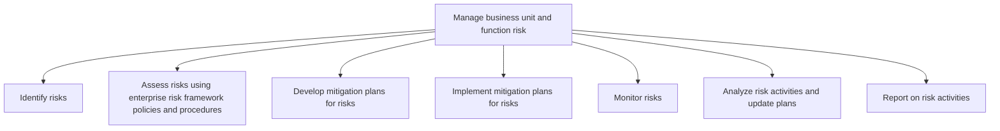
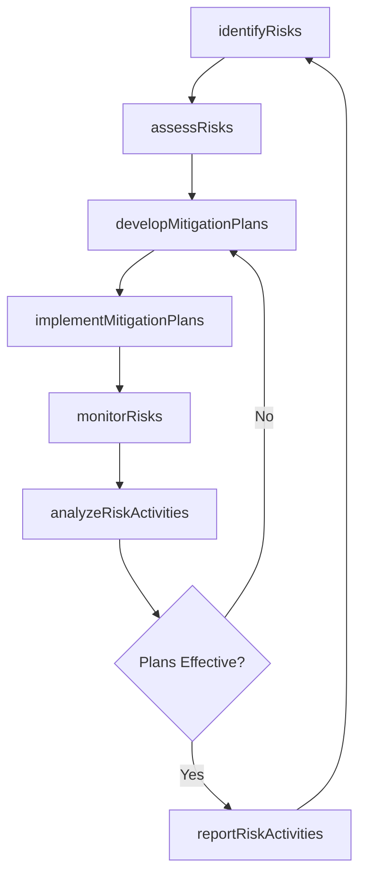

# Manage business unit and function risk

> Business-as-Code definition for identifying, assessing, mitigating, monitoring, and reporting on risks at the business unit and functional level using the enterprise risk framework and standardized procedures.

## Overview

Analyzing the threats a business unit/function faces to prioritize the controls it implements..

## Process Hierarchy



## GraphDL

```yaml
manage:
  object: Business Unit And Function Risk
  actor: BusinessUnitRiskManager
  result: RiskMitigationPlan
```

## Actions

| Action | Description |
|--------|-------------|
| identifyRisks | Catalog operational, financial, and strategic risks specific to the business unit |
| assessRisks | Evaluate risks using the enterprise risk framework's likelihood-impact methodology |
| developMitigationPlans | Create treatment plans with controls, owners, and timelines for identified risks |
| implementMitigationPlans | Deploy risk controls and execute approved mitigation activities |
| monitorRisks | Track risk indicators and control effectiveness on an ongoing basis |
| analyzeRiskActivities | Review risk mitigation outcomes and update plans based on findings |
| reportRiskActivities | Produce periodic risk reports for enterprise risk management |

## Events

| Event | Description |
|-------|-------------|
| risksIdentified | Business unit risk identification cycle completed |
| risksAssessed | Risk assessment using enterprise framework completed |
| mitigationPlansDeveloped | Risk treatment plans created with assigned owners |
| mitigationPlansImplemented | Risk controls and mitigation actions deployed |
| risksMonitored | Risk indicator monitoring review completed |
| riskActivitiesAnalyzed | Risk activity analysis completed with updated plans |
| riskActivitiesReported | Business unit risk report submitted to enterprise risk management |

## Searches

| Search | Description |
|--------|-------------|
| getBusinessUnitRiskRegister | Retrieve the risk register for a specific business unit |
| findRisksByStatus | Query risks by treatment status, severity, or owner |
| getMitigationPlanProgress | Check progress on risk mitigation plan implementation |
| getRiskActivityHistory | Retrieve historical risk activities and outcomes for a business unit |

## Process Flow



## RACI Matrix

| Activity | Responsible | Accountable | Consulted | Informed |
|----------|-------------|-------------|-----------|----------|
| identifyRisks | BusinessUnitRiskManager | BusinessUnitHead | Operations | ERM |
| assessRisks | RiskAnalyst | BusinessUnitRiskManager | Finance | Compliance |
| developMitigationPlans | BusinessUnitRiskManager | BusinessUnitHead | Legal | InternalAudit |
| monitorRisks | RiskAnalyst | BusinessUnitRiskManager | Operations | ERM |
| reportRiskActivities | RiskAnalyst | BusinessUnitRiskManager | Finance | ChiefRiskOfficer |

## Sub-Processes

| ID | Name | Description |
|----|------|-------------|
| 11.1.4.1 | Identify risks | Developing a timely and continuous process to identify activities that might hinder a project's goal |
| 11.1.4.2 | Assess risks using enterprise risk framework policies and procedures | Determining the possibility that a specified undesirable event will occur using established tools, i |
| 11.1.4.3 | Develop mitigation plans for risks | Developing possibilities and arrangements to improve opportunities and reduce deviations to project  |
| 11.1.4.4 | Implement mitigation plans for risks | Executing mitigation plans to improve opportunities and reduce deviations to project objectives. |
| 11.1.4.5 | Monitor risks | Identifying, examining, and recognizing/justifying any improbability in investment decision making. |
| 11.1.4.6 | Analyze risk activities and update plans | Examining the impact of risk activities in order to update the existing scheme of risk management. A |
| 11.1.4.7 | Report on risk activities | Creating reports on risk activities, and communicating them to management. Prepare reports on the po |

## Related Processes

| Process | Relationship |
|---------|-------------|
| 11.1.1 Establish the enterprise risk framework and policies | Upstream - framework provides methodology for risk assessment |
| 11.1.3 Coordinate business unit and functional risk management activities | Upstream - coordination ensures consistency across units |
| 11.3 Manage remediation efforts | Downstream - materialized risks trigger remediation processes |

## Related Departments

| Department | Role |
|-----------|------|
| Business Unit Management | Owns and prioritizes risk mitigation within the unit |
| Risk Management | Provides methodology and tools for risk assessment |
| Finance | Evaluates financial exposure and insurance adequacy |
| Operations | Implements operational controls to mitigate identified risks |

## Related Occupations

| Occupation | Involvement |
|-----------|-------------|
| Business Unit Risk Manager | Leads risk identification, assessment, and reporting for the unit |
| Risk Analyst | Conducts risk assessments and monitors key risk indicators |
| Insurance Analyst | Evaluates insurance coverage adequacy for identified risks |

## KPIs

| KPI | Description | Unit |
|-----|-------------|------|
| Risk Mitigation Plan Closure Rate | Percentage of mitigation plans completed within target timeline | % |
| Risk Incident Count | Number of risk events materialized per business unit per quarter | Count |
| Control Effectiveness Score | Average effectiveness rating of deployed risk controls | Score (1-5) |
| Risk Reporting Completeness | Percentage of required risk data fields populated in reports | % |

## Usage

```typescript
import { manageBusinessUnitAndFunctionRisk } from '@headlessly/manage-business-unit-and-function-risk'

const risk = manageBusinessUnitAndFunctionRisk()

// Identify risks for a business unit
const risks = await risk.identifyRisks({
  businessUnit: 'Manufacturing-West',
  categories: ['operational', 'supply-chain', 'safety'],
  assessmentDate: '2025-07-01'
})

// Develop mitigation plans for high-severity risks
const plan = await risk.developMitigationPlans({
  riskIds: ['RSK-MFG-042', 'RSK-MFG-055'],
  controlTypes: ['preventive', 'detective'],
  targetCompletionDate: '2025-09-30'
})
```
