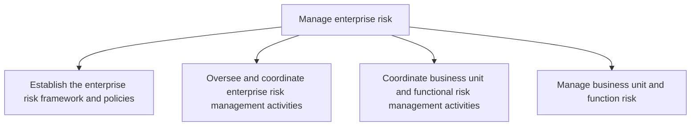
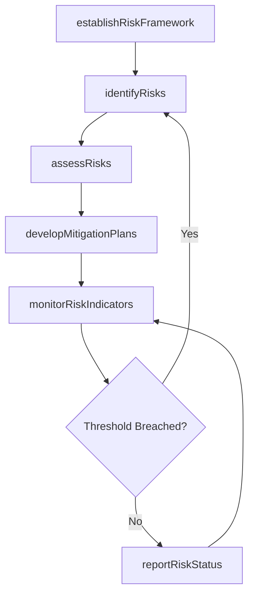

# Manage enterprise risk

> Business-as-Code definition for establishing risk frameworks, coordinating risk management activities across the enterprise, and ensuring each business unit identifies, assesses, mitigates, and monitors risks consistently.

## Overview

Creating requisite frameworks and coordinating all risk management activities for the entire organization and each function. Manage the enterprise risk by outlining the risk policies and procedures. Monitor and communicate all risk management activities. Encourage correspondence among the business units. Manage the risk of all business units and functions.

## Process Hierarchy



## GraphDL

```yaml
manage:
  object: Enterprise Risk
  actor: ChiefRiskOfficer
  result: EnterpriseRiskRegister
```

## Actions

| Action | Description |
|--------|-------------|
| establishRiskFramework | Define enterprise risk management policies, tolerances, and governance structure |
| identifyRisks | Catalog risks across strategic, operational, financial, and compliance domains |
| assessRisks | Evaluate probability and impact of identified risks using scoring methodologies |
| developMitigationPlans | Create risk treatment plans including avoidance, transfer, and acceptance strategies |
| monitorRiskIndicators | Continuously track key risk indicators and threshold breaches |
| reportRiskStatus | Prepare and deliver risk reports to executive management and the board |

## Events

| Event | Description |
|-------|-------------|
| riskFrameworkEstablished | Enterprise risk policies and governance structure approved |
| risksIdentified | New risks cataloged in the enterprise risk register |
| risksAssessed | Risk probability and impact scoring completed |
| mitigationPlansDeveloped | Risk treatment plans created and assigned to owners |
| riskIndicatorsMonitored | Key risk indicators reviewed and thresholds checked |
| riskStatusReported | Enterprise risk report delivered to stakeholders |

## Searches

| Search | Description |
|--------|-------------|
| findRisks | Query enterprise risk register by category, severity, or business unit |
| getRiskAssessment | Retrieve detailed risk assessment with scoring and treatment plan |
| getMitigationStatus | Check implementation status of risk mitigation actions |
| getRiskHeatmap | Get aggregated risk exposure by category and severity level |
| findRiskIndicators | List key risk indicators with current values and thresholds |

## Process Flow



## RACI Matrix

| Activity | Responsible | Accountable | Consulted | Informed |
|----------|-------------|-------------|-----------|----------|
| establishRiskFramework | RiskManager | ChiefRiskOfficer | GeneralCounsel | Board |
| identifyRisks | RiskAnalyst | ChiefRiskOfficer | BusinessUnitLeads | Finance |
| assessRisks | RiskAnalyst | RiskManager | InternalAudit | Compliance |
| developMitigationPlans | RiskManager | ChiefRiskOfficer | BusinessUnitLeads | Executive |
| reportRiskStatus | RiskAnalyst | ChiefRiskOfficer | CFO | AuditCommittee |

## Sub-Processes

| ID | Name | Description |
|----|------|-------------|
| 11.1.1 | Establish the enterprise risk framework and policies | Creating an agenda for the rules and regulations of enterprise risk that deal with hazardous, financ |
| 11.1.2 | Oversee and coordinate enterprise risk management activities | Coordinating to plan, organize, lead, and control the activities of an organization in order to mini |
| 11.1.3 | Coordinate business unit and functional risk management activities | Coordinating risk management activities to improve opportunities and lessen threats. Specify the org |
| 11.1.4 | Manage business unit and function risk | Analyzing the threats a business unit/function faces to prioritize the controls it implements.. |

## Related Processes

| Process | Relationship |
|---------|-------------|
| 11.2 Manage compliance | Parallel - regulatory risks feed into compliance programs |
| 11.3 Manage remediation efforts | Downstream - risk events trigger remediation activities |
| 11.4 Manage business resiliency | Downstream - risk assessments inform continuity planning |
| 8.0 Manage Financial Resources | Parallel - financial risks managed jointly with treasury |

## Related Departments

| Department | Role |
|-----------|------|
| Enterprise Risk Management | Owns framework, policies, and enterprise-level risk coordination |
| Internal Audit | Provides independent assessment of risk controls |
| Finance | Manages financial risk exposure and insurance programs |
| Legal | Advises on regulatory and litigation risk |
| Information Security | Manages cybersecurity and data risk domains |

## Related Occupations

| Occupation | Involvement |
|-----------|-------------|
| Chief Risk Officer | Executive accountability for enterprise risk management |
| Risk Manager | Coordinates risk identification, assessment, and mitigation |
| Risk Analyst | Performs risk analysis, scoring, and reporting |
| Internal Auditor | Validates control effectiveness and risk treatment adequacy |

## KPIs

| KPI | Description | Unit |
|-----|-------------|------|
| Risk Register Coverage | Percentage of business functions with current risk assessments | % |
| Mitigation Plan Completion | Percentage of risk mitigation actions completed on time | % |
| Risk Appetite Adherence | Number of risk appetite breaches per reporting period | Count |
| Key Risk Indicator Accuracy | Percentage of KRI thresholds that correctly predicted risk events | % |
| Risk Reporting Timeliness | Percentage of risk reports delivered within scheduled deadlines | % |

## Usage

```typescript
import { manageEnterpriseRisk } from '@headlessly/manage-enterprise-risk'

const risk = manageEnterpriseRisk()

// Identify risks across the enterprise
const risks = await risk.identifyRisks({
  scope: 'enterprise',
  categories: ['strategic', 'operational', 'financial', 'compliance'],
  period: '2025-annual'
})

// Assess a specific risk
const assessment = await risk.assessRisks({
  riskId: 'RISK-2025-0042',
  methodology: 'quantitative',
  confidenceLevel: 0.95
})

// Query risk heatmap for board presentation
const heatmap = await risk.getRiskHeatmap({
  groupBy: 'business-unit',
  minSeverity: 'medium'
})
```
