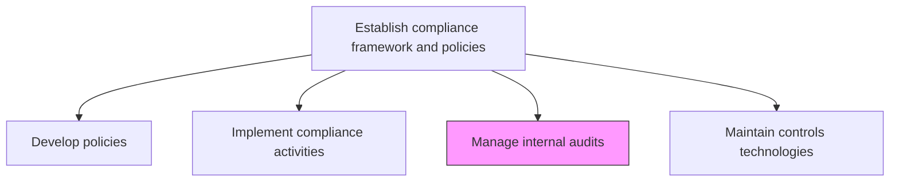
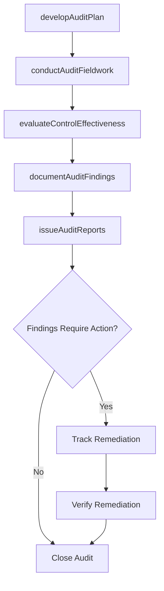

# Manage internal audits

> Business-as-Code definition for planning, executing, and reporting on internal audits to evaluate the effectiveness of controls, compliance, and risk management processes.

## Overview

Managing accounts and prepare regular reports on financial performance.

## Process Hierarchy



## GraphDL

```yaml
manage:
  object: Internal Audits
  actor: InternalAuditDirector
  result: AuditReport
```

## Actions

| Action | Description |
|--------|-------------|
| developAuditPlan | Create annual and quarterly audit plans based on risk assessment |
| conductAuditFieldwork | Execute audit procedures including testing, sampling, and interviews |
| evaluateControlEffectiveness | Assess whether internal controls operate as designed |
| documentAuditFindings | Record audit observations, findings, and recommendations |
| issueAuditReports | Publish formal audit reports to management and the audit committee |

## Events

| Event | Description |
|-------|-------------|
| auditPlanDeveloped | Annual or quarterly audit plan approved |
| auditFieldworkCompleted | Audit testing and evidence gathering concluded |
| controlEffectivenessEvaluated | Internal control testing results documented |
| auditFindingsDocumented | Audit observations and recommendations recorded |
| auditReportIssued | Formal audit report published and distributed |

## Searches

| Search | Description |
|--------|-------------|
| getAuditPlan | Retrieve current audit plan and schedule |
| findOpenFindings | List unresolved audit findings and recommendations |
| getAuditReports | Access completed audit reports by scope or period |
| getAuditTrackingStatus | View remediation status for audit findings |

## Process Flow



## RACI Matrix

| Activity | Responsible | Accountable | Consulted | Informed |
|----------|-------------|-------------|-----------|----------|
| developAuditPlan | InternalAuditDirector | AuditCommittee | ChiefRiskOfficer | ExecutiveTeam |
| conductAuditFieldwork | InternalAuditor | InternalAuditDirector | ProcessOwners | Compliance |
| evaluateControlEffectiveness | InternalAuditor | InternalAuditDirector | ControlOwners | RiskManager |
| issueAuditReports | InternalAuditDirector | AuditCommittee | GeneralCounsel | BoardOfDirectors |

## Related Processes

| Process | Relationship |
|---------|-------------|
| 11.2.1.1 Develop enterprise compliance policies and procedures | Upstream - policies define audit criteria |
| 11.2.1.4 Maintain controls-related technologies and tools | Parallel - technology supports audit activities |
| 11.2.2.6 Monitor and test regulatory compliance position | Parallel - audit validates compliance |
| 11.1.2.4 Verify business unit mitigation plans are implemented | Parallel - audit supports verification |

## Related Departments

| Department | Role |
|-----------|------|
| Internal Audit | Plans and executes audits |
| All Business Units | Subject to audit activities |
| Compliance | Provides compliance context for audits |
| Information Technology | Supports IT audit activities |

## Related Occupations

| Occupation | Involvement |
|-----------|-------------|
| Internal Audit Director | Audit program leader |
| Internal Auditor | Fieldwork and testing executor |
| IT Auditor | Technology-focused auditing |
| Audit Committee Member | Oversight and report recipient |

## KPIs

| KPI | Description | Unit |
|-----|-------------|------|
| Audit Plan Completion | Percentage of planned audits completed in the period | % |
| Finding Closure Rate | Percentage of audit findings remediated within target timeframe | % |
| Audit Cycle Time | Average time from audit start to report issuance | Days |
| Repeat Finding Rate | Percentage of findings that recur from prior audits | % |

## Usage

```typescript
import { manageInternalAudits } from '@headlessly/manage-internal-audits'

const audits = manageInternalAudits()

// Develop the annual audit plan
const plan = await audits.developAuditPlan({
  year: 2026,
  riskBasedPrioritization: true,
  scope: ['financial-controls', 'it-security', 'regulatory-compliance']
})

// Conduct audit fieldwork
const fieldwork = await audits.conductAuditFieldwork({
  auditId: 'AUD-2026-005',
  procedures: ['control-testing', 'document-review', 'staff-interviews'],
  sampleSize: 50
})
```
