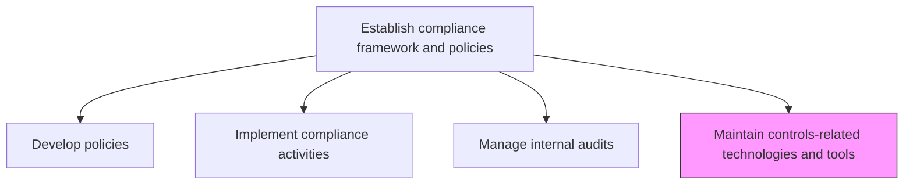
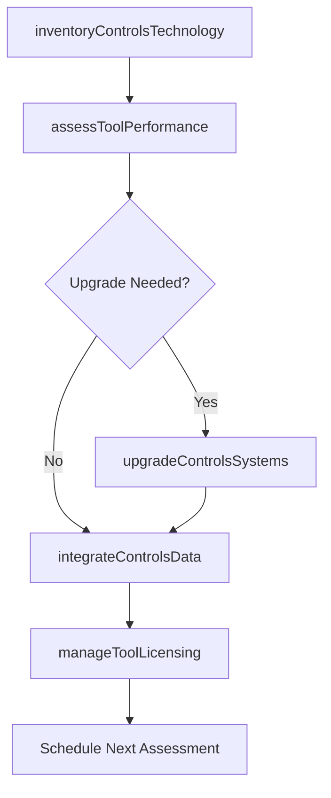

# Maintain controls-related technologies and tools

> Business-as-Code definition for managing and maintaining the technology platforms, tools, and systems that support internal controls, compliance monitoring, and audit activities.

## Overview

Managing technologies and tools related to the confidentiality, integrity, and availability of data in order to ensure the security of the organization's information.

## Process Hierarchy



## GraphDL

```yaml
maintain:
  object: Controls-related Technologies And Tools
  actor: GRCTechnologyManager
  result: ControlsTechnologyInventory
```

## Actions

| Action | Description |
|--------|-------------|
| inventoryControlsTechnology | Catalog all GRC platforms, control monitoring tools, and audit systems |
| assessToolPerformance | Evaluate current tools for reliability, accuracy, and fitness for purpose |
| upgradeControlsSystems | Apply patches, upgrades, and enhancements to compliance technology |
| integrateControlsData | Ensure data flows between control monitoring, audit, and reporting systems |
| manageToolLicensing | Administer software licenses, subscriptions, and vendor relationships |

## Events

| Event | Description |
|-------|-------------|
| controlsTechnologyInventoried | GRC tool catalog updated |
| toolPerformanceAssessed | Tool reliability and fitness evaluation completed |
| controlsSystemUpgraded | System upgrade or patch successfully applied |
| controlsDataIntegrated | Data integration between compliance systems established |
| toolLicensingManaged | License renewal or vendor change processed |

## Searches

| Search | Description |
|--------|-------------|
| getControlsToolInventory | Retrieve catalog of all compliance and controls technology |
| findToolsRequiringUpgrade | List tools with pending patches or upgrades |
| getToolPerformanceMetrics | Access performance and uptime metrics for GRC tools |
| getLicenseStatus | View license expiration dates and renewal status |

## Process Flow



## RACI Matrix

| Activity | Responsible | Accountable | Consulted | Informed |
|----------|-------------|-------------|-----------|----------|
| inventoryControlsTechnology | GRCTechnologyManager | CIO | ComplianceOfficer | InternalAudit |
| assessToolPerformance | GRCTechnologyManager | CIO | ITOperations | ChiefRiskOfficer |
| upgradeControlsSystems | ITOperations | GRCTechnologyManager | InfoSec | Compliance |
| integrateControlsData | DataIntegrationEngineer | GRCTechnologyManager | DataAnalytics | RiskManagement |

## Related Processes

| Process | Relationship |
|---------|-------------|
| 11.2.1.3 Manage internal audits | Consumer - audits rely on control technology |
| 11.1.1.3 Identify and implement enterprise risk management tools | Parallel - risk technology alignment |
| 11.2.2.6 Monitor and test regulatory compliance | Consumer - monitoring relies on tools |
| 8.5.5 Perform service solution maintenance and testing | Supporting - IT maintenance processes |

## Related Departments

| Department | Role |
|-----------|------|
| Information Technology | Maintains and upgrades compliance systems |
| Compliance | Primary user and requirements definer |
| Internal Audit | Uses audit tools and platforms |
| Information Security | Ensures controls technology security |

## Related Occupations

| Occupation | Involvement |
|-----------|-------------|
| GRC Technology Manager | Primary technology steward |
| IT Operations Engineer | System maintenance and upgrades |
| Compliance Analyst | Tool user and requirements contributor |
| Data Integration Engineer | System integration specialist |

## KPIs

| KPI | Description | Unit |
|-----|-------------|------|
| System Uptime | Availability of GRC platforms and monitoring tools | % |
| Upgrade Currency | Percentage of tools running on current supported versions | % |
| Integration Completeness | Percentage of control data sources integrated into central platform | % |
| Tool Satisfaction Score | User satisfaction with controls technology | Score (1-5) |

## Usage

```typescript
import { maintainControlsRelatedTechnologiesAndTools } from '@headlessly/maintain-controls-related-technologies-and-tools'

const controlstech = maintainControlsRelatedTechnologiesAndTools()

// Inventory all GRC tools
const inventory = await controlstech.inventoryControlsTechnology({
  categories: ['grc-platform', 'audit-management', 'policy-management', 'control-monitoring'],
  includeVersionInfo: true
})

// Assess tool performance
const performance = await controlstech.assessToolPerformance({
  toolId: 'GRC-PLATFORM-001',
  metrics: ['uptime', 'response-time', 'user-satisfaction', 'data-accuracy']
})
```
