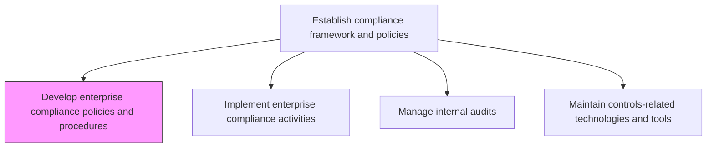
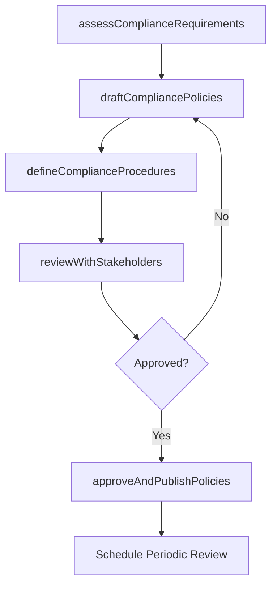

# Develop enterprise compliance policies and procedures

> Business-as-Code definition for establishing and documenting enterprise-wide compliance policies and procedures that address regulatory, ethical, and organizational requirements.

## Overview

Creating a standardized approach to ethics and compliance. Have a programmatic approach for compliance that focuses on the definite risks the organization faces.

## Process Hierarchy



## GraphDL

```yaml
develop:
  object: Enterprise Compliance Policies And Procedures
  actor: ChiefComplianceOfficer
  result: CompliancePolicyFramework
```

## Actions

| Action | Description |
|--------|-------------|
| assessComplianceRequirements | Identify regulatory, ethical, and organizational compliance obligations |
| draftCompliancePolicies | Author compliance policies addressing identified obligations |
| defineComplianceProcedures | Create step-by-step procedures for policy implementation |
| reviewWithStakeholders | Circulate draft policies for legal, executive, and departmental review |
| approveAndPublishPolicies | Finalize and distribute approved compliance policies |

## Events

| Event | Description |
|-------|-------------|
| complianceRequirementsAssessed | Compliance obligations inventory completed |
| compliancePoliciesDrafted | Draft compliance policies authored |
| complianceProceduresDefined | Compliance implementation procedures documented |
| stakeholderReviewCompleted | Policy review by stakeholders completed |
| policiesApprovedAndPublished | Compliance policies finalized and distributed |

## Searches

| Search | Description |
|--------|-------------|
| getCompliancePolicies | Retrieve compliance policies by domain or regulation |
| findPoliciesDueForReview | List policies approaching their review deadline |
| getComplianceProcedures | Access procedures associated with specific policies |
| getPolicyApprovalHistory | View approval workflow history for policies |

## Process Flow



## RACI Matrix

| Activity | Responsible | Accountable | Consulted | Informed |
|----------|-------------|-------------|-----------|----------|
| assessComplianceRequirements | ComplianceManager | ChiefComplianceOfficer | Legal | RiskManagement |
| draftCompliancePolicies | ComplianceManager | ChiefComplianceOfficer | GeneralCounsel | HumanResources |
| reviewWithStakeholders | ChiefComplianceOfficer | CEO | BusinessUnitLeads | AuditCommittee |
| approveAndPublishPolicies | ChiefComplianceOfficer | BoardOfDirectors | Legal | AllEmployees |

## Related Processes

| Process | Relationship |
|---------|-------------|
| 11.2.1.2 Implement enterprise compliance activities | Downstream - policies guide implementation |
| 11.2.2.1 Develop regulatory compliance procedures | Parallel - regulatory-specific procedures |
| 11.1.1.2 Develop and maintain enterprise risk policies | Parallel - risk policy alignment |
| 11.2.1.3 Manage internal audits | Downstream - policies define audit criteria |

## Related Departments

| Department | Role |
|-----------|------|
| Compliance | Primary author and owner of compliance policies |
| Legal | Ensures policies meet regulatory requirements |
| Human Resources | Integrates ethics and conduct policies |
| Internal Audit | Reviews policy effectiveness |

## Related Occupations

| Occupation | Involvement |
|-----------|-------------|
| Chief Compliance Officer | Policy framework owner |
| Compliance Manager | Policy author and maintainer |
| General Counsel | Legal review and validation |
| Ethics Officer | Ethics and conduct policy input |

## KPIs

| KPI | Description | Unit |
|-----|-------------|------|
| Policy Coverage | Percentage of compliance obligations with documented policies | % |
| Policy Currency | Percentage of policies reviewed within required cycle | % |
| Stakeholder Approval Time | Average time from draft to approved policy | Days |
| Employee Awareness | Percentage of employees acknowledging compliance policies | % |

## Usage

```typescript
import { developEnterpriseCompliancePoliciesAndProcedures } from '@headlessly/develop-enterprise-compliance-policies-and-procedures'

const compliance = developEnterpriseCompliancePoliciesAndProcedures()

// Assess compliance requirements
const requirements = await compliance.assessComplianceRequirements({
  domains: ['anti-corruption', 'data-privacy', 'anti-money-laundering'],
  jurisdictions: ['US', 'EU', 'UK']
})

// Draft compliance policies
const draft = await compliance.draftCompliancePolicies({
  domain: 'data-privacy',
  regulations: ['GDPR', 'CCPA'],
  effectiveDate: '2026-04-01'
})
```
