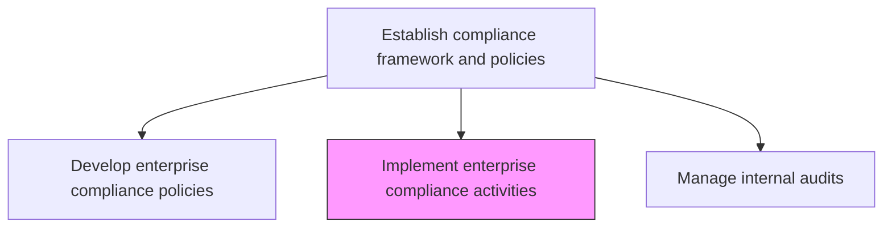
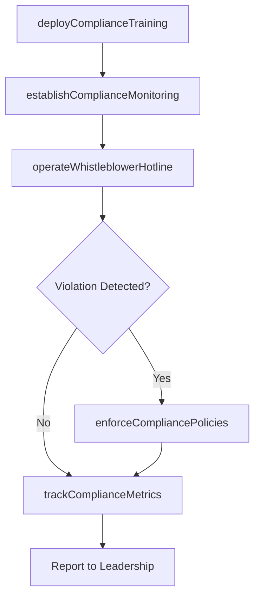

# Implement enterprise compliance activities

> Business-as-Code definition for executing enterprise compliance programs including training, monitoring, enforcement, and reporting activities across the organization.

## Overview

Implementing standardized for ethics and compliance. Have a programmatic approach, built from the top down, to enterprise compliance that focuses on the definite risks the organization faces.

## Process Hierarchy



## GraphDL

```yaml
implement:
  object: Enterprise Compliance Activities
  actor: ComplianceProgramManager
  result: ComplianceActivityRecord
```

## Actions

| Action | Description |
|--------|-------------|
| deployComplianceTraining | Roll out mandatory compliance training programs across the organization |
| establishComplianceMonitoring | Set up ongoing compliance monitoring and surveillance activities |
| operateWhistleblowerHotline | Manage anonymous reporting channels for compliance concerns |
| enforceCompliancePolicies | Apply disciplinary measures for compliance violations |
| trackComplianceMetrics | Measure and report on compliance program performance |

## Events

| Event | Description |
|-------|-------------|
| complianceTrainingDeployed | Compliance training program launched or updated |
| complianceMonitoringEstablished | Ongoing monitoring activities activated |
| whistleblowerReportReceived | Anonymous compliance concern submitted |
| complianceViolationEnforced | Disciplinary action taken for policy violation |
| complianceMetricsTracked | Compliance program metrics collected and reported |

## Searches

| Search | Description |
|--------|-------------|
| getTrainingCompletionRates | Retrieve compliance training completion data by department |
| findOpenViolations | List unresolved compliance violations |
| getWhistleblowerReports | Access anonymous compliance reports (redacted) |
| getComplianceProgramMetrics | Retrieve compliance program performance dashboard data |

## Process Flow



## RACI Matrix

| Activity | Responsible | Accountable | Consulted | Informed |
|----------|-------------|-------------|-----------|----------|
| deployComplianceTraining | ComplianceProgramManager | ChiefComplianceOfficer | HumanResources | AllEmployees |
| establishComplianceMonitoring | ComplianceAnalyst | ComplianceProgramManager | IT | InternalAudit |
| operateWhistleblowerHotline | EthicsOfficer | ChiefComplianceOfficer | Legal | AuditCommittee |
| enforceCompliancePolicies | HumanResources | ChiefComplianceOfficer | Legal | BusinessUnitDirector |

## Related Processes

| Process | Relationship |
|---------|-------------|
| 11.2.1.1 Develop enterprise compliance policies and procedures | Upstream - policies define activities |
| 11.2.1.3 Manage internal audits | Parallel - audit validates compliance activities |
| 11.2.2.6 Monitor and test regulatory compliance | Parallel - regulatory compliance monitoring |
| 7.3.5 Develop and manage employee training programs | Supporting - training program delivery |

## Related Departments

| Department | Role |
|-----------|------|
| Compliance | Manages and coordinates compliance activities |
| Human Resources | Delivers training and enforces policies |
| Legal | Advises on enforcement actions |
| Information Technology | Supports monitoring systems |

## Related Occupations

| Occupation | Involvement |
|-----------|-------------|
| Compliance Program Manager | Primary activity coordinator |
| Ethics Officer | Whistleblower program management |
| Compliance Analyst | Monitoring and metrics |
| HR Business Partner | Training delivery and enforcement |

## KPIs

| KPI | Description | Unit |
|-----|-------------|------|
| Training Completion Rate | Percentage of employees completing mandatory compliance training | % |
| Violation Detection Rate | Number of compliance violations detected per period | Count |
| Hotline Report Volume | Number of whistleblower reports received per period | Count |
| Time to Resolution | Average time to resolve compliance violations | Days |

## Usage

```typescript
import { implementEnterpriseComplianceActivities } from '@headlessly/implement-enterprise-compliance-activities'

const compliance = implementEnterpriseComplianceActivities()

// Deploy compliance training
const training = await compliance.deployComplianceTraining({
  program: 'anti-corruption-annual',
  audience: 'all-employees',
  deadline: '2026-03-31',
  format: 'e-learning'
})

// Track compliance metrics
const metrics = await compliance.trackComplianceMetrics({
  period: 'Q1-2026',
  indicators: ['training-completion', 'violation-count', 'hotline-reports']
})
```
