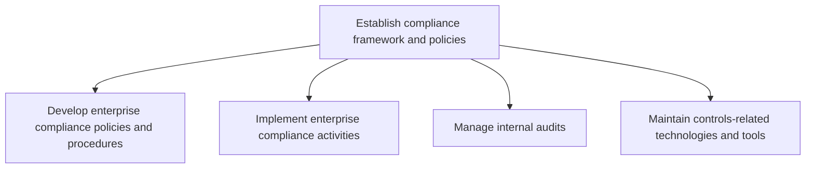
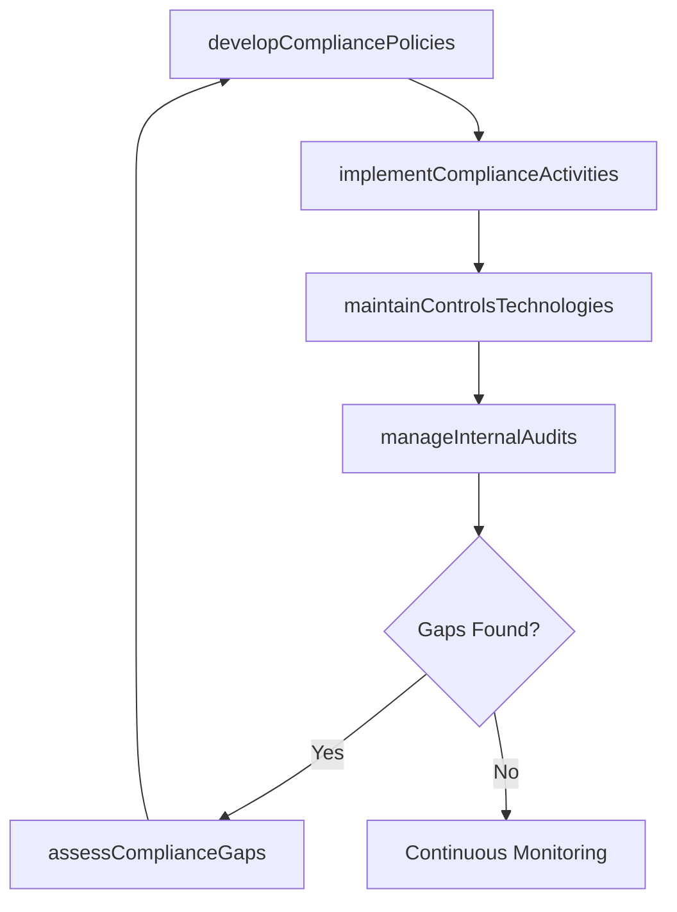

# Establish compliance framework and policies

> Business-as-Code definition for developing enterprise compliance policies, implementing compliance activities, managing internal audits, and maintaining controls-related technologies to ensure organizational adherence to laws and regulations.

## Overview

Developing a set of procedures detailing an organization's progress in complying with established guidelines, provisions, and legislation.

## Process Hierarchy



## GraphDL

```yaml
establish:
  object: Compliance Framework And Policies
  actor: ChiefComplianceOfficer
  result: ComplianceFramework
```

## Actions

| Action | Description |
|--------|-------------|
| developCompliancePolicies | Create enterprise-wide compliance policies, standards, and procedures |
| implementComplianceActivities | Deploy compliance training, controls, and monitoring activities |
| manageInternalAudits | Plan, execute, and follow up on internal audit engagements |
| maintainControlsTechnologies | Administer and update GRC tools, audit platforms, and control testing systems |
| assessComplianceGaps | Identify gaps between current practices and regulatory requirements |

## Events

| Event | Description |
|-------|-------------|
| compliancePoliciesDeveloped | Enterprise compliance policies reviewed and published |
| complianceActivitiesImplemented | Compliance training and controls deployed across organization |
| internalAuditManaged | Internal audit engagement completed with findings issued |
| controlsTechnologiesMaintained | GRC platform or audit tools updated and operational |
| complianceGapsAssessed | Gap assessment completed with remediation recommendations |

## Searches

| Search | Description |
|--------|-------------|
| getCompliancePolicies | Retrieve compliance policies by domain, jurisdiction, or effective date |
| findAuditEngagements | List internal audit engagements by status, department, or risk rating |
| getControlTestResults | Query control testing results by control type or audit cycle |
| findComplianceGaps | List identified compliance gaps by severity or business unit |

## Process Flow



## RACI Matrix

| Activity | Responsible | Accountable | Consulted | Informed |
|----------|-------------|-------------|-----------|----------|
| developCompliancePolicies | ComplianceManager | ChiefComplianceOfficer | Legal | AllDepartments |
| implementComplianceActivities | ComplianceManager | ChiefComplianceOfficer | HR | Operations |
| manageInternalAudits | InternalAuditDirector | ChiefComplianceOfficer | Finance | Board |
| maintainControlsTechnologies | GRCAdministrator | ComplianceManager | IT | InternalAudit |

## Sub-Processes

| ID | Name | Description |
|----|------|-------------|
| 11.2.1.1 | Develop enterprise compliance policies and procedures | Creating a standardized approach to ethics and compliance. Have a programmatic approach for complian |
| 11.2.1.2 | Implement enterprise compliance activities | Implementing standardized for ethics and compliance. Have a programmatic approach, built from the to |
| 11.2.1.3 | Manage internal audits | Managing accounts and prepare regular reports on financial performance. |
| 11.2.1.4 | Maintain controls-related technologies and tools | Managing technologies and tools related to the confidentiality, integrity, and availability of data  |

## Related Processes

| Process | Relationship |
|---------|-------------|
| 11.2.2 Manage regulatory compliance | Downstream - framework guides regulatory compliance management |
| 11.1.1 Establish the enterprise risk framework and policies | Parallel - compliance and risk frameworks align |
| 12.4 Manage legal and ethical issues | Parallel - compliance policies integrate with legal standards |

## Related Departments

| Department | Role |
|-----------|------|
| Compliance | Develops and enforces enterprise compliance standards |
| Internal Audit | Conducts audits to validate controls and compliance |
| Legal | Advises on regulatory requirements and legal obligations |
| Information Technology | Supports GRC tools and compliance automation |

## Related Occupations

| Occupation | Involvement |
|-----------|-------------|
| Chief Compliance Officer | Sponsors and governs the compliance framework |
| Internal Audit Director | Plans and oversees internal audit engagements |
| GRC Administrator | Maintains compliance technology platforms |

## KPIs

| KPI | Description | Unit |
|-----|-------------|------|
| Policy Coverage Rate | Percentage of regulatory domains covered by formal compliance policies | % |
| Internal Audit Finding Closure Rate | Percentage of audit findings remediated within target timeline | % |
| Compliance Training Completion | Percentage of employees completing required compliance training | % |
| Control Testing Pass Rate | Percentage of controls passing testing without exceptions | % |

## Usage

```typescript
import { establishComplianceFrameworkAndPolicies } from '@headlessly/establish-compliance-framework-and-policies'

const compliance = establishComplianceFrameworkAndPolicies()

// Develop compliance policies for a new regulation
const policy = await compliance.developCompliancePolicies({
  regulation: 'SOX-404',
  scope: 'financial-reporting',
  effectiveDate: '2025-01-01',
  reviewCycle: 'annual'
})

// Manage internal audit engagement
const audit = await compliance.manageInternalAudits({
  auditType: 'controls-testing',
  department: 'Finance',
  quarter: '2025-Q2',
  controlsScope: ['revenue-recognition', 'procurement', 'payroll']
})
```
