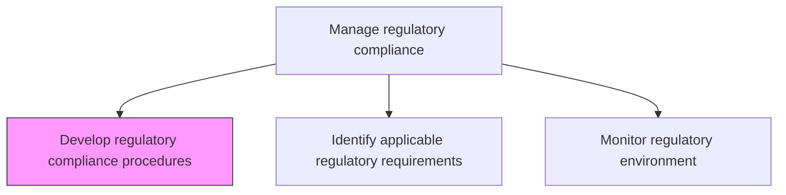
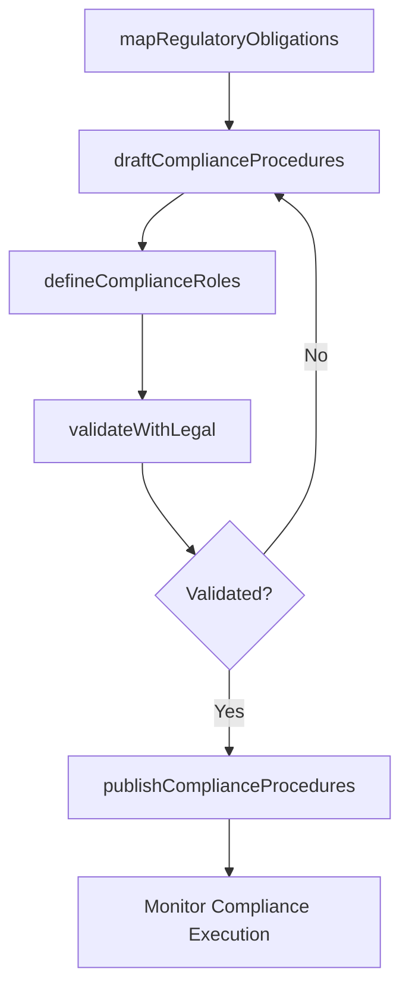

# Develop regulatory compliance procedures

> Business-as-Code definition for creating detailed procedures and methodologies that ensure organizational compliance with applicable laws, regulations, and industry standards.

## Overview

Developing procedures and methodologies to comply with relevant laws and regulations of an organization's obedience to laws, guidelines, strategies and stipulations related to business.

## Process Hierarchy



## GraphDL

```yaml
develop:
  object: Regulatory Compliance Procedures
  actor: RegulatoryComplianceManager
  result: ComplianceProcedureManual
```

## Actions

| Action | Description |
|--------|-------------|
| mapRegulatoryObligations | Link specific regulations to organizational processes and controls |
| draftComplianceProcedures | Author step-by-step procedures for regulatory compliance |
| defineComplianceRoles | Assign roles and responsibilities for compliance procedure execution |
| validateWithLegal | Obtain legal review and validation of drafted procedures |
| publishComplianceProcedures | Distribute finalized procedures to responsible parties |

## Events

| Event | Description |
|-------|-------------|
| regulatoryObligationsMapped | Regulatory requirements linked to processes and controls |
| complianceProceduresDrafted | Regulatory compliance procedures authored |
| complianceRolesDefined | Roles and responsibilities assigned for procedure execution |
| legalValidationCompleted | Legal review of compliance procedures completed |
| complianceProceduresPublished | Finalized procedures distributed to responsible parties |

## Searches

| Search | Description |
|--------|-------------|
| getComplianceProcedures | Retrieve procedures by regulation or business process |
| findProceduresRequiringUpdate | List procedures affected by regulatory changes |
| getComplianceRoleAssignments | Access role assignments for compliance procedures |
| getProceduresByJurisdiction | Filter compliance procedures by geographic jurisdiction |

## Process Flow



## RACI Matrix

| Activity | Responsible | Accountable | Consulted | Informed |
|----------|-------------|-------------|-----------|----------|
| mapRegulatoryObligations | RegulatoryComplianceManager | ChiefComplianceOfficer | Legal | RiskManagement |
| draftComplianceProcedures | ComplianceAnalyst | RegulatoryComplianceManager | ProcessOwners | HumanResources |
| validateWithLegal | GeneralCounsel | RegulatoryComplianceManager | ExternalCounsel | AuditCommittee |
| publishComplianceProcedures | RegulatoryComplianceManager | ChiefComplianceOfficer | CorporateCommunications | AllEmployees |

## Related Processes

| Process | Relationship |
|---------|-------------|
| 11.2.2.2 Identify applicable regulatory requirements | Upstream - requirements drive procedure development |
| 11.2.2.5 Implement missing or stronger regulatory compliance controls | Downstream - procedures guide control implementation |
| 11.2.1.1 Develop enterprise compliance policies and procedures | Parallel - enterprise policy alignment |
| 11.2.2.3 Monitor the regulatory environment | Upstream - regulatory changes trigger procedure updates |

## Related Departments

| Department | Role |
|-----------|------|
| Compliance | Authors and maintains compliance procedures |
| Legal | Validates regulatory interpretation |
| All Business Units | Execute compliance procedures |
| Human Resources | Incorporates procedures into training |

## Related Occupations

| Occupation | Involvement |
|-----------|-------------|
| Regulatory Compliance Manager | Primary procedure author |
| Compliance Analyst | Research and drafting support |
| General Counsel | Legal validation |
| Process Owner | Procedure execution and feedback |

## KPIs

| KPI | Description | Unit |
|-----|-------------|------|
| Procedure Coverage | Percentage of regulatory obligations with documented procedures | % |
| Procedure Currency | Percentage of procedures updated within required review cycle | % |
| Legal Validation Time | Average time from draft to legal sign-off | Days |
| Procedure Adoption Rate | Percentage of responsible parties trained on procedures | % |

## Usage

```typescript
import { developRegulatoryComplianceProcedures } from '@headlessly/develop-regulatory-compliance-procedures'

const procedures = developRegulatoryComplianceProcedures()

// Map regulatory obligations to processes
const mapping = await procedures.mapRegulatoryObligations({
  regulation: 'SOX-Section-404',
  processes: ['financial-reporting', 'internal-controls', 'disclosure']
})

// Draft compliance procedures
const draft = await procedures.draftComplianceProcedures({
  regulation: 'SOX-Section-404',
  processArea: 'financial-reporting',
  effectiveDate: '2026-04-01'
})
```
