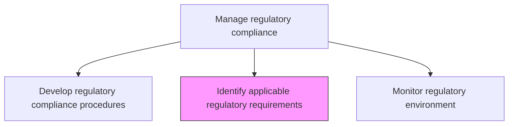
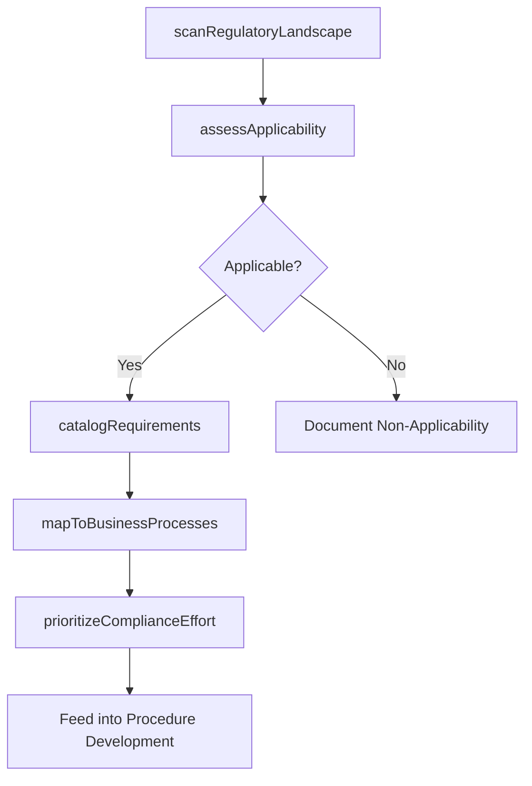

# Identify applicable regulatory requirements

> Business-as-Code definition for systematically identifying all regulatory requirements applicable to the organization based on its industry, geography, and business activities.

## Overview

Determining the regulatory requirements that are most appropriate for the organization. Identify goals in order to follow the appropriate rules and regulations, guidelines, and strategies.

## Process Hierarchy



## GraphDL

```yaml
identify:
  object: Applicable Regulatory Requirements
  actor: RegulatoryAnalyst
  result: RegulatoryRequirementsRegister
```

## Actions

| Action | Description |
|--------|-------------|
| scanRegulatoryLandscape | Survey the regulatory environment for all applicable laws and regulations |
| assessApplicability | Determine which regulations apply based on industry, jurisdiction, and activities |
| catalogRequirements | Document applicable requirements in a structured regulatory register |
| mapToBusinessProcesses | Link regulatory requirements to affected business processes and controls |
| prioritizeComplianceEffort | Rank requirements by risk, penalty severity, and implementation complexity |

## Events

| Event | Description |
|-------|-------------|
| regulatoryLandscapeScanned | Comprehensive regulatory survey completed |
| applicabilityAssessed | Regulation applicability determination completed |
| requirementsCataloged | Regulatory requirement documented in register |
| requirementsMappedToProcesses | Regulation linked to affected business processes |
| complianceEffortPrioritized | Requirements ranked by implementation priority |

## Searches

| Search | Description |
|--------|-------------|
| getRegulatoryRegister | Retrieve the full regulatory requirements register |
| findRequirementsByJurisdiction | Filter requirements by geographic jurisdiction |
| getRequirementsByProcess | List requirements affecting a specific business process |
| findNewRequirements | Identify recently added regulatory requirements |

## Process Flow



## RACI Matrix

| Activity | Responsible | Accountable | Consulted | Informed |
|----------|-------------|-------------|-----------|----------|
| scanRegulatoryLandscape | RegulatoryAnalyst | RegulatoryComplianceManager | Legal | ChiefComplianceOfficer |
| assessApplicability | RegulatoryAnalyst | RegulatoryComplianceManager | BusinessUnitLeads | RiskManagement |
| catalogRequirements | RegulatoryAnalyst | RegulatoryComplianceManager | GeneralCounsel | AuditCommittee |
| prioritizeComplianceEffort | RegulatoryComplianceManager | ChiefComplianceOfficer | CFO | ExecutiveTeam |

## Related Processes

| Process | Relationship |
|---------|-------------|
| 11.2.2.1 Develop regulatory compliance procedures | Downstream - requirements drive procedures |
| 11.2.2.3 Monitor the regulatory environment | Parallel - ongoing regulatory scanning |
| 11.2.2.4 Assess current compliance position | Downstream - requirements define assessment criteria |
| 11.1.1.1 Determine risk tolerance for organization | Upstream - tolerance informs prioritization |

## Related Departments

| Department | Role |
|-----------|------|
| Compliance | Leads regulatory identification efforts |
| Legal | Interprets regulatory applicability |
| Government Affairs | Provides regulatory intelligence |
| All Business Units | Contribute process context for applicability assessment |

## Related Occupations

| Occupation | Involvement |
|-----------|-------------|
| Regulatory Analyst | Primary research and cataloging |
| Regulatory Compliance Manager | Oversight and prioritization |
| General Counsel | Legal interpretation |
| Government Relations Specialist | Regulatory intelligence |

## KPIs

| KPI | Description | Unit |
|-----|-------------|------|
| Regulatory Coverage | Percentage of known regulations assessed for applicability | % |
| Requirements Completeness | Percentage of applicable regulations fully cataloged | % |
| Time to Identify | Average time from regulation enactment to organizational identification | Days |
| Process Mapping Coverage | Percentage of cataloged requirements linked to business processes | % |

## Usage

```typescript
import { identifyApplicableRegulatoryRequirements } from '@headlessly/identify-applicable-regulatory-requirements'

const regulatory = identifyApplicableRegulatoryRequirements()

// Scan the regulatory landscape
const landscape = await regulatory.scanRegulatoryLandscape({
  jurisdictions: ['US-Federal', 'US-State-CA', 'EU'],
  industries: ['financial-services', 'technology'],
  includeProposedRules: true
})

// Assess applicability of a specific regulation
const applicability = await regulatory.assessApplicability({
  regulationId: 'EU-AI-Act-2024',
  businessActivities: ['ai-development', 'data-processing'],
  revenueThresholds: true
})
```
