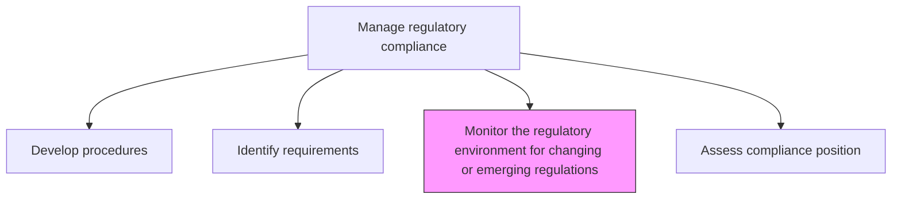
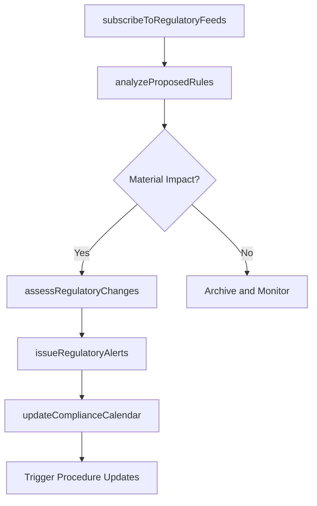

# Monitor the regulatory environment for changing or emerging regulations

> Business-as-Code definition for continuously scanning the regulatory landscape to detect new, changing, or emerging regulations that may impact the organization's compliance obligations.

## Overview

Analyzing and overseeing the regulatory environment in order to spot any changing or emerging regulations. This process element calls upon the organization to monitor the regulatory environment for any new statutes, policies, and enactments issued by the respective government authorities or those which have been updated.

## Process Hierarchy



## GraphDL

```yaml
monitor:
  object: Regulatory Environment For Changing Or Emerging Regulations
  actor: RegulatoryIntelligenceAnalyst
  result: RegulatoryChangeAlert
```

## Actions

| Action | Description |
|--------|-------------|
| subscribeToRegulatoryFeeds | Set up monitoring of regulatory agency publications and industry alerts |
| analyzeProposedRules | Evaluate proposed regulations for potential organizational impact |
| assessRegulatoryChanges | Determine the compliance implications of enacted regulatory changes |
| issueRegulatoryAlerts | Notify relevant stakeholders of significant regulatory developments |
| updateComplianceCalendar | Adjust compliance deadlines and milestones for new regulatory requirements |

## Events

| Event | Description |
|-------|-------------|
| regulatoryFeedSubscribed | New regulatory monitoring source activated |
| proposedRuleAnalyzed | Impact analysis of proposed regulation completed |
| regulatoryChangeAssessed | Compliance implications of regulatory change evaluated |
| regulatoryAlertIssued | Stakeholders notified of significant regulatory development |
| complianceCalendarUpdated | Compliance deadlines adjusted for new requirements |

## Searches

| Search | Description |
|--------|-------------|
| getRegulatoryAlerts | Retrieve recent regulatory change alerts |
| findProposedRules | List proposed regulations under review |
| getRegulatoryChanges | Access enacted regulatory changes by jurisdiction or domain |
| getComplianceCalendar | View upcoming compliance deadlines and milestones |

## Process Flow



## RACI Matrix

| Activity | Responsible | Accountable | Consulted | Informed |
|----------|-------------|-------------|-----------|----------|
| subscribeToRegulatoryFeeds | RegulatoryIntelligenceAnalyst | RegulatoryComplianceManager | GovernmentAffairs | Legal |
| analyzeProposedRules | RegulatoryIntelligenceAnalyst | RegulatoryComplianceManager | GeneralCounsel | ChiefComplianceOfficer |
| assessRegulatoryChanges | RegulatoryComplianceManager | ChiefComplianceOfficer | BusinessUnitLeads | RiskManagement |
| issueRegulatoryAlerts | RegulatoryComplianceManager | ChiefComplianceOfficer | CorporateCommunications | ExecutiveTeam |

## Related Processes

| Process | Relationship |
|---------|-------------|
| 11.2.2.2 Identify applicable regulatory requirements | Parallel - feeds requirements identification |
| 11.2.2.1 Develop regulatory compliance procedures | Downstream - changes trigger procedure updates |
| 11.2.2.5 Implement missing or stronger regulatory compliance controls | Downstream - changes may require new controls |
| 11.2.2.9 Maintain relationships with regulators | Supporting - regulator engagement provides intelligence |

## Related Departments

| Department | Role |
|-----------|------|
| Compliance | Leads regulatory monitoring activities |
| Legal | Interprets regulatory changes |
| Government Affairs | Provides regulatory intelligence and lobbying context |
| Strategy | Assesses strategic implications of regulatory changes |

## Related Occupations

| Occupation | Involvement |
|-----------|-------------|
| Regulatory Intelligence Analyst | Primary monitoring executor |
| Regulatory Compliance Manager | Impact assessment lead |
| Government Relations Specialist | Regulatory intelligence contributor |
| General Counsel | Legal interpretation of changes |

## KPIs

| KPI | Description | Unit |
|-----|-------------|------|
| Monitoring Coverage | Number of regulatory sources actively monitored | Count |
| Alert Timeliness | Average time from regulatory change to internal alert | Days |
| Impact Assessment Completion | Percentage of material changes with completed impact assessments | % |
| Regulatory Horizon Visibility | Number of proposed regulations under active tracking | Count |

## Usage

```typescript
import { monitorRegulatoryEnvironmentForChangingOrEmergingRegulations } from '@headlessly/monitor-regulatory-environment-for-changing-or-emerging-regulations'

const monitoring = monitorRegulatoryEnvironmentForChangingOrEmergingRegulations()

// Subscribe to regulatory feeds
const feeds = await monitoring.subscribeToRegulatoryFeeds({
  agencies: ['SEC', 'FTC', 'EU-Commission', 'FCA'],
  topics: ['data-privacy', 'financial-regulation', 'ai-governance']
})

// Analyze a proposed rule
const analysis = await monitoring.analyzeProposedRules({
  ruleId: 'SEC-2026-PROP-012',
  impactAreas: ['reporting', 'disclosure', 'internal-controls'],
  complianceTimeline: true
})
```
