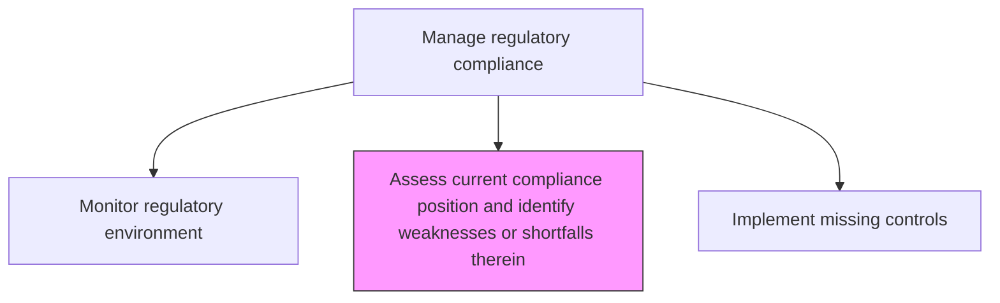
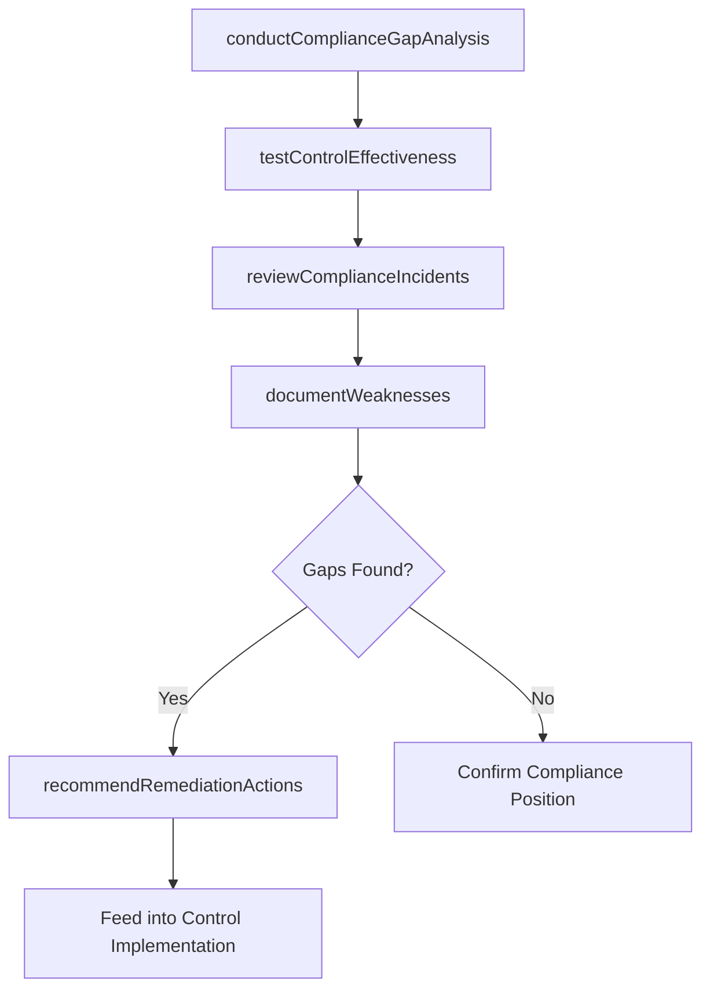

# Assess current compliance position and identify weaknesses or shortfalls therein

> Business-as-Code definition for evaluating the organization's current state of regulatory compliance and identifying gaps, weaknesses, or deficiencies requiring remediation.

## Overview

Evaluating current regulatory policies and regulations. Assess their performance. Make necessary changes.

## Process Hierarchy



## GraphDL

```yaml
assess:
  object: Current Compliance Position And Identify Weaknesses Or Shortfalls Therein
  actor: ComplianceAssessmentManager
  result: ComplianceGapAnalysis
```

## Actions

| Action | Description |
|--------|-------------|
| conductComplianceGapAnalysis | Compare current practices against regulatory requirements to identify gaps |
| testControlEffectiveness | Evaluate whether compliance controls are operating as intended |
| reviewComplianceIncidents | Analyze recent compliance violations or near-misses for patterns |
| documentWeaknesses | Record identified compliance shortfalls with severity and impact ratings |
| recommendRemediationActions | Propose specific actions to address identified compliance gaps |

## Events

| Event | Description |
|-------|-------------|
| complianceGapAnalysisCompleted | Gap analysis between requirements and current state completed |
| controlEffectivenessTested | Compliance control testing results documented |
| complianceIncidentsReviewed | Violation and near-miss analysis completed |
| weaknessesDocumented | Compliance shortfalls formally recorded |
| remediationActionsRecommended | Corrective actions proposed for identified gaps |

## Searches

| Search | Description |
|--------|-------------|
| getComplianceGaps | Retrieve identified compliance gaps by regulation or domain |
| findCriticalWeaknesses | List high-severity compliance shortfalls |
| getControlTestResults | Access compliance control testing results |
| getRemediationRecommendations | Retrieve proposed corrective actions for compliance gaps |

## Process Flow



## RACI Matrix

| Activity | Responsible | Accountable | Consulted | Informed |
|----------|-------------|-------------|-----------|----------|
| conductComplianceGapAnalysis | ComplianceAssessmentManager | ChiefComplianceOfficer | BusinessUnitLeads | InternalAudit |
| testControlEffectiveness | ComplianceAnalyst | ComplianceAssessmentManager | ControlOwners | RiskManagement |
| documentWeaknesses | ComplianceAnalyst | ComplianceAssessmentManager | Legal | AuditCommittee |
| recommendRemediationActions | ComplianceAssessmentManager | ChiefComplianceOfficer | ExecutiveTeam | BoardOfDirectors |

## Related Processes

| Process | Relationship |
|---------|-------------|
| 11.2.2.3 Monitor the regulatory environment | Upstream - regulatory changes trigger reassessment |
| 11.2.2.5 Implement missing or stronger regulatory compliance controls | Downstream - gaps drive control implementation |
| 11.2.1.3 Manage internal audits | Parallel - audits validate compliance assessments |
| 11.2.2.7 Compile and communicate compliance scorecards | Downstream - assessment results feed scorecards |

## Related Departments

| Department | Role |
|-----------|------|
| Compliance | Leads compliance position assessment |
| Internal Audit | Supports independent validation |
| All Business Units | Subject to compliance assessment |
| Legal | Interprets regulatory requirements for gap analysis |

## Related Occupations

| Occupation | Involvement |
|-----------|-------------|
| Compliance Assessment Manager | Primary assessor |
| Compliance Analyst | Testing and documentation |
| Internal Auditor | Independent validation |
| General Counsel | Regulatory interpretation |

## KPIs

| KPI | Description | Unit |
|-----|-------------|------|
| Gap Identification Rate | Number of new compliance gaps identified per assessment cycle | Count |
| Critical Gap Count | Number of high-severity compliance shortfalls open | Count |
| Assessment Coverage | Percentage of regulatory obligations assessed per cycle | % |
| Remediation Recommendation Rate | Percentage of gaps with approved remediation plans | % |

## Usage

```typescript
import { assessCurrentCompliancePositionAndIdentifyWeaknesses } from '@headlessly/assess-current-compliance-position-and-identify-weaknesses-or-shortfalls-therein'

const assessment = assessCurrentCompliancePositionAndIdentifyWeaknesses()

// Conduct compliance gap analysis
const gaps = await assessment.conductComplianceGapAnalysis({
  regulations: ['GDPR', 'SOX', 'HIPAA'],
  scope: 'enterprise-wide',
  depth: 'detailed'
})

// Test control effectiveness
const controlTest = await assessment.testControlEffectiveness({
  controlIds: ['CTRL-PRIV-001', 'CTRL-PRIV-002'],
  testingApproach: 'substantive',
  sampleSize: 30
})
```
