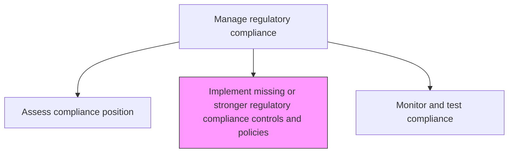
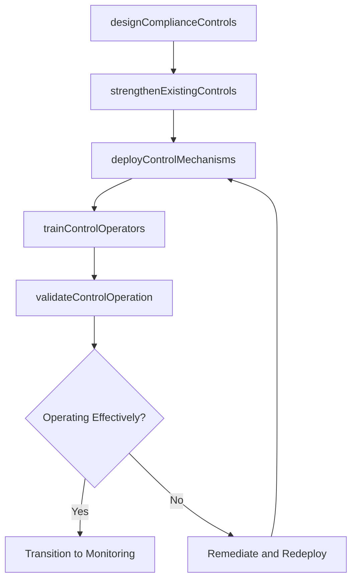

# Implement missing or stronger regulatory compliance controls and policies

> Business-as-Code definition for deploying new or enhanced compliance controls and policies to address identified regulatory gaps and strengthen the organization's compliance posture.

## Overview

Assessing the current policies and policies. Implement missing and necessary changes environmental changes, political changes, technological changes, etc.

## Process Hierarchy



## GraphDL

```yaml
implement:
  object: Missing Or Stronger Regulatory Compliance Controls And Policies
  actor: ComplianceControlsManager
  result: ImplementedComplianceControls
```

## Actions

| Action | Description |
|--------|-------------|
| designComplianceControls | Create new controls to address identified regulatory compliance gaps |
| strengthenExistingControls | Enhance current controls that are insufficient for compliance requirements |
| deployControlMechanisms | Implement approved compliance controls across affected processes |
| trainControlOperators | Ensure personnel responsible for controls understand requirements |
| validateControlOperation | Confirm that newly deployed controls function as designed |

## Events

| Event | Description |
|-------|-------------|
| complianceControlsDesigned | New compliance controls specifications completed |
| existingControlsStrengthened | Existing controls enhanced to meet requirements |
| controlMechanismsDeployed | Compliance controls implemented in production |
| controlOperatorsTrained | Personnel trained on new control procedures |
| controlOperationValidated | New control functionality confirmed through testing |

## Searches

| Search | Description |
|--------|-------------|
| getNewControls | Retrieve recently implemented compliance controls |
| findControlsByRegulation | List controls associated with a specific regulation |
| getControlImplementationStatus | Access deployment status of planned controls |
| getTrainingCompletionByControl | View training completion rates for specific controls |

## Process Flow



## RACI Matrix

| Activity | Responsible | Accountable | Consulted | Informed |
|----------|-------------|-------------|-----------|----------|
| designComplianceControls | ComplianceControlsManager | ChiefComplianceOfficer | ProcessOwners | RiskManagement |
| deployControlMechanisms | ProjectManager | ComplianceControlsManager | IT | BusinessUnitLeads |
| trainControlOperators | TrainingCoordinator | ComplianceControlsManager | HumanResources | AllAffectedStaff |
| validateControlOperation | InternalAuditor | ComplianceControlsManager | QualityAssurance | AuditCommittee |

## Related Processes

| Process | Relationship |
|---------|-------------|
| 11.2.2.4 Assess current compliance position and identify weaknesses | Upstream - gaps drive control implementation |
| 11.2.2.6 Monitor and test regulatory compliance position | Downstream - new controls enter monitoring |
| 11.2.1.1 Develop enterprise compliance policies and procedures | Parallel - policy updates accompany control changes |
| 11.1.4.4 Implement mitigation plans for risks | Parallel - risk-based control implementation |

## Related Departments

| Department | Role |
|-----------|------|
| Compliance | Designs and oversees control implementation |
| Information Technology | Deploys technology-based controls |
| All Business Units | Adopt and operate new controls |
| Internal Audit | Validates control effectiveness |

## Related Occupations

| Occupation | Involvement |
|-----------|-------------|
| Compliance Controls Manager | Primary implementation coordinator |
| Project Manager | Deployment logistics |
| IT Systems Engineer | Technology control deployment |
| Internal Auditor | Post-implementation validation |

## KPIs

| KPI | Description | Unit |
|-----|-------------|------|
| Gap Closure Rate | Percentage of identified compliance gaps addressed by new controls | % |
| Implementation Timeline | Average time from gap identification to control deployment | Days |
| Control Validation Pass Rate | Percentage of new controls passing initial validation | % |
| Training Completion | Percentage of control operators completing training | % |

## Usage

```typescript
import { implementMissingOrStrongerRegulatoryComplianceControlsAndPolicies } from '@headlessly/implement-missing-or-stronger-regulatory-compliance-controls-and-policies'

const controls = implementMissingOrStrongerRegulatoryComplianceControlsAndPolicies()

// Design a new compliance control
const newControl = await controls.designComplianceControls({
  gapId: 'GAP-GDPR-2026-003',
  controlType: 'preventive',
  regulation: 'GDPR-Article-17',
  description: 'Automated data deletion request processing'
})

// Deploy the control
const deployment = await controls.deployControlMechanisms({
  controlId: newControl.id,
  affectedProcesses: ['data-management', 'customer-service'],
  targetDate: '2026-03-15'
})
```
