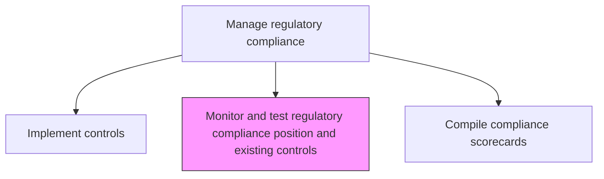
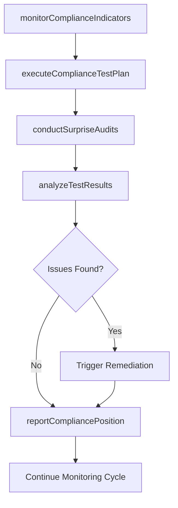

# Monitor and test regulatory compliance position and existing controls

> Business-as-Code definition for continuously monitoring the organization's regulatory compliance posture and testing the effectiveness of compliance controls through ongoing evaluation and testing programs.

## Overview

Monitoring, appraising, and evaluating the compliance position of the organization in order to fine-tune for effective remediation. Track efforts for handling regulatory and compliance requirements necessitated by law. Test the robustness of internal frameworks, procedures, and approaches for dealing with these requirements, in order to clearly identify any necessary changes.

## Process Hierarchy



## GraphDL

```yaml
monitor:
  object: And Test Regulatory Compliance Position And Existing Controls
  actor: ComplianceMonitoringSpecialist
  result: ComplianceTestingReport
```

## Actions

| Action | Description |
|--------|-------------|
| executeComplianceTestPlan | Perform scheduled testing of compliance controls |
| monitorComplianceIndicators | Track key compliance indicators and metrics in real time |
| conductSurpriseAudits | Execute unscheduled compliance checks to validate adherence |
| analyzeTestResults | Evaluate testing outcomes to determine control effectiveness |
| reportCompliancePosition | Communicate overall compliance status to management |

## Events

| Event | Description |
|-------|-------------|
| complianceTestPlanExecuted | Scheduled compliance testing completed |
| complianceIndicatorMonitored | Key compliance metric tracked and evaluated |
| surpriseAuditConducted | Unscheduled compliance check completed |
| testResultsAnalyzed | Compliance testing outcomes evaluated |
| compliancePositionReported | Overall compliance status communicated |

## Searches

| Search | Description |
|--------|-------------|
| getComplianceTestResults | Retrieve compliance testing results by control or regulation |
| getComplianceIndicators | Access real-time compliance indicator dashboard |
| findFailedControls | List controls that failed testing |
| getComplianceTestSchedule | View upcoming compliance testing schedule |

## Process Flow



## RACI Matrix

| Activity | Responsible | Accountable | Consulted | Informed |
|----------|-------------|-------------|-----------|----------|
| executeComplianceTestPlan | ComplianceMonitoringSpecialist | RegulatoryComplianceManager | ControlOwners | InternalAudit |
| monitorComplianceIndicators | ComplianceAnalyst | ComplianceMonitoringSpecialist | IT | ChiefComplianceOfficer |
| conductSurpriseAudits | InternalAuditor | ComplianceMonitoringSpecialist | ProcessOwners | AuditCommittee |
| reportCompliancePosition | ComplianceMonitoringSpecialist | ChiefComplianceOfficer | ExecutiveTeam | BoardOfDirectors |

## Related Processes

| Process | Relationship |
|---------|-------------|
| 11.2.2.5 Implement missing or stronger regulatory compliance controls | Upstream - new controls enter monitoring |
| 11.2.2.7 Compile and communicate compliance scorecards | Downstream - monitoring data feeds scorecards |
| 11.2.1.3 Manage internal audits | Parallel - audit testing complements monitoring |
| 11.2.1.4 Maintain controls-related technologies and tools | Supporting - technology enables monitoring |

## Related Departments

| Department | Role |
|-----------|------|
| Compliance | Leads monitoring and testing activities |
| Internal Audit | Provides independent testing and validation |
| Information Technology | Supports automated monitoring systems |
| All Business Units | Subject to compliance monitoring and testing |

## Related Occupations

| Occupation | Involvement |
|-----------|-------------|
| Compliance Monitoring Specialist | Primary monitoring and testing executor |
| Compliance Analyst | Indicator tracking and analysis |
| Internal Auditor | Independent testing support |
| IT Security Analyst | Automated monitoring support |

## KPIs

| KPI | Description | Unit |
|-----|-------------|------|
| Test Completion Rate | Percentage of planned compliance tests completed on schedule | % |
| Control Pass Rate | Percentage of tested controls meeting compliance requirements | % |
| Monitoring Coverage | Percentage of compliance obligations under active monitoring | % |
| Issue Detection Time | Average time from control failure to detection | Hours |

## Usage

```typescript
import { monitorAndTestRegulatoryCompliancePositionAndExistingControls } from '@headlessly/monitor-and-test-regulatory-compliance-position-and-existing-controls'

const monitoring = monitorAndTestRegulatoryCompliancePositionAndExistingControls()

// Execute compliance test plan
const results = await monitoring.executeComplianceTestPlan({
  regulation: 'SOX-Section-404',
  controls: ['financial-reporting-controls', 'access-controls'],
  testingPeriod: 'Q1-2026'
})

// Monitor compliance indicators
const indicators = await monitoring.monitorComplianceIndicators({
  domains: ['data-privacy', 'financial-reporting', 'anti-corruption'],
  alertThreshold: 'warning',
  frequency: 'daily'
})
```
